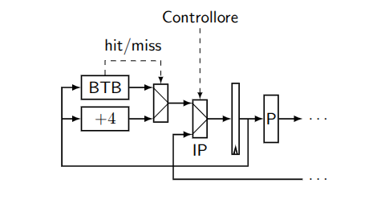
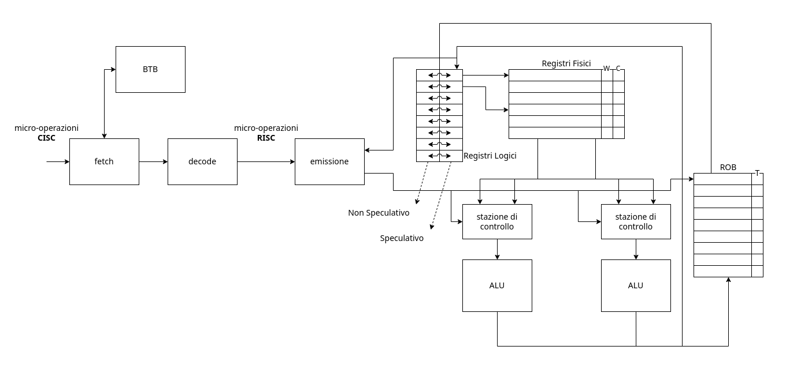

# 1. Indice

- [1. Indice](#1-indice)
- [2. Pipeline](#2-pipeline)
	- [2.1. Processori `RISC`](#21-processori-risc)
	- [2.2. Problemi legati alla Pipeline](#22-problemi-legati-alla-pipeline)
	- [2.3. Ottimizzazioni](#23-ottimizzazioni)
		- [2.3.1. ALEE sui dati](#231-alee-sui-dati)
		- [2.3.2. ALEE sul controllo](#232-alee-sul-controllo)
			- [2.3.2.1. `RET`](#2321-ret)
- [3. Architettura Intel](#3-architettura-intel)
	- [3.1. Fase di Fetch e Decode](#31-fase-di-fetch-e-decode)
	- [3.2. Esecuzione fuori ordine](#32-esecuzione-fuori-ordine)
	- [3.3. Dipendenze](#33-dipendenze)
		- [3.3.1. Dipendenze sui Dati](#331-dipendenze-sui-dati)
		- [3.3.2. Dipendenze sui Nomi](#332-dipendenze-sui-nomi)
		- [3.3.3. Dipendenze sul Controllo](#333-dipendenze-sul-controllo)
		- [3.3.4. Ottimizzazioni](#334-ottimizzazioni)
		- [3.3.5. Esecuzione speculativa](#335-esecuzione-speculativa)
	- [3.4. Istuzioni di `LD` e `ST`](#34-istuzioni-di-ld-e-st)
	- [3.5. Interazione con la _cache_](#35-interazione-con-la-cache)
- [4. Problemi di Sicurezza della speculazione](#4-problemi-di-sicurezza-della-speculazione)
	- [4.1. Meltdown](#41-meltdown)
	- [4.2. Spectre](#42-spectre)

È importante sottolineare da subito che le specifiche precise dei processori _Intel_ sono note **solamente da _Intel_**.
Quello che faremo noi è darne una buona aprossimazione.

# 2. Pipeline

Il processore per come lo abbiamo visto fin'ora si occupa di eseguire tre operazioni: `fetch`, `decodifica` e infine `esecuzione`.

Le **CPU** moderne fanno ancora la stessa cosa, ma introducendo tutta una serie di accorgimenti che permettono di aumentare la velocità di esecuzione delle istruzioni.

Tra le varie possibilità per migliorare l'efficenza del processore abbiamo:
- Rendere il _clock_ più veloce: ma ha un limite sotto al quale il processore non riesce a stare al passo
- Diminuire le dimensioni dei _transistor_ nel processore, così da poterne inserire di più: anche qui ormai siamo ai limiti imposti dalla fisica quantistica
- Inserire più processori in uno stesso _chip_, creando architetture **_multicore_**.

Noi vediamo quindi come in un unico _core_ il processore riesca ad eseguire più istruzioni dallo stesso flusso di esecuzione contemporaneamente.

L'idea alla base di _Intel_, adottata già dal `x486`, è quella della **_pipeline_**.

Le istruzioni passeranno adesso in diverse fasi:
1. **_Prelievo_**
2. **_Decodifica_**
3. **_Prelevio Operandi_** <small>(dalla memoria o dai registri)</small>
4. **_Esecuzione dell'istruzione_**
5. **_Scrittura del risultato nella destinazione_**

Ciascuna di queste fasi è eseguita da _parti fisicamente differenti_.
Infatti, all'interno del processore, sono presenti _circuiti distinti specializzati nel compiere un compito_ (prelievo, decodifica, `ALU`, `FPU`, ...).

L'idea della _pipeline_ si basa sul fatto che quando un circuito termina il suo lavoro per una istruzione, rimane in attesa finché non terminano anche le altre fasi. Quello che quindi implementa è permettere al circuito di **iniziare a operare sull'istruzione successiva**:

<div class="flexbox index" style="margin-bottom: 0px; padding-bottom: 16px" markdown="1">

|       | Prelievo | Decodifica | Prelevio Operandi (se necessario) | Esecuzione dell'istruzione | Scrittura del risultato nella destinazione |
| ----- | -------- | ---------- | --------------------------------- | -------------------------- | ------------------------------------------ |
| $t_0$ | `i`        |            |                                   |                            |                                            |
| $t_1$ | `i+1`      | `i`          |                                   |                            |                                            |
| $t_2$ | `i+2`      | `i+1`        | `i`                                 |                            |                                            |
| $t_3$ | `i+3`      | `i+2`        | `i+1`                               | `i`                          |                                            |
| $t_4$ | `i+4`      | `i+3`        | `i+2`                               | `i+1`                        | `i`                                          |

</div>

In questo modo aumentiamo il numero di istruzioni completate al secondo per 5, ovvero _il numero di stadi nella pipeline_. Questo migioramento avviene solo se siamo in grado effettivamente di implementarla in maniera corretta.
Una prima descrizione della _pipeline_ è la seguente:


Con questa configurazione il `clock` deve avere adesso un periodo che deve essere almeno uguale al massimo <code>$\Delta_i$</code>:
$$
	\Delta = \max_{i\:\in\:[1,5]}\{\Delta_i\} + t_{setup}
$$

Potremmo quindi velocizzare di `5 volte` il `clock` solamente se $\Delta_i = \Delta_j, \; \forall i \ne j$, ovvero $\Delta_i = {1 \over 5}\Delta_T$.

Questo però può essere possibile solamente in circuiti creati proprio con l'idea della _pipeline_ poiché in generale i $\Delta_i$ saranno diversi.
Il recupero di un informazione da un registro è infatti molto più veloce del tempo di attraversamento di una _RC di Divisione Intera_.

Un altro problema sorge anche tra il _prelievo_ e la _decodifica_ dell'informazione. Infatti, senza aver decodificato l'immediato, nell'`assembler` non abbiamo idea a priori di quanto sia grande l'istruzione, perciò ci è impossibile capire quale sarà la prossima istruzione.

Le istruzioni _Intel a 64bit_ hanno infatti una dimensione che può variare da `1Byte`, ad esempio `PUSH %eax`, al massimo di `16Byte` che contiene:
- 2 Prefissi
- Operatore
- La tripla `(scala, indice, base)`
- Valore immediato
- Valore di offset

Queste istruzioni sono dette dette `CISC` (_Complex Istruction Set Computer_).

<div class="stop"></div>

## 2.1. Processori `RISC`

Per poter riuscire a risolvere parte dei problemi delle operazioni `CISC` sono stati introdotti negli anni _'80_ i **processori `RISC`** (_Reduced Istruction Set Computer_).

Tutti i processori `RISC` hanno istruzioni grandi tipicamente `4Byte`, al cui interno le posizioni dei campi sono **fissi**:
```x86asm
OPCODE codiceOperando1 codiceOperando2 codiceDestinazione
```

Il formato `RISC` impone che le istruzioni siano _regolari_ e _semplici_, e inoltre _possano implementare semplicemente una pipeline_.

Il `RISC` permette di _**semplificare le operazioni necessarie all'`assembler` per eseguire una qualsiasi operazione**_, così da poter  diminuire il tempo di esecuzione.

Un'ulteriore differenza è che i processori `RISC` presentano una **netta separazione** tra le operazioni che operano nella memoria e quelle che non lo fanno. Saranno quindi solamente le operazioni di `LD` (_LoaD_) e `ST` (_STore_) a comunicare con la memoria, e avranno il formato:
```x86asm
LD offset(base), dst
ST src, offset(base)
```

Un compilatore dovrà quindi cercare di creare un programma che lavori il più possibile con i registri.
Le regole `RISC`, tra le altre cose, implementano proprio il fatto che alcuni operatori, come la `ADD`, possono operare **_solo con i registri_**.
Questo risolve il probema del _prelievo_, ma abbiamo ancora risolvere il problema detto delle `ALEE`.

## 2.2. Problemi legati alla Pipeline

All'interno del flusso delle istruzioni ci sono alcune situazioni che ci impediscono di eseguire un'istruzione ad ogni ciclo di _clock_.
Queste situazioni prendono il nome di `ALEE`.
Esse comprendono tutti quei casi in cui il flusso di istruzioni ci impedisce di utilizzare la _pipeline_, generando gli **stalli della pipeline**.


Ne esistono di tre tipi:
- `ALEE strutturali`
- `ALEE sui dati`
- `ALEE sul controllo`

Le `ALEE strutturali` nascono dal fatto che l'esecuzione di due istruzioni in parallelo possa richiedere _l'utilizzo della stessa risorsa_.

Immaginiamo infatti il seguente caso:
```x86asm
ST %rax, (%rsi)
MOV $5, %rax
LD (%rdi), %rbx
```

In questo caso l'istruzione di `LD` si trova 2 istruzioni dopo quella di `ST`.
Quando la `ST` sarà all'ultima fase della _pipeline_ (scrittura in memoria), la `LD` sarà alla terza (lettura dalla memoria), ed entrambe vorranno utilizzare il circuito che opera sulla memoria.

Le `ALEE sui dati` sono generate da istruzioni che utilizzano il risultato di un'istruzione precedente, come ad esempio:
```x86asm
op1 R1, R2, R3
op2 R3, R4, R5
```

Senza _pipeline_ questo problema non sussite, in quanto attenderemmo che la prima operazione sia terminata prima di passsare a quella successiva.

Utilizzando invece la _pipeline_, quando `op2` necessita `R3` come sorgente, `op1` si trova ancora all'esecuzione, e non avrà ancora inserito il risultato.


Le `ALEE sul controllo` sono generate da tutte quelle operazioni che potrebbero alterare il normale flusso di esecuzione del programma, come ad esempio salti condizionati `Jcond`.

Per riuscire a gestire queste `ALEE` si inserisce nella _pipeline_ un circuito di controllo che si occupa di prevenire i problemi.

Il controllo inserisce delle **_bolle_** (equivalenti ad una o più istruzioni `NOP`) che mettono in attesa un'operazione affinché quando entra nella successiva fase della _pipeline_ non verranno generati comportamenti indesiderati:
- Nel caso delle due operazioni che utilizzano `R3` basta inserire **_2 bolle_** prima dell'ingresso di `op2`.
- Nel caso di `LD` e `ST` è sufficente invece inserire una bolla tra un'operazione e l'altra.
- Nel caso di `Jcond` la situazione è più complessa ma sempre gestibile.

Inserire le bolle ovviamente **_diminuisce il numero di istruzioni al secondo_**. Inserire `5 bolle` equivale di fatti a tornare al processore senza _pipeline_.


## 2.3. Ottimizzazioni

Come già detto è possibile fare tutta una serie di _ottimizzazioni al compilatore_, che può da solo rilevare le `ALEE` e inserire istruzioni non correlate e non conflittuali tra le operazioni incriminate.
Questo processo è detto _**ottimizzazione di schedulazione**_.

Un esempio è il seguente:
<div class="grid2">
<div class="top">
<div class="p">

Prima
</div>

```x86asm
ADD R1, R2, R3
SUB R3, R4, R5
ADD R6, R7, R8
SUB R9, R0, RA
```
</div>
<div class="top">
<div class="p">

Dopo
</div>

```x86asm
ADD R1, R2, R3
ADD R6, R7, R8
SUB R9, R0, RA
SUB R3, R4, R5
```
</div>
</div>

È tuttavia anche possibile agire anche lato _hardware_.

### 2.3.1. ALEE sui dati

Riprendiamo il caso
```x86asm
op1 R1, R2, R3
op2 R3, R4, R5
```

`op2` non necessità tanto di `R3`, quanto del suo contenuto, che è calcolato da `op1` già alla fine dell'_esecuzione_.

Quello che possiamo fare quindi è inserire un collegamento tra _esecuzione_ e _recupero operandi_, chiamato **circuito di bypass**.


### 2.3.2. ALEE sul controllo

Per ottimizzare questi casi quello che fa il processore è **_cercare di indovinare dove salteremo_**.

Il processore effettuerà una scelta, vedremo più avanti come, e **inizierà a prelevare le istruzioni dal punto che lui crede sia quello al quale salteremo**.
Capiremo se abbiamo fatto la giusta scelta solamente quando la _jump_ verrà realmente _eseguita_.

Uno sbaglio in questa predizione comporta pagare il prezzo di quella che è chiamata _branch miss_, ovvero dovremo tornare a recuperare le istruzioni ignorando quello che avevamo già precalcolato.
Possiamo permetterci ciò anche in virtù del fatto che quanto precalcolato **non ha effetti a lungo termine**, in quanto questi avvengono solo alla scrittura.

Al primo salto il processore segue regole _statiche_ per indovinare dove andrà a finire:
- Se l'indirizzo di destinazione è precedente a quello dell'istruzione si aspetta un **loop**, indirizzerà quindi ad una delle etichette precedenti.
- Se l'indirizzo di destinazione è successivo a quello dell'istruzione si comporta come se la `Jcond` fosse un semplice `NOP`, prelevando l'istruzione successiva

Per rendere questo processo dinamico **salviamo in una struttura dati tutta una serie di informazioni relative ai salti già eseguiti**.
Le istruzioni di salto già avvenute cercano quindi di capire l'esito del salto riutilizzando questi dati, ricordando quando e dove siamo saltati e quando invece siamo "andati dritti".

Nel caso dei cicli tuttavia potremmo andare in errore ben due volte:
1. All'ultima esecuzione del `Jcond` che _non dovrà più essere eseguita_
2. Alla prima esecuzione della stessa `Jcond` qual'ora vi tornassimo in un secondo momento

Una delle tecniche per conservare i dati sui salti precedenti è implementare per ogni salto un **contatore**.

<div class="grid2">
<div class="">

Il _contatore_ è un circuito a quattro stati:
- **Strongly Not Taken** (_SNT_)
- **Weakly Not Taken** (_WNT_)
- **Weakly Taken** (_WT_)
- **Strongly Taken** (_ST_)

</div>
<div class="">


</div>
</div>


La regola è che:
- La prima volta, a seconda che si salti o meno assumerà lo stato di _WNT_ o _WT_.
- Aumenta di uno per ogni salto effettuato (_SNT_ $\to$ _WNT_ $\to$ _WT_ $\to$ _ST_)
- Diminuisce di uno per ogni salto non effettuato. (_SNT_ $\leftarrow$ _WNT_ $\leftarrow$ _WT_ $\leftarrow$ _ST_)


Predittori migliori ricordano anche la _storia del salto_, associando uno _sheet register_ contenente una sequenza di `bit` che rappresentano lo storico dei salti effettuati (`1`) e non (`0`).
Da questa informazione il predittore cerca quindi di **_imparare a utilizzarlo_**, cercando di trovare _pattern_.

In generale tutte queste cose vengono fatte dal **_Branch Target Buffer_** (`BTB`), a tutti gli effetti una _cache_, che:
> Ha come scopo associare ad ogni salto il proprio esito e la destinazione del salto (se avviene)

L'operatore di _prelievo_ si baserà quindi proprio sul contenuto di `BTB` per scegliere da dove recuperare i dati dopo aver riconosciuto un istruzione di salto.

Il `BTB` non si preoccupa delle colllisioni come avviene con la _cache di memoria_, poiché un suo errore non porta a effetti disastrosi ma  "solamente" degli step della _pipeline_.




#### 2.3.2.1. `RET`

`RET` è un operatore di salto indiretto molto usato e con una struttura statica.
Perciò possiede un suo circuito autonomo che si occupa di recuperare in autonomia l'indirizzo di salto dalla pila.

# 3. Architettura Intel

Nel 1995 _Intel_ produce il `Pentium Pro`, la cui architettura è la base sulla quale si evolvono ancora oggi i processori moderni.

_Intel_ ha tentato di cambiarne degli aspetti nel tempo, ma con esito insufficente.

L'idea principale di questo processore è:
> Prendere le istruzioni `CISC` e **_tradurle internamente in istruzioni_** `RISC`.

Da ora in poi faremo delle ipotesi sulle operazioni vere e prorie utilizzate.

## 3.1. Fase di Fetch e Decode

La prima fase dei processori _Intel_ è composta da `Fetch` e da `Decode`.

Questa fase prelieva _microistruzioni_ `CISC` per tradurle in _microistruzioni_ `RISC`.

Una singola **microistruzione `CISC`** può tradursi come:
- Un'unica **microistruzione `RISC`**
- Più **microistruzioni `RISC`** <small>(più raro ma possibile)</small>

Il circuito di `Fetch` ha al suo interno due buffer da `16Byte` l'uno. Sono due poiché, per via delle dimensioni variabili delle operazioni `CISC`, non sappiamo nemmeno dove l'operazione inizi. È quindi possibile che una singola istruzione possa sforare il primo registro.

Il circuito di `Decode` si divide invece in due fasi:
1. _Fase di predecodifica_: questa fase è necessaria a capire **dove si trovano le istruzioni** passate dalla `Fetch`;
1. _Fase di decodifica_: si occupa di decodificare le istruzioni recuperate dalla `Fetch` per tradurle in _microistruzioni `RISC`_.
   Nel _Pentium Pro_ venivano decodificate fino a 3 istruzioni alla volta, oggi, nei processori moderni, si arriva a 5.

Facciamo quindi un esempio di quello che compiono la `Fetch` e la `Decode`, immaginando di avere la seguente istruzione:
```x86asm
ADD %rax, 1000(%ebx, %ecx, 8)
```

La traduzione utilizza **registri interni ai quali il programmatore _non ha accesso_**, che chiamiamo per adesso `tmp`.
La traduzione diventa quindi la seguente:
```x86asm
SHL %ecx, 	$3, tmp1
ADD %ebx, tmp1, tmp1
LD	1000(tmp1),	tmp2
ADD %rax, tmp2, tmp2
ST  tmp2, 1000(tmp2)
```


Immaginiamo invece di avere il sequente spezzone di programma:
```cpp
// ...
for(int i = 0; i < 100000; ++i){
	a[i] = v1[i] + v2[i];
}
// ...
```

Ogni operazione effettuata nei vari cicli del `for` **_è indipendente dalle altre_**.
Non abbiamo quindi _nessun obbligo ad eseguirle nell'ordine che il programmatore desidera_. Infatti, se avessimo sufficenti sommatori a disposizione, potremmo persino _effettuarle tutte insieme_.
Se i vettori sono grossi, è possibile inoltre che una loro parte si trovi persino in _cache_, quindi sarebbe molto più veloce da recuperare piuttosto alle altre in **RAM**.
Quindi, mentre attendiamo che arrivino dalla **RAM** le `miss` della _cache_ è conveniente cominciare a calcolare quelle operazioni che invece hanno fornito una `hit`.

Per essere completamente precisi, in realtà tra un'operazione e l'altra sono presenti dei **salti incondizionali**, che possiamo ancora una volta cercare di indovinare.
A differenza della previsione delle _pipeline_ adesso però, le istruzioni nell'indirizzo indovinato verranno eseguita in tutto e per tutto, **_andando anche a scrivere in memoria se lo richiedano_**.
Dobbiamo quindi riservarci un modo che ci permetta di effettuare il _rollback delle scritture_ qual'ora avessimo sbagliato a prevedere il salto. Li vedremo meglio più avanti.

## 3.2. Esecuzione fuori ordine

Portando degli accorgimenti al processore, possiamo permettergli di eseguire delle istruzioni **_fuori ordine_** rispetto a quello imposto dal programmatore, o persino in parallelo tra di loro.

Queste modifiche avvengono dopo la fase di `Fetch` e `Decode`, quindi lavoreremo con istruzioni `RISC`:
```x86asm
op1 src1, src2, dst
```

Possiamo cercare di modificare l'architettura del processore affinché sia in grado di eseguirle nel momento stesso in cui esse sono pronte, **anche se quelle precedenti non sono ancora state eseguite**.
L'architettura che vediamo adesso **non esiste nella realtà**, ma è comoda per farci capire meglio i vari problemi da risolvere.

<div class="grid2">
<div class="">

Per ottenere questo risultato immaginiamo di avere più di un'unica `ALU`, ognuna preceduta da quelle che chiamiamo `stazioni di prenotazione`.
Nella realtà ognuna delle varie `ALU` è specializzata in qualcosa di diverso dalle altre, ma noi immagineremo che sono **tutte uguali**.

Proseguiamo aggiungendo un'ulteriore componente che chiamiamo `emissione`.
Questo componente riceve le istruzioni dalla `decode` e le smisterà nelle varie `stazioni di prenotazione` passando attraverso i **registri interni**, diversi da quelli utilizzabili dal programmatore e che, oltre ai dati stessi, contengono anche due campi aggiuntivi:
- `W` (_writing_)
- `C` (_count_)

Le `ALU` invieranno i risultati in automatico, tramite 1 o più _bus_, ai registri.

</div>
<div class="">

</div>
</div>

## 3.3. Dipendenze

Affinché il risultato finale dei registri sia significativo, dobbiamo rispettare una serie di condizioni chiamate **_Dipendenze_**, che si dividono in tre tipi:
- **_Dipendenze sui Dati_**
- **_Dipendenze sui Nomi_**
- **_Dipendenze sui Controllo_**

Le **_dipendenze_** sono **proprietà del programma**, _indipendenti dal circuito che esegue il programma_.

### 3.3.1. Dipendenze sui Dati

Sono definite così:
> Un'istruzione `i` **dipende dai dati** di un'altra istruzione `j`, _precedente ad essa_, se `i` utilizza come uno dei registri `src` il registro `dst` di `j`.

```x86asm
ADD R1, R2, R3
; ...
SUB R3, R4, R5
```


Le **_Dipendenze sui Dati_** forzano le istruzioni dipendenti a _non poter essere riordinate liberamente_, poiché è necessario che l'istruzione `i` venga eseguita <u>dopo</u> `j`, per avere il contenuto corretto del registro che dovrà utilizzare.

Per risolvere questo tipo di dipendenze, facciamo in modo che l'`emissione` setti il bit `W` del registro `dst` dell'istruzione che sta emettendo.

La stazione di `emissione`, prima di inviare i dati alla `ALU`, valuterà il bit `W` dei sorgenti, inviandoli **solamente quando `dst->W == 0`**.

### 3.3.2. Dipendenze sui Nomi

Le dipendenze sui nomi si differenziano in due tipi:
- **Antidipendenze**
- **Dipendenze in uscita**


<div class="grid2">
<div class="top">
<div class="p">

Antidipendenza
</div>

Sono così definite:
> Un'istruizone `i` si dice _**antidipendente**_ da un'altra istruzione `j`, _successiva ad essa_, se `i` utilizza come `src` lo stesso registro `dst` di `j`.

Per questo tipo di dipendenze è quindi necessario che `j` venga eseguita <u>dopo</u> di `i`, affinché non aggiorni troppo presto i suoi sorgenti
```x86asm
ADD R1, R2, R3
; ...
SUB R4, R5, R1
```
</div>
<div class="top">
<div class="p">

Dipendenza in uscita
</div>

Sono così definite:
> Un'istruzione `i` si dice **_dipendente in uscita_** rispetto ad un'altra `j`, se entrambe vogliono scrivere nello stesso registro `dst`.

In questo caso rischiamo che eventuali istruzioni tra le due lavorino con l'uscita di quella successiva, e non della precedente.
```x86asm
ADD R1, R2, R3
; ...
SUB R4, R5, R3
```
</div>
</div>

Un modo per risolvere le **dipendenze sui nomi** è far andare in **stallo l'`emissione`**. Questa può infatti entrare e uscire liberamente dallo stato di stallo, tramite dei controlli.

Per le **dipendenze in uscita**, verrà controllato il bit `dst->W`, e propagherà l'istruzione <u>solo se</u> `dst->W == 0`.

Per quanto riguarda le **antidipendenze**, si valuterà il campo `dst->C`. Anche in questo caso l'istruzione verrà propagata <u>solo se</u> `dst->C == 0`.

Il campo `C` di un registro viene:
- **Incrementato dal circuito di `emissione`** ogni qual volta quel registro è un `src`.
- **Decrementato dalla `ALU`** quando l'operazione viene completata.


### 3.3.3. Dipendenze sul Controllo

> Un istruzione `i` è **_dipendente dal controllo_** di una istruzione `j`, _precedente ad essa_, se `j` potrebbe comportare un salto che produrrà un flusso non definito a priori del programma.

Le **Dipendenze sul Controllo** indicano quindi che l'esecuzione di una serie di istruzioni dipende dal controllo dell'esito di una precedente.
```x86asm
	CMP ;...
	JE fine2

	ADD ;...		# Sono Dipendenti sul Controllo della JE
	SUB ;...		# Sono Dipendenti sul Controllo della JE
	JMP fine2
fine1:
	DIV ;...		# È dipendente sul controllo della JE a causa di JMP fine2
fine2:
	MUL ;...		# In maniera raffinata questa non è dipendente

```

Se non vogliamo implementare la "raffinatezza", possiamo creare una dipendenza sul controllo **nel momento in cui viene emessa una `Jcond`** che genera uno _stallo_ finché non si recupera il risultato.

### 3.3.4. Ottimizzazioni

Sono possibili varie ottimizzazioni, come il _bypass_, che collega il _bus_ di uscita delle `ALU` direttamente con le `stazioni di controllo`.

Un'ulteriore ottimizzazione è la rimozione del campo `C` dai registri interni, possibile aggiungendo delle `stazioni di controllo` lo spazio per salvare anche il **contenuto dei sorgenti**, così da rendere i registri liberamente modificabili dopo che l'istruzione è stata smistata ad una stazione.

Noi non ci occuperemo di questi accorgimenti, ma andremo a cercare come **_minimizzare il numero di stalli_**.

Per quanto riguarda le dipendenze sui dati, sostanzialmente non eliminabili, possiamo banalmente mantenerle all'interno delle `stazioni di prenotazione` senza bloccare il passaggio di altre istruzioni che possono essere eseguite nel mentre che queste aspettano la risoluzione della dipendneza.

Vediamo quindi uno schema delle dipendenze date due istruzioni `i` e `j` con `i` eseguita prima di `j`:


È importante sottolineare che tutte le azioni che vedremo adesso non influenzano le uscite della `Decode`, ma lavorano su di esse.

Per quanto riguarda le **dipendenze sui nomi**, esse sono anche chiamate **dipendenze fittizie**, questo perché se andiamo a sovrascrivere il contenuto di un registro è perché adesso lo vogliamo utilizzare per fare altro.
Possiamo quindi risolvere:
- _Antidipendenza_: è sufficiente cambiare il registro `dst` di `j`.
- _Dipendenza in uscita_: cerchiamo per ogni scrittura un registro non utilizzato da nessun'altro.

Per riuscire a implementare questa ottimizzazione, chiamata **_riscrittura sui registri_**, dobbiamo ovviamente poi continuare a modificare questi registri per tutte le operazioni successive.

Un modo per semplificare questo passaggio è inserire, prima degli $n$ registri fisici `Fi`, una tabella contentente $m$ **_registri logici_** `Ri` che punteranno ai registri fisici non in uso.

In questa nuova architettura, le istruzioni tradotte dalla `decode` faranno riferimento ai **registri logici**.

L'`emissione` si preoccuperà quindi anche di tradurli in _**registri fisici**_ `Fi` con l'accortezza che:
> Il `dst` di una operazione deve **sempre** essere un registro fisico _non puntato da nessun altro e non utilizzato dalla `ALU`_ (`W == 0 && Count == 0`).

Vediamo quindi una possibile traduzione da _logico_ a _fisico_:
<div class="grid2">
<div class="top">

```x86asm
ADD R1, R2, R3

SUB R4, R5, R2
```
$$
\begin{CD}
	@VVV
\end{CD}
$$

```x86asm
ADD F1, F2, F6

SUB F4, F5, F7
```

Lo stato dei registri al termine delle due istruzioni sarà quindi quello sulla destra.
</div>
<div class="top">

$$
\def\arraystretch{1.75}

\begin{matrix}
		&     &     & & [\;\text{Dati}\;| \;C\; | \;W\; ] \\[0.5em] \hline
	R_1 & \to & F_1 & = & [\quad | \;1\; | \quad ] \\ \hline
	R_2 & \to & F_2 & = & [\quad | \;1\; | \quad ] \\ \hline
	R_3 & \to & F_6 & = & [\quad | \quad | \;1\; ] \\ \hline\hline
	R_4 & \to & F_4 & = & [\quad | \;1\; | \quad ] \\ \hline
	R_5 & \to & F_5 & = & [\quad | \;1\; | \quad ] \\ \hline
	R_2 & \to & F_6 & = & [\quad | \quad | \;1\; ] \\ \hline
	
\end{matrix}
$$

</div>
</div>


### 3.3.5. Esecuzione speculativa 

Per quanto riguarda le **dipendenze sul controllo** anche qui, come per la _pipeline_, continuiamo a esaminare le informazioni come se il flusso dei dati fosse corretto.
Infatti la `Fetch & Decode` ha continuato a prelevare istruzioni dal punto indicato nel `BTB`, supponendo di aver effettuato una _predizione corretta_.

In questo caso la nostra architettura andrà a _eseguire_ queste istruzioni predette **prima di sapere se debbano o meno essere eseguite**.
Questa tecnica si chiama **_Speculazione_**.

Per un'implementazione corretta della _specuazione_ è necessaria una nuova struttura dati chiamata **_ReOrder Buffer_** `ROB`. Questa struttur data è una _coda_ che **ricostruisce l'ordine di emissione delle istruzioni**.
Al suo interno ha un bit `T` che, se settato, indica che l'operazione associata è terminata.

In questa nuova architettura, le istruzioni vanno a scrivere i risultati nei registri **_solo dopo che sono state ritirate dal `ROB`_**.

Il trucco è che il `ROB`, in quanto _coda_, <u>può solo effettuare prelievi dalla testa</u>.

Adesso, quando terminiamo un'istruzione di `Jcond` e ne conosciamo l'esito, setteremo il suo bit `T` e la estraemo. Successivamente, valutandone l'esito:
- Se **si effettua dove ci aspettiamo** continuiamo a prelevare dal `ROB`
- Se **abbiamo sbagliato** allora **_<u>svuotiamo il `ROB`</u>_**.

Finché le istruzioni del `ROB` non sono prelevate **_non abbiamo infatti effetti sui registri veri e propri_**, perciò possiamo tranquillamente eseguire codice che non siamo sicuri vada eseguito.

Il fatto che le modifiche sui registri non si manifestino immediatamente al completamento dell'esecuzione dell'`ALU`, comporta però che le `stazioni di prenotazione`, qual'ora vogliano prelevare un valore da un registro, esso non sia stato ancora sovrascritto dal valore desiderato, ancora bloccato nella coda `ROB`.
Dobbiamo quindi modificare il modo in cui le `stazioni di prenotazione` prelevano i valori, introducendo un meccanismo di prelievo dal `ROB`.

Invece di avere un solo indirizzo logico, per ogni registro ne conserviamo adesso due:
- Nel primo inseriamo l'_informazione certa_, quella che siamo sicuri vada lì
- Nel secondo inseriamo invece l'_informazione speculativa_ derivata dal `ROB`

L'`esecutore`, nella traduzione degli indirizzi logici in fisici **utilizzerà quelli speculativi** per i sorgenti.
Il registro `dst` verrà sempre tradotto in un nuovo registro non utilizzato per quello che abbiamo detto prima.

Quando la `ALU` termina, scrive quindi l'esito dell'operazione nel _registro logico speculativo_ e setta il bit `T` della `ROB`.

Quando effettuiamo il prelievo dal `ROB` **_il valore speculativo di quell'operazione diventa non speculativo_**.

In questo modo, quando svuotiamo il `ROB` nel caso delle `Jcond` che non hanno l'esito atteso, è sufficente copiare i valori _non speculativi_ nei registri _speculativi_.
Così facendo, alla prossima operazione, prelevando dal registro _non speculativo_, **non avremo effetti collaterali** poiché quelli salvati sono valori certi.

In questa architettura l'esecuzione va in attesa **_<u>solo per via di limiti fisici</u>_**.
Per migliorare le prestazioni è infatti sufficente aumentare i parametri fisici: le dimensioni del `ROB`, il numero di `ALU` e `stazioni di controllo`, il numero di _registri_, ...




## 3.4. Istuzioni di `LD` e `ST`

Le istruzioni di `LD` e `ST` sono più complicate delle istruzioni viste fin'ora.

Come prima cosa, la `ST` effettua **modifiche in memoria**. Perciò, se dovesse essere eseguita speculativamente dovremmo trovare un modo per poter effettuare il _rollback_ di queste scritture in memoria.

Questo si ottiene inserendo uno `Store Buffer`, una _coda_ nella quale effettuiamo le scritture/letture durante l'esecuzione speculativa, senza quindi accedere direttamente in memoria. 
Copieremo i dati in memoria _**solamente quando l'istruzione verrà recuperata**_ dal `ROB`.

Per le letture, questa operazione si chiama `Store Buffer Forwarding`. Permettiamo infatti alla `ALU` di eseguire l'operazione, ma prima di permetterle di andare a recuperare i dati dalla memoria, controlliamo eventuali `hit` all'interno dello `Store Buffer`.

Il problema principale con questi meccanismi è che **non possiamo vedere direttamente lo stato dell'istruzione**.
Le istruzione `LD` e `ST` contengono indirizzi del tipo `offset(base)`, calcolati solamente quando le istruzioni vengono valutate.

Dobbiamo quindi prestare attenzione alla loro **esecuzione speculativa**, poiché potrebbe portare ad accessi in _zone di memoria non accedibili_, generando eccezioni.

Vediamo un'esempio:
```x86asm
	CMP $1000, %rbx
	JAE fine
	MOV off($rbx), %rax
fine:
```

In questo codice propriamente scritto, controlliamo prima di essere in un range minore di `$1000` e solo in quel caso effettuiamo la `MOV`.
Se l'`BTB`, quando incontra la `JAE fine`, _specula di non saltare_, rischiamo di causare `page fault` qualora `%rbx` fosse stato maggiore di `$1000` e non avessimo i permessi di accesso necessari per gli indirizzi successivi a `off+1000`.

Per evitare quindi che si possa generare un `fault` in questi casi, quello che facciamo è dedicare un'ulteriore bit `fault` all'interno del `ROB`.
Adesso, l'eccezione verrà sollevata **_solamente quando l'istruzione con il bit settato viene prelevata_**.
Così facendo, nel momento in cui il processore si rende conto di aver sbagliato nella speculazione e svuota il `ROB`, non avremo alcun sollevamento di _eccezioni non desiderate_.

## 3.5. Interazione con la _cache_

Grazie ai processi di _speculazione_ riusciamo inoltre a **prevedere le `hit/miss` della cache**, così da permetterci di prelevare il dato prima rispetto a quando sarebbe accaduto senza questi accorgimenti.
Anche se la _cache_ comunicasse una `miss`, e dovessimo quindi attendere la **RAM**, la richiesta dei dati a quest'ultima avviene comunque prima.

Per ragioni in realtà non ben definite, i vari errori che avvengono durante la speculazione **_<u>non vanno a ripulire gli effetti provocati sulla cache</u>_**.
Qual'ora avessimo eseguito speculativamente una lettura in memoria, questa salva la corrispondente porzione di memoria all'interno di una delle _cacheline_, e successivamente la trasmette al processore.

Se la lettura speculativa fosse annullata poiché ci rendiamo conto di aver speculato male una `Jcond`, **puliamo i registri speculativi e il `ROB`**, ma **_lasciamo inalterata la cacheline recuperata impropriamente_**.
Questo fatto è importante per quanto riguarda i problemi di sicurezza che questa mancanza comporta, come vediamo nel prossimo capitolo.

# 4. Problemi di Sicurezza della speculazione

Agli inizio di Gennaio 2018 è stato scoperto che la **_speculazione ha problemi di sicurezza <u>insormontabili</u>_**, questi problemi sono relativi all'annullamento delle azioni _speculative_.

È infatti possibile per chi attacca le macchine, bypassare i servizi di sicurezza _hardware_ implementanti nel processore, riuscendo ad accedere liberamente alle informazioni proprio struttando i problemi di annullamento della speculazione.

I due problemi principali sono:
- **_Meltdown_**: sfrutta le misure di sicurezza _hardware_ di permessi di accesso e mancati accorgimenti progettuali. Oggi è ampiamente risolto
- **_Spectre_**: sfrutta gli accorgimenti non vitali per il funzionamento della nostra architettura (indirizzi virtuali, _cache_, ...) ed è intrinseco nell'idea stessa della speculazione.

Entrambi sfruttano la separazione tra lo stato _architetturale_ e quello _$\mu$-architetturale_.

## 4.1. Meltdown

Come abbiamo detto alla fine del precedente capitolo, la `LD` recupera delle informazioni _speculativamente_ dalla memoria, salvandole di conseguenza in _cache_.
Come abbiamo sottolineato, può accadere che si scopra che la `LD` non andava eseguita e si annullino le modifiche che aveva apportato, lasciando però la _cache_ **aggiornata con le informazioni prelevate**.

Una cosa importante da dire prima di descrivere il problema è che, poiché la _cache_ è molto più veloce della **RAM**, misurando il tempo di estrazione di un informazione **<u>possiamo capire se è stata recuperata adesso dalla _RAM_ o se si trovava già in _cache</u>_**.

Per produrre il problema proviamo ad accedere, dal nostro processo `utente`, ad un'_indirizzo vietato_, come un'indirizzo a livello `sistema`.

Quando l'operazione verrà estratta dal `ROB`, la nostra _architettura_ invierà un `segmentation fault` annullando di fatto l'operazione e non permettendoci di accedere ai dati.
Tuttavia, il nostro processore adesso valuta le operazioni _speculando_, quindi, _**prima che venga sollevato il `fault`**_ le istruzioni successive alla lettura saranno state eseguite sui dati proibiti senza problemi.

Il problema sfrutta proprio queste operazioni per permettere all'attaccante di poter recuperare i dati dall'`indirizzo_vietato` senza recuperarli direttamente, ma sfruttando proprio la _cache_:

```x86asm
; Svuoto la cache

XOR %rax, %rax
MOV indirizzo_vietato, %al	; questa operazione genera `segmentation fault`
; -------------------------------------------------------------------------
; questa sezione non dovrebbe essere eseguita dall'architettura
; che rileva che non abbiamo i privilegi di accesso
; tuttavia a causa della speculazione queste operazioni vengono eseguite
; ma sono annullate prima che possa accadere


SHL $12, %rax				; trasformo %al in un indice di cacheline ($12 per disattivare il prefetch, meccanismo non visto in questo corso ma presente)
MOV vettore(%rax), %rbx		; leggo dalla memoria l'indirizzo vettore[%rax], che verrà salvato alla cacheline n° %rax

; -------------------------------------------------------------------------
; intercetto il fault e proseguo da qui (con dei try{}catch{} o in altri modi)

; Controllo infine la cache

```

In `Unix` è infatti possibile intercettare il `segmentation fault`, permettendo quindi al programma di proseguire nonostante queste eccezioni.

Se quindi ci preoccupiamo di intercettarlo, per il continuo del programma sarà possibile accedere alla _cache_ manipolata.

Sarà quindi sufficente scrivere una sezione di codice che **_controlla il tempo di estrazione delle informazioni di ogni indice del `vettore`_**.
Questo produrrà due valori diversi:
- **Alto**: se l'elemento `vettore[i]` non era presente in _cache_ e abbiamo dovuto recuperarlo dalla **RAM**
- **Basso**: se l'elemento `vettore[i]` <u>era già presente in _cache</u>_

Poiché ci siamo assicurati di svuotare la _cache_ prima di eseguire questo codice di verifica, l'unica _cacheline_ presente sarà proprio quella con indice `%rax`, dove `%rax` era proprio **_il contenuto dell'_**`indirizzo_vietato`.

Siamo così riusciti a prelevare il contenuto di un'`indirizzo_vietato` senza accedervi direttamente, sfuttando la _speculazione_.


Oggi questa vulnerabilità è stata risolta in diversi modi, ne citiamo due:
- **_Rimozione delle traduzioni univoche nella parte utente_**, che infatti oggi non sono più presenti.
- **_Riconoscere l'eccezione di protezione e terminare la speculazione da quel punto in poi_**.

Nei processori moderni comunque il **_Meltdown_** <u>non esiste più</u>.

## 4.2. Spectre

_Spectre_ rappresenta tutta una serie di debolezze _**intrinseche al concetto stesso di speculazione**_, che si basano su una **_manipolazione del `BTB`_**.

Parte di questa famiglia di problemi **addestra il `BTB` a sbagliare**.
È infatti sufficiente utilizzare _istruzioni codificate con gli stessi bit delle istruzioni di salto_, per creare collisioni all'interno del `BTB`, generando di conseguenza **falsi dati**.

Il `BTB`, pur avendo una struttura molto simile a quelal di una _cache_, non verifica che _**l'indice ricavato dal dato in ingresso si riferisca proprio a quel dato e non ad uno a lui naturalmente allineato**_, cosa che invece fa la _cache_ tramite la corrispondenza `indice`-`offset`.
Sfruttando questo mancato controllo, possiamo far prelevare al `BTB` dati che sovrascrivono sempre gli stessi indici, di fatto addestrandolo ad andare **_dove vuole l'utente_**.

In questo modo l'**_utente può costringere anche il codice privilegiato a speculare nel modo che vuole lui_**.
Questo codice privilegiato produrrà di conseguenza degli effetti $\mu$-architetturali attraverso i quali sarà possibile ancora una volta per l'utente recuperare dati del _kernel_.

Per questi problemi non esiste ancora una soluzione efficace e univoca, ma una serie di accortezze che cercano di limitarne gli effetti.
Una di queste accortezze è stata quella di **_svuotare il `BTB` qual'ora entri il kernel_**, così che le traduzioni forzate vengano perse prima di poter essere eseguite.