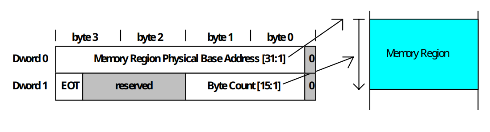

# 1. Indice

- [1. Indice](#1-indice)
- [2. DMA](#2-dma)
	- [2.1. Interazione con la _cache_](#21-interazione-con-la-cache)
		- [2.1.1. Politica `write-through`](#211-politica-write-through)
		- [2.1.2. Cache con politica `write-back`](#212-cache-con-politica-write-back)
		- [2.1.3. Letture](#213-letture)
		- [2.1.4. Scritture](#214-scritture)
		- [2.1.5. Scrittura di intere `cacheline`](#215-scrittura-di-intere-cacheline)
	- [2.2. Interazione con `MMU`](#22-interazione-con-mmu)
- [3. PCI Bus Mastering](#3-pci-bus-mastering)
	- [3.1. Interazione con le interruzioni](#31-interazione-con-le-interruzioni)
- [4. HD e DMA](#4-hd-e-dma)
	- [4.1. Bus Master IDE Command Register](#41-bus-master-ide-command-register)
	- [4.2. Bus Master IDE Status Register](#42-bus-master-ide-status-register)
	- [4.3. Descriptior Table Pointer register](#43-descriptior-table-pointer-register)
	- [4.4. Esempio](#44-esempio)
		- [4.4.1. Allineamento e Confini](#441-allineamento-e-confini)
		- [4.4.2. Inizializzare un PRD](#442-inizializzare-un-prd)

<div class="stop"></div>

# 2. DMA

Per trasferire una serie di informazioni alla memoria abbiamo visto fino ad ora due modalità:
- **A "controllo di programma"**: più veloce per quanto riguarda il trasferimento stesso, ma blocca la **CPU** per tutta la durata temporale tra il primo trasferimento e l'ultimo;
- **Tramite Interruzioni**: più lento, ma permette di utilizzare la **CPU** per eseguire altri _processi_ durante le attese tra un trasferimento e l'altro..

Per entrambe le modalità è previsto il coinvolgimento della **CPU**, che dovrà eseguire prima una _lettura_ (_registro_ pronti, **RAM** $\to$ **CPU**) e poi una scrittura (**CPU** $\to$ `IO`), comportando due scambi dati sul `bus`

La modalità `DMA` (_Direct Memory Access_) prevede invece che sia direttamente il dispositivo ad eseguire le operazioni di lettura o scrittura necessarie sulla **RAM**, **_senza coinvolgere la CPU_**.
Per fare ciò si dotano i dispositivi di un _software_ particolare che eseguirà in autonomia un trasferimento dati dal dispositivo verso un _buffer_ in **RAM** (ingresso/lettura) o viceversa (uscita/scrittura).

Supponiamo che il _buffer_ si trovi all'indirizzo `b` e sia grande `n` byte (comunicati al dispositivo), occupando quindi gli indirizzi `[b, b+n)`. Una volta ottenuti questi dati il dispositivo si preoccuperà di **eseguire autonomamente** le operazioni in **RAM**.

Ovviamente il dispositivo deve essere dotato di:
- un `sommatore` che gli permetta di calcolare da solo gli indirizzi necessari a partire da `b`
- un `contatore` che decrementi `n` ogni volta che è stato completato un trasferimento.

Quando tutti i byte sono stati trasferiti il dispositivo segnalerà l'informazione settando opportunamente un suo **registro di stato** (tipicamente generando un'_interruzione_).

<figure class="80">

<figcaption>

Struttura `DMA` dal punto di vista _hardware_ (rimuovendo temporaneamente _cache_, _MMU_ e _bus PCI_)
</figcaption>
</figure>

L'accesso alla **RAM** è arbitrato tramite i collegamenti `HOLD`/`HOLDA` fra dispositivo e **CPU**, che fanno da _handshake_.
Infatti poiché comunicano tutti sullo stesso _bus_ vogliamo che la comunicazione sia esclusiva, per evitare corse e più dispositivi che inviano dati in contemporanea.

La comunicazione si sviluppa così:
1. Il dispositivo mantiene normalmente i suoi piedini di uscita in `alta impedenza`
2. Ogni volta che il dispositivo vuole eseguire un trasferimento sul bus, attiva `HOLD`;
3. La **CPU** _termina l'eventuale trasferimento in corso_ (che può essere anche nel mezzo di una istruzione), mette i suoi piedini di uscita in _alta impedenza_ e attiva `HOLDA`;
4. Il dispositivo _attiva i suoi piedini di uscita_ ed esegue il trasferimento, quindi _rimette le uscite in alta impedenza_ e disattiva `HOLD`;
5. La **CPU** disattiva `HOLDA`, attiva i suoi piedini e riprende il suo normale funzionamento.

In pratica, la **CPU** si mette in attesa dando la precedenza al `DMA` nell'accesso al bus. Questa tecnica è chiamata _"cycle stealing"_, in quanto il `DMA` "ruba" cicli di bus alla **CPU**.

Questo porta un rallentamento nell'esecuzione delle istruzioni, poiché molte rischiano di andare in attesa per un tempo indeterminato nel caso in cui il `DMA` fosse sempre in accesso alla **RAM**.
Tuttavia il meccanismo resta vantaggioso in almeno tre casi:

1. Se la **CPU** è più lenta della **RAM**. Era comune negli _home computer_ degli anni '80, dove il `DMA` era utilizzato per trasferire i dati di una schermata dalla **RAM** alla _scheda video_ mentre la **CPU** eseguiva il programma che preparava la schermata successiva. Oggi questo caso è impensabile.

2. Se il trasferimento a controllo di programma non è abbstanza veloce per il dispositivo

3. Se il dispositivo deve trasferire i dati con più urgenza di quanto permesso dal meccanismo delle interruzioni

Gli utlimi due scenari possono verificarsi anche oggi, basta pensare ad alcune _schede di rete_  che possono ricevere o inviare decine di milioni di pacchetti al seconda a velocità di `200 Gbps`.

## 2.1. Interazione con la _cache_

<div class="grid2">
<div class="">

Se inseriamo la _cache_ notiamo subito che i segnali `HOLD`/`HOLDA` si collegano ora al **controllore cache**, in quanto è lui ad essere collegato al `bus` e non più la **CPU**.

Viene quindi introdotto un grande vantaggio:
> La **CPU**, statisticamente, può ora eseguire più istruzioni.
> Infatti parte delle istruzioi in memoria saranno probabilmente salvate proprio in _cache_ e non richiederanno un'accesso alla **RAM**.

Questo fatto provoca anche delle _**complicazioni**_.
Questi problemi nascono dal fatto che le operazioni del `DMA` potrebbero coinvolgere parti di **RAM** che erano state _**precedentemente copiate in cache**_.

</div>
<div class="">

</div>
</div>

Vediamo come gestire le comunicazioni a seconda che la _cache_ segua le politica `write-through` o la politica `write-back`.

### 2.1.1. Politica `write-through`

È il caso più semplice poiché all'inizio del trasferimento tutte le `cacheline` eventualmente presenti contengono lo stesso valore delle corrispondenti `cacheline` in **RAM**.
Questo implica che non ci sono problemi nel caso di operazione di _uscita su_ `DMA` (_lettura_), poiché i dati in **RAM** sono aggiornati coerentemente con le modifiche salvate nelle `cacheline`.

Nel caso di operazione di _ingresso in_ `DMA` (_scrittura_) invece dobbiamo assicurarci che **tutte le `cacheline` coinvolte nel trasferimento vengano rimosse dalla _cache_**, o che siano perlomeno aggiornate.

Esistono due metodi per poter risolvere questo problema, uno al livello _hardware_ e uno a livello _software_.

Nei processori _Intel_ la soluzione è risolta in `hardware`.
Si fa in modo che il _controllore cache_ **_osservi tutte le possibili sorgenti di scritture in RAM_** attraverso il bus condiviso, processo chiamato di _snooping_.
Se le linee di controllo identificano un operazione di _scrittura_, il controllore può usare il contenuto delle linee di indirizzo per eseguire una normale ricerca in _cache_, e **nel caso di `hit` invalidare in autonomia la corrispondente `cacheline`**.

Se il _controllore cache_ ricevesse in ingresso anche le linee di dati, allora potrebbe addirittura **aggiornare la** `cacheline` invece di invalidarla. Questa operazione si chiama _snarfing_ e non prevista nei processori _Intel_.

Nei sistemi `ARM` il problema è invece delegato al _software_, tramite istruzioni dedicate che permettono alla **CPU** di interagire direttamente con il _controllore cache_ e invalidarne le `cacheline`.
Il _software_  dovrà quindi eseguire tutte le istruzioni specificando l'intervallo `[b, b+n)` (allineato opportunamente alle _cacheline_) **_subito dopo che il trasferimento sia terminato_**, così da poter manualmente invalidare gli indirizzi.


### 2.1.2. Cache con politica `write-back`

In questa politica le scritture della **CPU** vengono mantenute soltanto in _cache_ e effettuate in maniera _sincrona_ in secondi momenti (come quando la `cacheline dirty` verrebbe sovrascritta).
Le `cacheline ~dirty` invece continuano a contenere _le stesse informazioni_ della **RAM**.

Questa politica comporta un problema sia nelle operazioni di _uscita_ su `DMA`, poiché il buffer di lettura in **RAM** **potrebbe contenere memoria non aggiornata**, sia per le operazioni di _entrata_ in `DMA`, dove la faccenda è più complessa.
Infatti, nelle _scritture_, il `DMA` potrebbe andare a modificare **_solo una parte della `cacheline dirty`_**, perciò la mera _invalidazione_ porterebbe a perdere le modifiche effettuate sulle parti di `cacheline` non comprese nel _buffer_.


### 2.1.3. Letture

Concentriamoci intanto sull'_uscita_, ovvero le _letture_.

Per risolvere possiamo utilizzare la tecinca di _snooping_, ma in questo caso il _controllore cache_ **_deve implementare lo snarfing per le cacheline dirty_**.
Nei processori dove lo _snarfing_ non è previsto il protocollo di accesso alla **RAM** viene modificato in modo che si svolga in più fasi, la prima comune a tutti:

1. Il `DMA` comunica al _controllore cache_ gli indirizzi a cui vuole accedere e quest'ultimo risponde con il segnale di `hit`/`miss` e l'eventuale stato del bit `dirty`.

Vi possono essere quindi più seconde fasi:
- `miss || (hit && ~dirty)`: allora si procede normalmente con l'accesso in **RAM** come visto per il `write-through`

- `hit && dirty`: il `DMA` interrompe la richiesta, passando il controllo alla _cache_, che effettua la `write-back` in **RAM**.
  Si può poi proseguire in due modi:
  - Terminato il `write-back`, _controllore cache_ restituisce il controllo al `DMA` che reinizializza la lettura dei dati ottenendo adesso dati corretti dalla `RAM`
  - Mentre il _controllore cache_ comunica le informazioni il `DMA` fa _snooping_ con _snarfing_.

### 2.1.4. Scritture

Anche per le operazioni di _entrata_ (_scrittura_) la struttura è simile.
Il primo passo è il medesimo delle letture, successivamente anche qui ci possono essere più seconde fasi:

- `miss`: si procede normalmente con l'accesso in **RAM**

- `hit && ~dirty`: si invalida la `cacheline` e si prosegue normalmente

- `hit && dirty`: si possono percorrere più strade:
  - Se il `DMA` sovrascrivesse un'intera `cacheline` è sufficente invalidarla e scrivere direttamente in **RAM** (_Write and Invalidate_)
  - Altrimenti abbiamo due possibilità:
    - Il `DMA` lascia il controllo al _controllore cache_ per fargli eseguire il `write-back` in **RAM**, quindi riesegue la sua operazione di scrittura
    - Il _controllore cache_ trasmette la `cacheline dirty` <u>solamente al <code>DMA</code></u>, invalidando successivamente la propria copia.
  	  Il `DMA` lavora quindi sui dati forniti dal _controllore cache_, e procede scrivendo in **RAM** l'intera `cacheline` aggiornata.

Nella soluzione interamente _software_, la politica più comune è quella di **_invalidazione senza write back_**. COnsiste nell'esegiuire sempre il `write-back` di un certo intervallo di indirizzi (quelli del _buffer_) **_prima di avviare il trasferimento_**, invalidandoli successivamente.

### 2.1.5. Scrittura di intere `cacheline`

Nel caso della scrittura su intere `cacheline` la struttura del _buffer_ `[b, b+n)` vista dalla _cache_ sarà la seguente:
- Prima sezione da `[b, finePrimaCacheline)`
- Intere sezioni di `cacheline`
- `[inizioUltimaCacheline, n)`

Per le sezioni intermedie è possibile fare _Write and Invalidate_ mentre, per quelle iniziali e finali il `DMA` potrà utilizzare normali scritture con _snooping_.

Anche nel caso puramente _software_ la sovrascrittura di intere `cacheline` può essere ottimizzata, grazie all'istruzione di _invalidazione senza write-back_.
Questa istruzione deve comunque essere effettuata all'inizio del trasferimento, per evitare il `write-back` di eventuali `cacheline dirty` sovrascrivendo porzioni di memoria che erano state già modificate dal `DMA` e che non volevamo modificate.

## 2.2. Interazione con `MMU`

La `DMA` può utilizzare **_soltanto indirizzi fisici_**, infatti non interagisce con la `MMU`.
Tuttavia il _software_ utilizza **_soltanto indirizzi virtuali_** `[b, b+n)`.

Sono quindi necessari i seguenti accorgimenti per integrare `DMA` e `MMU`:
1. Al `DMA` andrà comunicato l'indirizzo **fisico** `f(b)` e non quello _virtuale_ `b`
2. Se l'intervallo `[b, b+n)` attraversa **più pagine non tradotte in _frame_ contigui**, il trasferimento _**deve essere spezzato in più trasferimenti in modo che ciascuno di essi coinvolga solo <u>frame contigui</u>**_.
3. La traduzione degli indirizzi coinvolti in un trasferimento **_non deve cambiare mentre il trasferimento è in corso_**

Considerando il punto _1._, comunicando `b` il `DMA` lo utilizzerebbe come fisico, accedendo a parti di memoria che non centrano niente con il _buffer_ (tranne nei rari casi dove `b = f(b)`).

<div class="grid2">
<div class="">

Per il punto _2._ ipotizziamo invece il caso sulla destra.

Se comunicassimo `f(b)` ed `n`, il `DMA` scriverà su `[f(b), f(b) + n)`, invadendo `F2` con effetti disastrosi.

Quello che vogliamo noi è invece l'intervallo fisico `[f(b), f(b+n))`.
Per poterlo modificare opportunamente il trasferimento, in questo caso, **deve essere spezzato in due parti**:
- `[f(b), fineF1)`
- `[inizioF3, f(b)+n)`.

</div>
<div class="">


</div>
</div>

Per il punto _3._ immaginando quindi di trovarci in un _sistema multiprocesso_ che realizzi _swap-in/out_ dei processi per poter eseguire più processi di quanti ne possano entrare in **RAM**.
Supponiamo quindi che un processo `P1` avvii un trasferimento in `DMA` attraverso un _buffer privato_. È quindi necessario che `P1` **<u>non venga mai <em>swappato</em></u>**, altrimenti in quegli indirizzi subentrerebbe un processo `P2` che vedrebbe la sua memoria privata modificata.

# 3. PCI Bus Mastering

<div class="grid2">
<div class="">

Un'esempio di architettura con `bus PCI` è quella nell'immagine sulla destra.

In questo caso, tra le periferiche, l'unica collegata al _bus principale_ è il `ponte ospite-PCI`. In questa architettura, è proprio lui a pilotare i fili `HOLD`/`HOLDA` collagati alla _cache_.

Avevamo già detto quando abbiamo visto il `bus PCI` che **diversi dispositivi** possono agire da `bus master` ed effettuare trasferimento dati.

Vediamo quindi in particolare come i `bus master` effettuano trasferimenti da e verso la **RAM**.

Per essere precisi, in realtà i `bus master` inizializzano il trasferimento verso il `ponte` non direttamente verso la **RAM**. È infatti quest'ultimo che poi reindirizza i dati alla **RAM**.

Poiché diversi dispositivi possono agire da `bus master` dobbiamo prevederne _un coordinamento_, affinché non possano entrare in comunicazione tutti insieme.
Introduciamo quindi un `arbitro`, un ulteriore dispositivo (spesso integrato nel `ponte` stesso) che gestisce tramite _handshake_ tutte le richieste di trasferimento.
Quando un `bus master` vuole iniziare una richiesta invia il segnale di `REQ` all'`arbitro`.
Appena è il suo turno l'`arbitro` invia un segnale chiamato di _grant_ `GNT` o segnale di _acknowledge_ `ACK`.

Per ottimizzare i tempi, l'_arbitraggio_ può verificarsi mentre è ancora in corso una precedente transazione.
Infatti il dispositivo che ottiene `GNT`, prima di iniziare la propria transazione, necessita comunque che sia `FRAME#` che `IRDY#` siano disattivati, ovvero che il **_bus sia libero_**. Perciò rimarrà in attesa finché la precedente operazione non sarà terminata.
I dispositivi si metteranno quindi autonomamente in coda e partiranno opportunamente e verrano eseguiti immediatamente al termine della transazione in corso.

Le informazioni vengono quindi passate attraverso l'`arbitro` al `ponte`, che poi si occuperà di trasferirle al destinatario sul `bus principale`.

Nonostante il trasferimento avvenga quindi in _asincrono_, il `ponte` invia comunque un segnale di **trasferimento completato** al `bus master` che si occupa delle operazioni <u>nel momento della ricezione in locale delle informazioni</u>.
Questo permette infatti di ottimizzare i tempi, facendo iniziare un nuovo ciclo di ricezione/scrittura dati, anche quando in realtà le informazioni sono ancora contenute solamente in locale al `ponte`.
Questa tipo di gestione delle informazioni viene chiamata **_bufferizzazione_**.
</div>
<div class="">


</div>
</div>


## 3.1. Interazione con le interruzioni

Il problema di interazione tra `bus mastering` e _interruzioni_ sorge proprio per via della _bufferizzazione_.

Il `bus master` invia infatti `EOI` all'`APIC` nel momento in cui il `ponte` gli comunica che ha ricevuto l'ultimo pacchetto di dati.
Non è però detto che le informazioni siano ancora state caricate in **RAM** quando il processore gestirà l'_interruzione_ sollevata dall'`APIC`.

Esistono diverse soluzioni a questo problema, una puramente _software_ può essere **_provare a leggere un registro della periferica che si è occupata del trasferimento_**.
Questa lettura verrà infatti accodata alle altre in attesa sul `ponte` che si riferiscono al medesimo _dispositivo_.
Il `ponte` quindi _prima terminerà il trasferimento dei dati in_ **RAM**, e solo successivamente riuscirà a compiere la lettura del registro.
Tramite questa lettura, che di per se non ci interssa nel contenuto, siamo invece sicuri che la scrittura in **RAM** è stata completata, e che quindi possiamo andare a recuperare i dati.

La _Intel_ ha invece proposto una soluzione _hardware_ che collega il `ponte` all'`APIC` attraverso un _handshake_.
L'`APIC`, quando riscontra una richiesta di interruzione, prima di inviare il segnale alla **CPU** richiede un segnale di `ACK` al `ponte`.
Quest'ultimo lo fornirà **_solamente quando ha trasferito tutti i dati che contiene fino a quel momento_**.

Un ultima soluzione moderna prevede invece che le richieste di interruzione non viaggino su linee separate, ma **_siano inoltrate come speciali transazioni sul bus `PCI` stesso_**, sotto forma di scritture a particolari indirizzi chiamati **_Message Signaled Interrupts_**. Poiché prima che la richiesta di interruzione arrivi, il buffer del `ponte` dovrà essere svuotato dai precedenti contenuti, si risolve anche in questo modo il problema delle corse.

# 4. HD e DMA

Vediamo un esempio pratico di un dispositivo in grado di effettuare `DMA`, ovvero l'`HD`.

Dobbiamo però considerare che l'`HD` che abbiamo a disposizione operava il `DMA` sul vecchio `PC AT`. Dobbiamo quindi fornirgli un _controllore DMA_ aggiuntivo che si occupi di effettuare i controlli descritti fin'ora per poter trasferire i dati.

Nei calcolatori con bus `PCI` il _controllore DMA_ non è più presente, poiché il suo ruolo è stato delegato ad un `ponte PCI-SATA`.
Il `ponte PCI-SATA` si comporta infatti da `bus master` sostituendo a tutti gli effetti il _controllore DMA_.
L'`HD` si preoccupa quindi di comunicare con il `ponte` come se questo fosse il controllore. Il `ponte` dal suo canto, trasferisce i dati sul `PCI` in meniera coerente con le regole del _bus_.

Tutte le operazioni che sono descritte in seguito sono presenti nelle **specifiche del nucleo**, in particolare nella sezione `3.1`.
Le specifiche della programmazione dei `Bus Master IDE Controller` si può trovare invece [a questo link](https://calcolatori.iet.unipi.it/deep/idems100.pdf).

L'interfaccia implementa un meccanismo di _scatter/gather_ che permette il trasferimento di grandi blocchi che dovranno essere sparsi/raccolti dalla memoria, utilizzando di fatto **_buffer_ discontigui**.
Grazie a questo meccanismo è possibile diminuire il numero di _interrupt_ al sistema.

Per fornire informazioni sul _buffer_ al controllore è necessario creare un `PRD` (_Physical Region Descriptor_) che ha la seguente forma:



La funzione `bus master IDE` utilizza `16Byte` dello spazio di `I/O`, accessibili come `Byte`, `Word` o `Dword`.

I registri a disposizione sono i seguenti:<small>(`R/W` sono diritti in lettura e scrittura. `RWC` sono diritti in lettura e azzeramento del contenuto)</small>

<div class="flexbox" markdown="1">

| Offset        | Registro                                        | Diritti di Accesso |
| ------------- | :---------------------------------------------- | ------------------ |
| `0x00`        | Registro di comando Bus Master IDE Primario     | `R/W`              |
| `0x01`        | Specifico del dispositivo                       |                    |
| `0x02`        | Registro di stato Bus Master IDE Primario       | `RWC`              |
| `0x03`        | Specifico del dispositivo                       |                    |
| `0x04 - 0x07` | Indirizzo tabella PRD Bus Master IDE Primario   | `R/W`              |
| `0x08`        | Registro di comando Bus Master IDE Secondario   | `R/W`              |
| `0x09`        | Specifico del dispositivo                       |                    |
| `0x0A`        | Registro di stato Bus Master IDE Secondario     | `RWC`              |
| `0x0B`        | Specifico del dispositivo                       |                    |
| `0x0C - 0x0F` | Indirizzo tabella PRD Bus Master IDE Secondario | `R/W`              |

</div>

La specifica ci fornisce anche le regole che il dispositivo deve seguire:

<div class="grid2">
<div class="top">

## 4.1. Bus Master IDE Command Register

- Nome del registro: `Bus Master IDE Command Register`
- Offset dell'indirizzo:
  - Canale principale: `base + 0x00`
  - Canale Secondario: `base + 0x08`
- Valore di _default_: `0x00`
- Attributi: `R/W`
- Dimensione: `8bits`

<div class="flexbox" markdown="1">

| Bit   | Descrizione                                                                             |
| ----- | :-------------------------------------------------------------------------------------- |
| `7:4` | **Riservati**. Devono restituire `0` in lettura.                                        |
| `3`   | Controllo di lettura o scrittura: `0` per le letture, `1` per scritture.                |
| `2:1` | **Riservati**. Devono restituire `0` in lettura.                                        |
| `0`   | Avvia/Arresta Bus Master: Portato ad `1` per abilitare il funzionamento del bus master. |

</div>
</div>
<div class="top">

## 4.2. Bus Master IDE Status Register

- Nome Registro: `Bus Master IDE Status Register`
- Offset:
  - Canale Principale: `base + 0x02`
  - Canale Secondario: `base + 0x0A`
- Valore di _default_: `0x00`
- Attributi: `R/W`, `Clear`
- Dimensione: `8bits`

<div class="flexbox" markdown="1">

| Bit   | Descrizione                                                                                                       |
| ----- | :---------------------------------------------------------------------------------------------------------------- |
| `7`   | Solo simplex: Indica se i canali primario e secondario possono operare contemporaneamente (`0`) o no (`1`).       |
| `6`   | Drive 1 DMA Capable: Indica che il drive 1 è capace di trasferimenti DMA e che il controller è ottimizzato.       |
| `5`   | Drive 0 DMA Capable: Indica che il drive 0 è capace di trasferimenti DMA e che il controller è ottimizzato.       |
| `4:3` | Riservati. Devono restituire 0 in lettura.                                                                        |
| `2`   | Interrupt: Indica che il dispositivo IDE ha sollevato un'interruzione. Si azzera scrivendo `1`.                   |
| `1`   | Errore: Indica un errore nel trasferimento dati. Si azzera scrivendo `1`.                                         |
| `0`   | Bus Master IDE Active: Indica che il bus master è attivo. Si azzera al termine del trasferimento o scrivendo `0`. |

</div>

</div>
</div>

## 4.3. Descriptior Table Pointer register

- Nome Registro: `Descriptor Table Pointer Register`
- Offset:
	- Canale Principale: `base + 0x04`
	- Canale Secondario: `base + 0x0C`
- Valore di _default_: `0x00000000`
- Attributi: `R/W`
- Dimensione: `32bits`

<div class="flexbox" markdown="1">

|  Bit   | Descrizione                                                          |
| :----: | :------------------------------------------------------------------- |
| `31:2` | Indirizzo _base_ della `Descriptor Table`, corrispondono a `A[31:2]` |
| `1:0`  | Riservati                                                            |

</div>

La `Descriptor Table` deve essere allineata a `Dword`, e **non deve superare il limite di `64KB` in memoria**.


## 4.4. Esempio

Esaminiamo quindi un esempio di lettura di una porzione dell'`HD`:
```cpp
namespace bm{
	ioaddr iBMCMD;		// Command Register
	ioaddr iBMSTR;		// Status Register
	ioaddr iBMDTPR;		// Descriptor Table Pointer Register
	//....
}
using namespace bm;

int main (){
  	natb nn = BUFSIZE / 512;
  	natb lba = 0;
  	natb bus = 0, dev = 0, fun = 0;

  	vid::clear(0x0f);
  	if(!bm::find(bus,dev,fun)){
  		printf("bm non trovato!\n");
  	  	pause();
  	  	return 0;
  	}
  	printf("PCI−ATA at %2x:%2x:%2x\n", bus, dev, fun);
  	bm::init(bus, dev, fun);
  	// ...
```

Dobbiamo innanzitutto trovare il ponte tra i dispositivi `PCI` installati.
Dalle specifiche ricaviamo che i primi due byte del _Class Code_ del ponte devono valere `0x0101` (sezione 5 punto 1).
Il _Class Code_ è il campo di `3Byte` all'offset `9` dello spazio di configurazione `PCI`.

La funzione `bm::find()` cerca dunque il primo dispositivo che contenga `0x0101` nella `word` all'_offset_ `10`.

```cpp
bool bm::find(natb& bus, natb& dev, natb& fun) {
	natb code[] = { 0xff, 0x01, 0x01 };

	do {
		if (pci::find_class(bus, dev, fun, code) && (code[0] & (1U << 7)))
			return true;
	} while (pci::next(bus, dev, fun));

	return false;
}
```

Le specifiche ci dicono inoltre che l'indirizzo base dei registri del ponte è controllato dalla `BAR`, che si trova all'_offset_ `36` (sezione 5 punto 2).
Inoltre, sempre nelle specifiche, è indicato che i registri si trovano nello spazio di `I/O` agli offset `0`, `2` e `4` rispetto alla base.

```cpp
void init(natb bus, natb dev, natb fun)	{
	natl base = pci::read_confl(bus, dev, fun, 0x20);
	// Azzeriamo il bit meno significativo poiché siamo nello spazio di `I/O`.
	base &= ~0x1;

	iBMCMD  = (ioaddr)(base + 0x00);
	iBMSTR  = (ioaddr)(base + 0x02);
	iBMDTPR = (ioaddr)(base + 0x04);

	// Settiamo i bit 0 e 2 nel registro `Command` per abilitare il ponte
	//  per le transazioni di I/O e a operare in bus mastering
	natw cmd = pci::read_confw(bus, dev, fun, 4);
	pci::write_confw(bus, dev, fun, 4, cmd | 0x5);
}
```
Otteniamo così la fase e possiamo ottenere gli indirizzi dei tre registri sommandovi gli _offset_.

Vediamo il continuo del codice:
```cpp
  	//...
  	apic::set_VECT(14, HD_VECT) ;
  	gate_init(HD_VECT, a_bmide);
  	apic::set_MIRQ(14, false);
	//...
```

Nelle prime due righe associamo la funzione `a_bmide()` al piedino `14` dell'`APIC`, tramite il tipo `HD_VECT`.

Lo scopo di questa funzione è di invocare `c_bmide()`:
```cpp
extern "C" void c_bmide(){
	done = true;
	bm::ack();
	hd::ack_intr();
	apic_send_EOI();
}
```
```c
void ack() {
	natb work = inputb(iBMCMD);
	work &= 0xFE;
	outputb(work, iBMCMD);
	inputb(iBMSTR);
}
```

Il _driver_ dovrà quindi solamente farci sapere quando l'operazione è conclusa ponendo la variabile globale `done` a `true`, dichiarando diverse variabili:

```cpp
volatile bool done = false;
extern char vv[];
const natl BUFSIZE = 65536;
extern natl prd[];
extern "C" void a_bmide();
```

Il contenuto degli `nn` settori deve essere scritto in `vv`, dichiarato in `Assembler` per motivi che vediamo dopo.

```x86asm
#include <libce.h>
.text
	.global a_bmide
	.extern	c_bmide
a_bmide:
	salva_registri
	call c_bmide
	carica_registri
	iretq

.data
.balign 4
.global prd
prd:	.fill 16384, 4

.balign 4
.global vv
vv:		.fill 65536, 1
```

Per verificare che il contenuto di `vv` cambierà senza che il nostro programma vi ci scriva direttamente, lo inizializziamo con i caratteri `'-'`.

```cpp
	//...
	for(int i = 0; i < BUFSIZE; i++)
		vv[i]='−';

	printf("primi 80 caratteri di vv:\n");
	for(int i = 0; i < 80; i++)
		charwrite(vv[i]);

	printf("ultimi 80 caratteri di vv:\n");
	for(int i = BUFSIZE − 80; i < BUFSIZE; i++)
		charwrite(vv[i]);
	//...
```

Quando l'operazione di `Bus Mastering` sarà conclusa dovremo trovare che questi caratteri sono stati sostituiti con i byte letti dall'`HD` della macchina virtuale, con un numero sufficente di caratteri `'@'`.

Per scrivere nell'`HD` i `64k` caratteri che poi dovranno essere letti si utilizza il seguente comando:
```sh
perl -e 'print "@"x65536' | dd of=~/CE/share/hd.img conv=notrunc
```

Il comando prima della _pipe_ stampa i caratteri, quello dopo li scrive nel file a partire dall'inizio e senza cambiarne le dimensioni.

```cpp
	//...
	prd[0] = reinterpret_cast<natq>(vv) ;
	prd[1] = 0x80000000 | ((nn * 512) & 0xFFFF);
	bm::prepare(reinterpret_cast<natq>(prd), false);
	hd::enable_intr();
	hd::start_cmd(lba, nn, READ_DMA);
	bm::start();
	printf("aspetto l'interrupt ...\n");
	while(!done)
		;

	printf("primi 80 caratteri di vv:\n");
	for(int i = 0; i < 80; i++)
		charwrite(vv[i]);

	printf("ultimi 80 caratteri di vv:\n");
	for(int i = BUFSIZE − 80; i < BUFSIZE; i++)
		charwrite(vv[i]);

	pause();
}
```

Il resto del programma segue abbastanza da vicino lo schema suggerito nella sezione `3.1` delle specifiche:
1. Prepara la tabella dei `PRD`

2. Nella funzione `bm::prepare()` scriviamo l'indirizzo di partenza nel registro chiamato `BMDTPR`, scegliendo il trasferimento **_verso la memoria_**, azzerando i bit di `Interrupt` e `Error` nel _registro di stato_:
```cpp
void bm::prepare(natq prd, bool write){
	outputl(prd, iBMDTPR);
	natb work = inputb(iBMCMD);

	if(write)
		work &= ~0x8;
	else
		work |= 0x8;

	outputb(work, iBMCMD);
	work = inputb(iBMSTR);
	work |= 0x6;
	outputb(work, iBMSTR);
}
```

3. Programmiamo il controllore dell'`HD` per il trasferimento in `DMA` usando la stessa funzione `hd::start_cmd()` già utilizzata per i normali trasferimenti di lettura e scrittura, con la differenza che nel registro `CMD` **abilitiamo il controllore a inviare ricieste di interruzione**

4.  Nella funzione `bm::start()` avviamo anche il ponte, ponendo a `1` lo `Start Bit` nel registro `BMCCMD` (`2.1`)
```cpp
void bm::start(){
	natb work = inputb(iBMCMD);
	work |= 1;
	outputb(work, iBMCMD);
}
```

5. Le azioni in questo punto sono svolte **dal ponte e dal controllore**

6. Aspettiamo quindi che arrivi l'_interruzione_

7. Le azioni da qui descritte sono svolte direttamente dal _driver_ `c_bmide()` tramite `bm::ack()`.
   Inoltre il driver _disabilita ulteriori richieste di interruzione_ da parte del controllore (anche se non strettamente necessario).

### 4.4.1. Allineamento e Confini

Alla fine della sezione `1.2` delle specifiche troviamo una nota:
> Le regioni di memoria specificate tramite i `PRD` **non devono trovarsi a cavallo dei confini di `64KiB`**.

Quello che accade se si attraversano questi confini può avere esiti disastrosi.
Infatti, il sommatore del `ponte PCI-ATA` potrebbe essere di _soli `16bit`_, e quindi, dato l'indirizzo `0x1122FFFF`, passerà poi all’indirizzo `0x11220000` invece che a `0x11230000`.

Nell'esempio precedente per vedere questo comportamento è sufficente modificare le seguenti righe:
```cpp
	nn = BUFSIZE / 12;
	// ...

	// Prima dell'attesa
	char *buf = (char *)((natq)&vv & 0xFFFFFFFFFFFF0000);
	printf("80 byte all'indirizzo %p\n", buf);
	for (int i = 0; i < 80; i++)
	      vid::char_write(buf[i]);
	// ...

	// Dopo l'attesa
	printf("80 byte all'indirizzo %p\n", buf);
	for (int i = 0; i < 80; i++)
	      vid::char_write(buf[i]);
```

Abbiamo sostanzialmente due modi per risolvere il problema:
- Allineare il _buffer_ modificando nel file `assembly` la riga `.balign 65536` prima della dichiarazione di `vv:`
- Eseguire più trasferimenti distrinti, in modo che nessuno attraversi un confine

### 4.4.2. Inizializzare un PRD

Immaginiamo di avere il buffer `vv` di dimensione `n`. `vv` potrebbe iniziare in una pagina, senza riempirla tutta.
Le successive sezioni del _buffer_ completano le pagine nelle quali si trovano.
Potrebbe inoltre capitare che l'ultima sezione termini non in corrispondenza della fine di una _pagina_, ma anch'essa nel mezzo.
Per fare ciò:

```cpp
ioaddr iBMPTR,	///< Indirizzo del buffer di destinazione
	   iBMLEN,	///< Numero di byte da trasferire
	   iCMD;	///< Registro di comando

paddr f, g;
char* vv;
int totali, rimanenti;

natl mutex = sem_ini(1);
// Suppongo che chi scrive i frame faccia una `sem_signal`
//  quando il frame è stato caricato
natl sync = sem_ini(0);

char* tmp = vv;
while(totali > 0){
	f = trasforma(tmp);

	if(tmp & 0x1){
		flog(ERROR_LOG, "indirizzo fisico di una pagina di vv dispari");
		return 0;
	}

	// g primo indirizzo della pagina successiva
	g = limit(f)

	// Dimensione della porzione da trasmettere
	rimanenti = g - f;

	// Se siamo alla fine
	if(rimanenti > totali){
		rimanenti = totali;
	}

	sem_wait(mutex);
	sem_wait(sync);

	tmp = g;
	totali -= rimanenti;

	outputl(f, c->iBMPTR);
	outputl(rimanenti, c->iBMLEN);
	outputl(1, c->iCMD);

	sem_signal(mutex);
	}
```