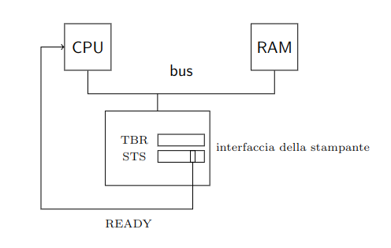

<link rel="stylesheet" type="text/css" href="./assets/style.css">

# 1. Indice

- [1. Indice](#1-indice)
- [2. Interruzioni](#2-interruzioni)
	- [2.1. Interruzioni a più sorgenti - APIC](#21-interruzioni-a-più-sorgenti---apic)
		- [2.1.1. Gestione più richieste](#211-gestione-più-richieste)
		- [2.1.2. Gestione corretta delle routine](#212-gestione-corretta-delle-routine)

# 2. Interruzioni

Il processore lavora su un flusso di controllo, determinato esclusivamente e univocamente da software.

Il programmatore però potrebbe utilizzare un modello di programmazione diverso, in grado di associare i programmi a degli **eventi**.
Questi eventi sono un numero finito e ben stabilito, ed il programmatore vi può associare una _propria routine_.

Vorremmo quindi che il processore, anche mentre sta eseguendo un programma `p`, stia sempre in ascolto per gli eventi con routine. Nel momento in cui l'evento viene generato, il processore **dovrebbe mettere in pausa l'esecuzione di `p` per gestire la _routine_ dell'evento**.
Una volta terminata la _routine_, vorremmo che l'esecuzione di `p` riprenda da dove si è interrotta.

Uno dei primi a studiare questo aspetto è stato _Dijsktra_, con il seguente problema:

Ipotizziamo di avere una tabella contenente due indici:
- Nel primo si trova un numero $x$ crescente
- Nel secondo si trova il valore di una funzione $f(x)$ calcolata sul valore di $x$ attuale.

Vorremmo che venissero stampati le coppie valore $x$-$f(x)$.
<div class="flexbox"><span class="">

|   $x$    | $f(x)$ |
| :------: | :----: |
|   0000   |  ....  |
|   0001   |  ....  |
|   0002   |  ....  |
|   0003   |  ....  |
| $\vdots$ |  ...   |

</span></div>

La stampa degli elementi è gestita  tramite una stampante con due registri:
- `TBR`: contiene il valore di $f(x)$
- `STS`: _handshake_, contiene un flag che indica che la stampa di $f(x)$ è avvenuta con successo e si può inserire un nuovo valore in `TBR`.

Un approccio al problema potrebbe essere questo:
1. Calcolo $f(x_1)$
2. Lo inserisco nella stampante
3. Attendo che la stampa avvenga spettando `checkFlag()`
4. Calcolo $f(x_2)$
5. ...

Questo approccio però perde del tempo durante l'attesa di `chechFlag()`.
In particolare potremmo utilizzare questo tempo per precalcolare le $f(x_i)$ successive.

Un'opzione che potremmo utilizzare è quello di controllare `checkFlag()` più volte all'interno del programma:
<div class="grid2">
<div class="top">
<p class="p">Troppo Raro</p>

```cpp
checkFlag();
for(int i = 0; i < 1000000; ++i)
    a += i;
checkFlag();
```
</div>
<div class="top">
<p class="p">Troppo Spesso</p>

```cpp
for(int i = 0; i < 1000000; ++i){
    checkFlag()
    a += i;
}
```
</div>
</div>

Implementiamo quindi una modifica **<u>hardware</u>** che ci permetta poi di implementare le _routine_ degli eventi in _software_.

<div class="grid2">
<div class="">


Quello che possiamo fare per supportare gli eventi di questa interfaccia è collegare fisicamente il bit della stampante alla **CPU** e aggiungere una $\mu$-istruzione che controlla il bit al termine di ogni istruzione.

Essendo solo un evento, il programmatore ha la possibilità di scrivere un programma che personalizzi la _routine_, utilizzando un indirizzo di memoria _dedicato_.
</div>
<div class="">

</div>
</div>


Il comportamento è alquanto basilare:
>Nel caso in cui la $\mu$-istruzione verifichi `FLAG == 1` il processore salta alla routine e la esegue per poi resettare il bit in `STS`.

Nel caso della stampa però dobbiamo fare delle precisazioni:
- Se il $\mu$-programma resettasse `READY` e basta, si entrerebbe in _loop_.
  Questo accadrebbe perché `TBR` non verrebbe mai di fatto aggiornato tra una stampa e l'altra.
- Il processore vede continuamente il segnale `READY` come settato ricevendo di fatto infinite richieste, quando in realtà vogliamo solamente una richiesta singola.

<div class="grid2">
<div class="">

Per rimediare a questi problemi è sufficente inserire un **generatore di impulsi** e un **`FF-SR`** che verrà resettato quando la richiesta sarà stata già presa in **attenzione**.
</div>
<div class="">

</div>
</div>

Per quanto riguarda la gestione delle interruzioni durante _routine_, nel processore _intelx86_ esiste un **flag aggiuntivo** in `RFLAG`, chiamato `IF` (_Interact Flag_). Se il bit è resettato, il processore **non accetta nuove richieste** finché non ha terminato quella attuale. Per poterlo manipolare esistono due istruzioni:
- `STI` (_SeT Interact flag_)
- `CLI` (_CLear Interact flag_).


Quando il processore _accetta un'interruione_ salva nella pila
- `RIP` per capire dove tornare al termine della routine
- `RFLAG` per poter poi ripristinare i flag come se la routine non fosse mai avvenuta.

Nelle routine ci sono alcune regole da seguire:
1. Ricordarsi di settare e resettare correttamente `IF` tramite le istruzioni `STI` e `CLI`
1. Utilizzare l'istruzione `IRETq` piuttosto che `RET`. `IRETq` ripristina `RFLAG` e altri registri prima di ripristinare `RIP`.

## 2.1. Interruzioni a più sorgenti - APIC

Nella macchine moderne ci sono tantissimi eventi supportati, noi ne vedremo solo alcuni.
In particolare, nella macchina `QEMU` che studiamo abbiamo tre interfacce che generano eventi:
- **Tastiera**: presenza di un nuovo valore non letto in `RBR`
- **Timer**: segnali generati dal contatore `0` quando si azzera per  richieste temporizzate
- **HD**: presenza di un nuovo valore non letto nel buffer interno/scrittura dei nuovi valori completata.

<div class="grid2">
<div class="">

Per gestire tutte le richieste viene introdotto una nuova componente, detto **_Controllore delle Interruzioni_** `APIC` (_Advanced Programmable Interrupt Controller_).

Il _controllore_ è collegato alle periferiche tramite tre fili, ognuna collegata ad un piedino noto, in particolare quelli a noi rilevanti sono:
- **Tastiera** $\harr$ `1`
- **Timer** $\harr$ `2`
- **Hard Disk** $\harr$ `14`

Quando uno di questi segnali viene settato l'`APIC` invia alla **CPU** un segnale tramite un suo registro interno chiamato `INTR` (_INTervall Request_), inizializzando un _handshake_.

Per permettere di capire chi è la sorgente del segnale, **<u>il programmatore</u>** associa ad ogni piedino del controllore `APIC` un _tipo_, ovvero una codifica su `8bit`.

Nel momento in cui la **CPU** accetta la richiesta, si prepara inviando il segnale di _handshake_ tramite il filo `INTA`: _INTervall Acknowledge_.

Successivamente l'`APIC` carica il tipo sul _bus_ così che la **CPU** lo possa leggere.

</div>
<div class="">

</div>
</div>

Affinché tutto questo funzioni, la **CPU** ha un suo registro interno chiamato `IDTR` (_Interact Descriptor Table Register_) che ha salvato l'indirizzo della `IDT` salvata in memoria.
La `IDT` è una tabella che ha per ogni riga delle informazioni, tra le quali:
- _Indirizzo della routine_ dove saltare
- Flag per capire se la **CPU** deve disabilitare `IF` o meno durante la _routine_.

`IDT` **deve essere allocata dal programmatore**, e ogni sua riga viene identificata dal _tipo_ che il programmatore ha precedentemente dato ai piedini di `APIC`.

Da software questo si fa con i seguenti comandi:
```cpp
#include<libce.h>

namespace kbd {

	const ioaddr iCMR = 0x64;
	const ioaddr iTBR = 0x60;

	void enable_intr()
	{
		outputb(0x60, iCMR);
		outputb(0x61, iTBR);
	}

	void disable_intr()
	{
		outputb(0x60, iCMR);
		outputb(0x60, iTBR);
	}

}
```
```cpp
const natb KBD_VECT = 0x40;             // Valore di Esempio

apic::set_VECT(1, KBD_VECT);		// Scelgo il valore 0x40 per il piedino 1 (associato alla tastiera)
gate_init(KBD_VECT, tastiera);		// Associo la funzione tastiera() al tipo 0x40
apic::set_MIRQ(1, false);		    // Azzera la maschera affinché non vengano accettate nuove interruzioni durante quelle in esecuzione
kbd::enable_intr();		        	// Permetto alla tastiera di generare segnali di interruzione
```

Il comando `gate_init()` ha un terzo parametro settato di default su `false`, che imposta `IF = 0` durante le _routine_, affinché non possano essere interrotte. Se volessimo invece che una _routine_ possa essere interrotta, dobbiamo impostarlo esplicitamente a `true`.

Per capire se c'è una nuova richiesta o meno, si utilizza un metodo software chiamato **controllo su Livello**.
Questo tipo di controllo fa in modo che `APIC`, dopo aver inviato una richiesta, guardi nuovamente i piedini **<u>solo dopo aver ricevuto il segnale di gestione completata dell'interruzione</u>**.
Per inviare questo segnale il _software_ utilizza il registro `EOI` (_End Of Interrupt_) di `APIC`.

È importante che questo `bit` venga settato **quando tutta la routine è terminata** e non c'è altro da fare, per evitare comportamenti indesiderati da parte di `APIC` che potrebbe reinviare segnali di interruzioni su eventi già gestiti.

Oltre a `EOI`, `APIC` possiede altri due reigstri a `256bit`:
- `ISR` (_In Service Register_): conserva informazioni relative ai tipi accettati dalla **CPU**.
- `IRR` (_Interrupt Request Register_): conserva informazioni relative alle richieste dei tipi non ancora accettati

Nel _debugger_ della macchina `QEMU` esiste il comando `apic` che ci permette di visualizzare il contenuto di questi due registri.

Vedremo nel dettaglio questi registri più avanti.

### 2.1.1. Gestione più richieste

Se manteniamo il `IF = 1`, quando avvengono due richieste di interruzione dobbiamo porci la domanda se abbia senso interrompere la prima interruzione o attendere prima che qeusta venga completata.

La scelta ricade esclusivamente sulla priorità che **il programmatore** dà alle varie interruzioni, e può cambiare da caso a caso: attendere per la visualizzazione di un carattere a schermo può non provocare problemi, mentre se abbiamo una richiesta attraverso il timer, non gestirla può provocare perdita di richieste, e quindi ha più senso interrompere anche le eventuali interruzioni.

Interromprere le interruzioni è ovviamente un'operazione lecita, dopotutto le interruzioni funzionano _a pila_, e non vanno a toccarsi tra di loro <u>se ben gestite</u>.

Il programmatore ha quindi il compito di assegnare una **precedenza** alle varie richieste, e lo fa tramite il **tipo**.

Quando assegna un tipo il programmatore ha `8bit`, dove i 4 più significativi indicano la _classe di precedenza_.

Se arriva una nuova richiesta che ha _classe strettamente maggiore_ `APIC` invierà una **nuova richiesta**, negli altri casi attenderà `EOI`, per poi inviare la successiva richiesta con classe più alta in `IRR`.
Nel caso in cui ci fossero più richieste con la stessa classe di priorità, andrà a discriminare sui `4bit` meno significativi, inviando quella con il valore più alto.

In ogni caso <u>l'ultima parola sull'eseguire in maniera effettiva o meno l'interruzione spetta alla **CPU**.</u>
Solamente quando la **CPU** invia il segnale di `INTA` l'`APIC` sceglierà la richiesta di classe più elevata in `IRR` e la sposterà in `ISR`.

È inoltre possibile configurare `APIC` affinché legga le richieste sui fronti di salito o sui fronti di discesa.

Con la tastiera abbiamo visto la richiesta sul fronte di salita, vediamo ora quello sul fronte di discesa tramite il contatore:
```cpp
#include <libce.h>

namespace timer {

	static const ioaddr iCWR = 0x43;
	static const ioaddr iCTR0_LOW = 0x40;
	static const ioaddr iCTR0_HIG = 0x40;

	void start(natw N) {
		outputb(0b00110100, iCWR);        // contatore 0 in modo 2
		outputb(N, iCTR0_LOW);
		outputb(N >> 8, iCTR0_HIG);
	}
}
```
```cpp
volatile natq counter = 0;
extern "C" void c_timer() {
	counter++;
	apic::send_EOI();
}
```
```cpp
extern "C" void a_timer();
const natb TIM_VECT = 0x50;		    // tipo
void main() {
	apic::set_VECT(2, TIM_VECT);	// piedino 2 è il timer
	gate_init(TIM_VECT, a_timer);	// riempiamo la riga di IDT con la routine
	timer::start0(59660); 		    // periodo di 50ms (50/1000 * 1193192.66...)
	apic::set_TRGM(2, false);
    /*
    * Trigger Mode: genera segnale sul piedino 2 quando avviene
    *   false=riconoscimento su fronte,
    *   true=riconoscimento su livello
    */

	apic::set_MIRQ(2, false);		// Inizia a guardare il piedino 2

	for (volatile int i = 0; i < 100000000; i++)
		;							// Attendiamo a vuoto un po'

	printf("counter = %lu\n", counter);
	pause();
}
```
```x86asm
#include <libce.h>
; .....
	.global a_timer
	.extern c_timer
a_timer:
	salva_registri
	call c_timer
	carica_registri
	iretq
```

IL timer genera un'onda quadra. Abbiamo inserito un periodo di `50ms` perciò il segnale sarà ad `1` per `25ms` e a `0` per `25ms`.

Se avessimo impostato `apic::setTRGM(2, true)`, avremmo avuto molte più richieste.
Infatti, il segnale è settato per `25ms`, che è un tempo **molto maggiore** del tempo necessario a eseguire la _routine_, e ogni volta che terminerà la _routine_ la farà ripartire con lo stesso segnale.

### 2.1.2. Gestione corretta delle routine

Il compilatore **non ha idea di come distiguere le _funzioni routine_** dalle altre.
Perciò il comportamento di _default_  segue le classiche politiche di compilazione:
- Terminare la traduzione del codice con una classica `RET` invece che di `IRETq`,
- Ottimizzare il codice, non tenendo conto però del fatto che per via delle interruzioni alcune variabili/registri possano essere utilizzati in maniera non prevedibile

Per ovviare a ciò quello che facciamo è inserire manualmente degli _snippet_ in **assembler** per poter terminare la chiamata alla funzione con la `IRETq`:

<div class="grid2">
<div class="top">

```cpp
extern "C" void a_tastiera();

extern "C" void c_tastiera(){
    /* Implementazione */
    apic::setEOI();         //! IMPORTANTE !//
}
```
</div>
<div class="top">

```x86asm
	.global a_tastiera
	.extern c_tastiera
a_tastiera:
    CALL c_tastiera
    IRETq

```
</div>
</div>

Un altro errore comune generato dalle interruzioni è quello di **sovrascrivere i registri utilizzati dal flusso principale**.

Questo succede per via di una **_convenzione_**, che stabilisce cha alcuni registri sono _ad utilizzo libero_, e non è quindi richiesto alle funzioni di ripristinarli al termine della loro esecuzione.
Tra questi registri abbiamo ad esempio il registro `%rcx`.
Nel caso in cui **sia il nostro flusso principale che la _routine_** utilizzino `%rcx` la probabilità che il programma abbia dei comportamenti inaspettati è molto elevata.

Per ovviare anche a questo la soluzione è quella di salvare il contenuto di **tutti i registri** nella pila.
In `assembly` su `64bit` non esistono equivalenti della `PUSHAD`/`POPAD`, ma possiamo utilizzare una macro messa a disposizione dalla libreria, trasformando il nostro codice così:
```x86asm
#include <libce.h>
	.global a_tastiera
	.extern c_tastiera
a_tastiera:
	salva_registri
	call c_tastiera
	carica_registri
	iretq
```

Un altro tipo di problemi che compaiono spesso sono quelli generati quando le _routine_ **modificano variabili globali che nel flusso principale non dovrebbero variare**.
Il compilatore, quando ottimizza, eviterà infatti di effettuare controlli multipli su una variabile che sa non cambiare mai, ignorando che queste modifiche potrebbero avvenire per via della routine.

Per "forzare" il compilatore a controllare queste variabili, un metodo è quello di utilizzare la keyword `volatile`, che indica al compilatore che la variabile ha un comportamento inaspettato, e che quindi non può dare per scontato le sue variazioni.
```cpp
volatile bool fine = false;
```

Il problema di quando più flussi operano sulle stesse variabili è stato chiamato _"Vaso di Pandora"_ da _Dijsktra_.
La gestione di questi casi può diventare infatti estremamente complessa.
