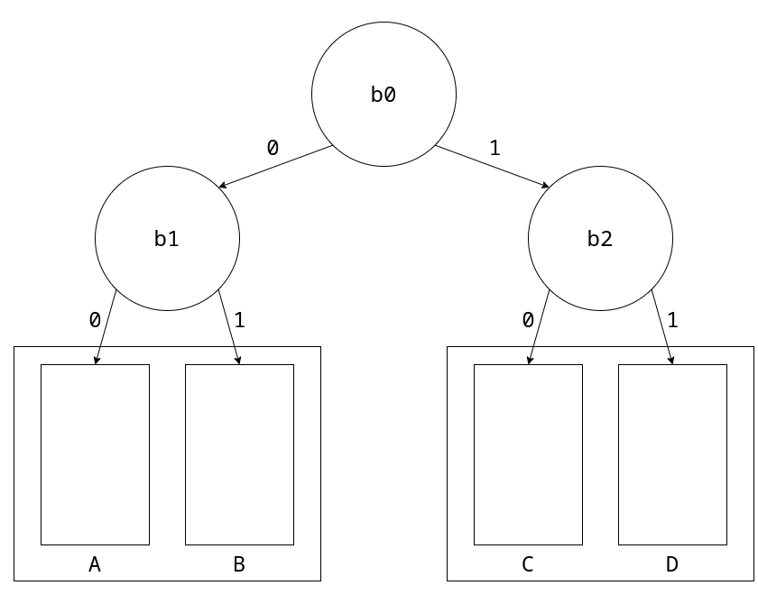

<link rel="stylesheet" type="text/css" href="./assets/style.css">

# 1. Indice

- [1. Indice](#1-indice)
- [2. Calcolatori Elettronici](#2-calcolatori-elettronici)
  - [2.1. Flusso di Controllo](#21-flusso-di-controllo)
  - [2.2. Informazioni Hardware o Software?](#22-informazioni-hardware-o-software)
  - [2.3. Memoria](#23-memoria)
    - [2.3.1. Offset](#231-offset)
    - [2.3.2. Intervalli](#232-intervalli)
  - [2.4. Oggetti Allineati](#24-oggetti-allineati)
    - [2.4.1. Allineamento a un numero $2^n$](#241-allineamento-a-un-numero-2n)
    - [2.4.2. Allineamenti ad oggetti](#242-allineamenti-ad-oggetti)
    - [2.4.3. Allineamento Naturale](#243-allineamento-naturale)
  - [Regione e Confine](#regione-e-confine)
  - [2.5. Comunicazione CPU-Memoria](#25-comunicazione-cpu-memoria)
    - [2.5.1. Intervalli e allineamenti](#251-intervalli-e-allineamenti)
  - [2.6. Spazio di I/O e periferiche](#26-spazio-di-io-e-periferiche)
    - [2.6.1. Tastiera](#261-tastiera)
    - [2.6.2. Video](#262-video)
      - [2.6.2.1. Modalità Testo](#2621-modalità-testo)
      - [2.6.2.2. Modalità Grafica](#2622-modalità-grafica)
    - [2.6.3. Timer](#263-timer)
    - [2.6.4. Hard Disk](#264-hard-disk)
      - [2.6.4.1. Hard Disk - Interfaccia](#2641-hard-disk---interfaccia)
  - [2.7. Memoria Cache](#27-memoria-cache)
    - [2.7.1. Cache ad Indirizzamento Diretto](#271-cache-ad-indirizzamento-diretto)
    - [2.7.2. Cache Associative ad Insiemi](#272-cache-associative-ad-insiemi)

# 2. Calcolatori Elettronici

Andremo a studiare un'architettura Architettura CPU - Memoria (RAM e ROM) - I/O.
<figure class="60">

<figcaption>

Questa architettura è stata progettata con lo scopo di **eseguire software**
</figcaption>
</figure>


Per il nostro studio diventa quindi importante saper rispondere alla domanda "_chi sa cosa_?":

<div class="flexbox"><span class="index">

|         | Cosa conosce                                                                                                                                                                                                                | Cosa non conosce                                                                                                   |
| ------- | --------------------------------------------------------------------------------------------------------------------------------------------------------------------------------------------------------------------------- | ------------------------------------------------------------------------------------------------------------------ |
| CPU     | Il contenuto dei propri registri                                                                                                                                                                                            | Il contesto esterno ai registri                                                                                    |
| Memoria | I dati salvati nelle proprie locazioni (indirizzi) come sequenze di `0` e `1`                                                                                                                                               | Il significato dei dati memorizzati                                                                                |
| I/O     | Le periferiche tramite interfacce, viste come letture/scritture di registri con effetti collaterali                                                                                                                         | Il significato delle operazioni, conosce solo l'effetto di lettura/scrittura sui registri                          |
| Bus     | I segnali trasmessi <u>_uno alla volta_</u> in _broadcast_, tramite indirizzi nello spazio di memoria. <br> In alcuni dispositivi _intel_ più datati la **I/O** possedeva indirizzi propri separati dallo spazio di memoria | Chi comunica. <br> Sono infatti le singole componenti a capire se sono interpellate, tramite delle maschere di bit |

</span></div>


## 2.1. Flusso di Controllo

Abbiamo più volte detto che la **CPU** non fa altro che leggere e eseguire le istruzioni una alla volta.
Per capire però dove recuperare una nuova istruzione una volta eseguita quella precedente va a consultare l'_istruction Pointer_ `%rip` che viene aggiornato dell'operazione precedente.

Il controllo **è unico** e può essere solo scambiato tra i vari stati della **CPU**, a loro volta scanditi dal _programma in esecuzione_.

Al'avvio del calcolatore però il contenuto della memoria **RAM** è _casuale_.
È quindi necessario che il programma di `bootstrap`, ovvero quelle informazioni necessarie a inizializzare in maniera corretta l'`%rip`.

Il programma `bootstrap` deve essere salvato in una memoria **ROM** sulla quale il programma deve essere salvato.

All'inizio della storia dei calcolatori il programma di `bootstrap` veniva caricato **manualmente** dagli operatori ad ogni accensione del calcolatore.
La **ROM** permette di non dover fare più questa operazione, è infatti sufficente impostare che in fase di `/reset` la **CPU** vada a consultare quest'ultima. Il `BIOS` è contenuto in questa parte di programma.

## 2.2. Informazioni Hardware o Software?

È importante riuscire a distinguere se una determinata cosa sia fatta in _hardware_ o _software_.

Per capire se è l'_hardware_ a fare una determinata cosa bisogna domandarci:
> "_Quella componente ha già al suo interno tutte le informazioni necessarie alla risoluzione di $x$?_"

Se invece vogliamo capire se è _software_ ci domandiamo:
> "_Il flusso di controllo è assegnato a quel processo?_
>  _Come avviene questo passaggio al programma $p$? Siamo effettivamente **in grado di scrivere il software $p$**?_"

## 2.3. Memoria

La memoria è un dispositivo al quale è possibile un **accesso al byte**, che ha costo costante qualsiasi sia l'indirizzo specificato.
Gli indirizzi _esistono sempre tutti_. Ciò significa che qualsiasi indirizzo può essere interpellato in qualsiasi momento, indipendentemente dal fatto che sia assegnato o meno ad una componente.

È bene familiarizzare fin dall'inizio con questi _casi notevoli_:
- `1Byte` $\to$ 2 cifre esadecimali

- `512` $\to$ $(1000)_8$

- `4Ki` $\to$ $(1000)_{16}$, $(10.000)_8$

- `1Mi` $\to$ $(10.000)_16$

- `4Gi` $\to$ $(100.000.000)_16$

Inizialmente la memoria era accedibile tramite _parole_, ovvero sequenze di bit che identificavano un determinato indirizzo.
Per modificare un bit bisognava recueprare l'intera _parola_ (anche sequenze di `4/8 Byte` per modificare un solo bit).

Nelle memorie per processori _Intelx86_ che vedremo le dimensioni degli accessi in memoria sono i seguenti:
<div class="flexbox"><span class="index">

|       |  `B`  |  `W`  |  `L`  |  `Q`  |
| :---: | :---: | :---: | :---: | :---: |
| Byte  |  `1`  |  `2`  |  `4`  |  `8`  |
|  Bit  |  `8`  | `16`  | `32`  | `64`  |

</span></div>

Le varie opzioni sono rimaste retrocompatbili con le vecchie versioni e sono state implementare per ottimizzare le informazioni.
Ad esempio nei sistemi a 32bit non esistono le esecuzioni `quad Q`, ma su 64 sono molto utili invece di utilizzare più letture a 32bit.

Un indirizzo a `8Byte` (`64bit`) è come il seguente:
<p class="p"><code>0xaabbccdd00112233</code></p>

Se l'indirizzo si legge a partire dalla fine (`33`) si dice in notazione **Little Endian**, altrimenti se si legge a partine dalla testa (`aa`) si dice in notazione **Big Endian**.

Le architetture Intel e la maggiorparte di quelle utilizzate sono tutte **_Little Endian_**, mentre i protocolli web sono **_Big Endian_**.

Se salvassimo il valore sopra all'indirizzo `8` conviene utilizzare la seguente rappresentazione per non confondersi
<div class="flexbox"><span class="">

|  +7   |  +6   |  +5   |  +4   |  +3   |  +2   |  +1   |  +0   | Indirizzo Base |
| :---: | :---: | :---: | :---: | :---: | :---: | :---: | :---: | :------------: |
|       |       |       |       |       |       |       |       |       0        |
| `aa`  | `bb`  | `cc`  | `dd`  | `00`  | `11`  | `22`  | `33`  |       8        |
|       |       |       |       |       |       |       |       |       16       |
|       |       |       |       |       |       |       |       |       24       |
|       |       |       |       |       |       |       |       |       32       |
|       |       |       |       |       |       |       |       |       40       |

</span></div>

### 2.3.1. Offset

Innanzitutto bisogna sottolineare che **le operazioni sugli indirizzi vanno sempre pensate come operazioni modulo $2^n$**.

L'**_offset_** identifica il numero di bit da sommare per arrivare da un bit ad un altro tramite la formula: $fine - inizio$.

L'_offset_ è un valore che può essere sia negativo che positivo.
Se non volessimo un offset negativo possiamo sfruttare il _wrapper-up_ degli indirizzi, che sono modulati.
Infatti se $y < x$:
$$
    y - x = |x - y|_{2^n}
$$

Gli _offset_ che si trovano all'interno delle istruzioni `AMD64` usano la rappresentazione in _c2_ **con segno**.

### 2.3.2. Intervalli

Un **intervallo** (_range_) è una sequenza di indirizzi.
Se invece andiamo a considerare degli insiemi di indirizzi li possiamo definire come:
$$
    [x, y) := \{n\quad | \quad x \le n < y\} \quad \Leftrightarrow \quad x < y \\
    x: \text{Base dell'intervallo} \\
    y: \text{Limite dell'intervallo}
$$

Per evitare problemi con il _wrapper-up_ della memoria **vietiamo** tutte le notazioni $[x, y) \wedge x > y$.
L'unica eccezione valida è l'insieme $[x, 0)$ che identifica tutte le locazioni a partire da  $x \ne 0$ fino alla fine.

Il privilegio di questa definizione è che possiamo ricavare molto semplicemente la _lunghezza dell'intervallo_ <small>(numero di elementi)</small>: $\quad l = y - x$


## 2.4. Oggetti Allineati

Tutte le definizioni sicsssive faranno riferimento ad un oggetto $o$ così definito: $o := [x, x+l)$.

### 2.4.1. Allineamento a un numero $2^n$

Un oggetto $o$ si dice allineato a un numero $2^n$ se $|o|_{2^n} = 0$, ovvero se:
$$
    \boxed{o = k\cdot 2^n}
$$

Per verificare quindi che un indirizzo sia allineato a 4 basta verificare che le _LSB_ siano un multiplo di 4.
- `0xaa...4344` $\to$ allineato
- `0xaa...4355` $\to$ non allineato

### 2.4.2. Allineamenti ad oggetti

Un oggetto $o$ si dice _allineato ad un'altro oggetto_ $y$ con $sizeof(y) = 2^k \wedge k > 0$ se:
$$
    \boxed{|o|_{sizeof(y)} = 0}
$$

### 2.4.3. Allineamento Naturale

Un oggetto $o$ si dice _allineato naturalmente_ se
$$
    \boxed{|o|_{sizeof(o)} = 0}
$$

## Regione e Confine

I **confini** non sono altro degli indirizzi particolari. Una **regione** è identificata da due _confini_.

Per fare un esempio pratico, ipotizziamo di avere uno spazio a `64bit` e di stabilire i seguenti confini:
<div class="grid2">
<div class="">


</div>
<div class="">

La prima regione $[0, 2^m)$ sarà identificata da indirizzi che hanno gli $n-m$ bit più significativi che sono `0`.

La seconda regione $[2^m, 2^{m+1})$ sarà invece identificata da indirizzi che hanno gli $n-m+1$ bit più significativi impostati a `0` mentre l'$m$-esimo bit settato a `1`

La terza regione invece $[2^{m+1}, 2^n-1)$ è quindi identificata da tutti i restanti indirizzi, che hanno come caratteristica quella di avere l'$m+1$-esimo bit a `1` e i restanti variabili

</div>
</div>

Possiamo notare che, per ogni regione, gli ultimi $m$ bit rappresentano l'_offset_ dal confine di inizio della regione.

Nella memoria RAM possiamo identificare una regione come uno spazio di `8Byte`.
Assegneremo quindi ad ognuna un numero, detto **numero di riga**, che la identificherà.

## 2.5. Comunicazione CPU-Memoria

Il formato delle istruzioni _Intelx86_ può avere al massimo **1 operando esplicito in memoria**.

Tuttavia è possibile operare con due operatori in memoria, attraverso **operazioni che hanno accessi impliciti**.
 Alcuni esempi sono la `MOVS`, `PUSH (%rdi)`, `POP(%rdi)`.

Una qualsiasi informazione che va nella memoria possiede due proprietà:
- **Indirizzo**: indirizzo della prima locazione di memoria desiderata
- **Dimensione**: talvolta si deduce dai registri, talvolta necessita di essere esplicitata con il _suffisso_, indica a quanti byte vogliamo accedere.

<div class="grid2">
<div class="">

**CPU** e **RAM** sono collegate da un _bus_ che è composto da:
- `D`: Rappresenta le **Linee di indirizzo**. In teoria sarebbero `64` ma nei processori _Intelx86_ il massimo è `57`. Nei processori comuni tendenzialmente questi fili però sono "solamente" `37`. Questo perché $2^{64}$ indirizzi di memoria sono decisamente troppi per un calcolatore comune.
- `A`: indica il **numero di riga** in **RAM** alla quale vogliamo accedere.
- `C`: rappresenta i fili che contengolo le variabili di controllo (`/mw`, `/mr`, ...)
- `/be`: sono i _Byte Enabler_. Ne esiste uno per ogni byte di _una riga_. Vengono utilizzati principalmente in scrittura, perché permettono di poter modificare solamente i singoli bit in un indirizzo.

</div>
<div class="">

</div>
</div>

Il singolo chip di **RAM** avrà come collegamenti possibili:
- `/s`: select
- `A`: indirizzo
- `/r`: comando di lettura
- `/w`: comando di scrittura
- `D`: dati, su `8bit`


<div class="grid2">
<div class="100">

<figure class="">
<figcaption>

L'interno del rettagolo tratteggiato è una scheda di memoria, la parte esterna è il bus.
</figcaption>
</figure>
</div>
<div class="">

Ipotizzando un calcolatore a $n$ bit.

Per l'$i$-esimo chip di RAM dovremo collegare:
```v
assign w_ = W_;
assign r_ = R_;

assign Di = D[8*i + 7 : 8*i];
// Il padding corretto del bus dei dati

assign Ai = A[(k-3)-1 : 0];
/*
* k-3 perché ogni riga di indirizzo contiene 8 indirizzi,
* Se tutti i chip devono memorizzare 2^k byte, ognuno ne memorizzerà:
*   2^k / 8 -> 2^(k-3) byte
* Ciò implica che
*/
wire mask_; assign mask_ = A[n - 1 : n - k] ^ indirizzo_di_riga;
/*
* Metto in OR (sono attivi bassi) :
*  - Il bit corrispettivo del Byte Enabler
*  - XOR tra la parte alta di A e l'indirizzo della riga
*
* Questo si fa per determinare se la regione è quella interpellata
*/
assign s_ = (BE_[i] | mask_);
```

</div>
</div>

Data questa configurazione risulta chiara l'importanza degli allineamenti.

Se volessimo infatti accedere a indirizzi non allineati è **necessario** fare **2 accessi**.
Inoltre potrebbe diventare necessario sitemare il padding dei byte, in quanto quelli all'indirizzo precedente si trovano nella regione delle _MSB_, anche se per quello che ci riguarda sono nella _LSB_.

<figure class="80">

<figcaption>

Tutte queste operazioni vengono eseguite non dal software (l'operazione `MOVQ 4097, %RAX` di fatto fa tutto in una riga), ma dall'**hardware**, in particolare nel _$\mu$-codice che implementa l'accesso in memoria_ che si trova nella **CPU**.
</figcaption>
</figure>


### 2.5.1. Intervalli e allineamenti

Non necessariamente avremo intervalli $[x, y)$ che andiamo ad interrogare si trovano in un'unica regione.

Quello che il processore deve essere in grado di fare è stabilire in quali regioni si trovi questo intervallo.

Per fare ciò, dovremo quindi stabilire un modo per capire come determinare **la prima regione toccata** e **la prima regione _non_ toccata** dall'intervallo.

Conoscendo la lunghezza $b$ di ogni sezione:
- Prima regione toccata: &emsp;&emsp;$\qquad$ `r1 = x >> b`
- Prima regione _non_ toccata: $\qquad$ `r2 = (((y-1) >> b) + 1) & ((1UL << b) - 1)`

Per quanto riguarda l'offset del primo indirizzo nella regione lo calcoliamo così: $\qquad$ `off = x & ((1UL << b) - 1) `

## 2.6. Spazio di I/O e periferiche

Nei sistemi moderni è presente un sistema di _protezione_ che non ci permette di accedere alle periferiche della macchina.

Noi andremo a studiare una macchina virtuale `QEMU` priva di questa protezione, in modo da poter capirne il funzionamento.
La macchina sarà priva di qualsiasi programa di _bootsrap_ e conterrà solamente le informazioni per l'accensione e **il singolo programma che inseriremo noi**.
Nella programmazione a basso livello che andremo a fare **tutte le operazioni sono lecite**, e la memoria sarà **tutta a nostra disposizione**.
È importante sottolineare che la CPU non conosce i nomi delle variabili ma _esclusivamente i loro indirizzi_.

Le periferiche che andremo a studiare sono simulazioni delle periferiche dello standard _**ISA**_, compatibile con tutti i produttori di PC IBM-compatibili e cloni.
Queste periferiche fanno riferimento alle vecchie periferiche del **_PC AT_** dell'_IBM_.
L'hardware moderno tende comunque sempre ad emulare queste periferiche più antiche.

Le periferiche sono quindi:
- **Tastiera** (_PC AT_)
- **Video** (_standard VGA_)
- **Timer** (_PC AT_)
- **HardDisk** (_PC AT_ quando venne inserito)

### 2.6.1. Tastiera

Lo scopo della tastiera è di rilevare i tasti premuti e rilasciati e di comunicarli al PC.

Nelle tastiere a (quasi) ogni tasto fisico è associato un _codice di scansione_, che si divide in _make code_ (pressione) e _break code_ (rilascio).
È il software che interpreta il _codice di scansione_ come **codice ASCII**.

La pressione prolungata viene interpretata come sequenza di caratteri uguali **in maniera meccanica dalla tastiera stessa**, dopo un determinato intervallo di tempo detto _typemeter_.

<div class="grid2">
<div class="">

La tastiera è composta da 3 fogli di plastica:
- Il primo ha delle traccie verticali
- Quello centrale non ha tracce, ma dei buchi in corrispondenza tra i tasti.
- L'ultimo ha delle tracce orizzontali

Quando premiamo un tasto, un pulsantino comprime i fogli e mette in conduzione un traccia orizzontale e una verticale.

Collegato alle tracce (sia verticali che orrizontali) si trova un **microcontrollore** (ROM e piccolo chip con processore e RAM).
Il microcontrollore invia migliaia di impulsi al secondo sulle tracce di uno dei due fogli (nell'immagine quello in basso).

Se non ci sono pulsanti premuti non ha segnale di ritorno, altrimenti lo ha in corrispondenza della traccia incolonnata.

A questo punto aggiornerà la **RAM** con la chiave selezionata e manderà segnale di _pressione_/_sollevamento_ a seconda che la chiave sia stata aggiunta o rimossa.
</div>
<div class="">

</div>
</div>

Sulla scheda madre si trova un'ulteriore microcontrollore con 4 registri (`RBR`, `TBR`, `STR`, `CMD`).
Il segnale in entrata salva l'ultimo codice di scansione in `RBR` aggiornando opportunamente il registro di stato `STR`.

È possibile comunicare alla tastiera diverse informazioni, alcune delle quali sono:
- _Typemeter_
- Eventuali led della tastiera.

Il software si occupa di convertire i codici di scansione inviati dalla tastiera in codice _ASCII_:
```cpp
#include<libce.h>
namespace kbd{
    const natl MAX_CODE = 29;
    bool shift = false;
    natb tab[MAX_CODE] = {  // tasti lettere (26), spazio, enter, esc
	    0x10, 0x11, 0x12, 0x13, 0x14, 0x15, 0x16, 0x17, 0x18, 0x19,
	    0x1E, 0x1F, 0x20, 0x21, 0x22, 0x23, 0x24, 0x25, 0x26,
	    0x2C, 0x2D, 0x2E, 0x2F, 0x30, 0x31, 0x32, 0x39, 0x1C, 0x01
    };
    natb tabmin[MAX_CODE] = {
    	'q', 'w', 'e', 'r', 't', 'y', 'u', 'i', 'o', 'p',
    	'a', 's', 'd', 'f', 'g', 'h', 'j', 'k', 'l',
    	'z', 'x', 'c', 'v', 'b', 'n', 'm', ' ', '\n', 0x1B
    };

    natb tabmai[MAX_CODE] = {
    	'Q', 'W', 'E', 'R', 'T', 'Y', 'U', 'I', 'O', 'P',
    	'A', 'S', 'D', 'F', 'G', 'H', 'J', 'K', 'L',
    	'Z', 'X', 'C', 'V', 'B', 'N', 'M', ' ', '\r', 0x1B
    };
```
```cpp
    char conv(natb c){
        natb cc;
        natl pos = 0;

        while(pos < MAX_CODE && tab[pos] != c)
            ++pos;

        if(pos == MAX_CODE)
            return 0;

        if(shift)
            cc = tabmai[pos];
        else
            cc = tabmin[pos];

        return cc;
    }
```
```cpp
    char char_read(){
        natb c;
        char a;

        do{
            c = get_code();
            if(c == 0x2A)
                shift = true;   // left-shift make
            else if(c == 0xAA)
                shift = false;  // left-shift break
        }while(c >= 0x80 || c == 0x2A);
        a = conv(c);
        return a;
    }
}
```
```cpp
void main(){
  char c;

  for (;;) {
    c = kbd::char_read();
    if (c == 0x1B)
      break;
    vid::char_write(c);     // Se c == 0 non fa niente
  }
}
```

### 2.6.2. Video

Andiamo adesso a studiare la periferica per il video tramite teconologia `VGA` (_Video Graphic Adapter_), perché studiare quelle moderne con collegamenti con teconologia `USB` è molto più complesso, e poco rilevante per gli scopi di questo corso.

L'idea del video è quello di avere una sua propria **memoria video**, alla quale è possibile accedere come se fosse una _normale memoria_.

Questo è un primo esempio di qualcosa che sta nello spazio di memoria diverso dalla **RAM**.
Questa memoria può essere più o meno grande, ma in qualsiasi caso abbastanza da poter contenere **tutta la pagina mostrata a schermo**.

La memoria video è particolare dal punto di vista hardware, poiché ha 2 porte di accesso (invece di una sola come la **RAM**):
- 1 verso la CPU (identica alla RAM)
- 1 verso l'adattatore video

L'adattatore video può leggere tutta la memoria, e lo fa un numero diverso di volte al secondo (30, 60, 90, 120, ...).

La teconologia `VGA` permette l'interpretazione da parte dell'adattatore della memoria in due modi:
- **Modalità Testo**
- **Modalità Video**

#### 2.6.2.1. Modalità Testo

Sia la memoria che il display vengono interpretati come caratteri ASCII e ogniuno viene portato in una determinata intersezione riga-colonna.
Di _default_ i vecchi dispositivi si accendono in questa modalità.
La nostra macchina `QEMU` ha proprio un display di 80x25 <small>(200 caratteri totali)</small>
.

L'adattatore ha una sua memoria `ROM` che associa ad ogni codice ASCII un determinato font da poi mostrare sul testo.

In memoria ogni carattere non è definito solo dal suo _ASCII_, ma anche da una sezione di attributo colore.

<div class="flexbox"><span class="">

| Blinking | Background | Foreground | ASCII  |
| :------: | :--------: | :--------: | :----: |
| Blinking |    RGB     |    IRGB    |        |
|  `1bit`  |   `3bit`   |   `4bit`   | `8bit` |

<small>(il bit di _blinking_ indica se il carattere lampeggia, in QEMU è inutile)</small>

</span></div>

Nella nostra macchina la modalità video inizia all'indirizzo `0xB8000`;

Nonostante gli indirizzi non siano anch'essi che una serie di bit, in `c++` per poterli utilizzare come tali è necessario reinterpretarli attraverso un _cast_:
```cpp
#include <libce.h>

namespace vid{
    natw* video = reinterpret_cast<natw*>(0xB8000); //array di 2000 word
}
```

Vediamo quindi un esempio di utilizzo della modalità testo.
Ipotizziamo di voler riempire tutto il nostro schermo con la lettera `'a'` di color _azzurro chiaro_ con sfondo _rosso_.
Il codice è il seguente:

```cpp
void main(){
    for(int i = 0; i < 2000; i++)
        vid::video[i] = 0x4B00 | 'a';
        /*
        * Il numero esadecimale `0x4B00` indica nelle sue cifre:
        * - 0b0100: sfondo rosso senza blink
        * - 0b1011: colore azzurro con intesità 1
        * - 0x00: padding l'OR con il codice ASCII
        */

    for(;;){
        char c = kbd::char_read();
        if(c == 0x1B)       // ASCII -> esc
            break;
    }
}
```

Vediamo altre implementazioni sulla modalità testo.

Un comportamento che ci aspettiamo è che, quando terminiamo lo spazio nello schermo, venga inserita una nuova riga e che la prima riga sparisca con tutta la pagina che _scrolla_.
Un modo che abbiamo per realizzare questo comportamento è copiare tutte le righe $i \ne 1$ nella posizione $i-1$.
In fondo andiamo a inserire una nuova riga "vuota" nell'ultima locazione di memoria:

```cpp
namespace vid {
    void scroll(){
        natw work = attr;
        for (unsigned int i = 0; i < VIDEO_SIZE - COLS; i++)
            video[i] = video[i + COLS];

        for (unsigned int i = 0; i < COLS; i++)
            video[VIDEO_SIZE - COLS + i] = ' ' | work << 8;
        y--;
    }
}

```

Per implementare invece il _backspace_:
```cpp
namespace vid{
    void char_write(char c){
        switch(c){
            case 0:
                break;
            case '\b':
                if(y == 0 && x == 0)
                    break;
                if(x == 0){
                    y--;
                    x = COLS - 1;
                }
                else{
                    x--;
                }
                video[y * COLS + x] = attr | ' ';
        }
    }
}
```

Il cursore lampeggiante è _hardware_ e se ne occupa la scheda video.
È quindi comunicare alla scheda video la posizione la sua posizione.
È importante sapere che `IND` e `DAT` sono gli unici registri visibili da fuori della scheda video.
La posizione del cursore invece si trova su altri due registri da `8bit` (la posizione sarebbe da 16, la dividiamo in un `CUR_HIGH` e `CUR_LOW`).
Per modificare questi registri si inserice il loro indirizzo su `IND`, e la modifica su `DAT`.
`IND` funziona da _switch_ che collega le modifiche di `DAT` al registro specificato.


```cpp
const natl ROWS = vid::rows();
const natl COLS = vid::cols();

namespace vid{
    const ioaddr IND = 0x03D4;
    const ioaddr DAT = 0x03D5;

    const natl VIDEO_SIZE = COLS*ROWS;
    const natb CUR_HIGH = 0x0e;
    const natb CUR_LOW = 0x0f;

    name attr;      // Attributo colore
    natb x, y;      // coordinate inizialmente nulle;
    volatile natw* video = reinterpret_cast<natw*>(0xB8000);


    void cursor(){
        natw pos = COLS * y + x;
        outputb(CUR_HIGH, IND);
        // Seleziona il registro CUR_HIGH e scrive il suo indirizzo in IND
        outputb(pos >> 0x8, DAT);
        // Inserisce la parte alta della posizione in CUR_HIGH utilizzando DAT
        outputb(CUR_LOW, IND);
        // Seleziona il registro CUR_LOW e scrive il suo indirizzo in IND
        outputb(pos, DAT);
        // Inserisce la parte alta della posizione in CUR_LOW utilizzando DAT
    }
}
```

#### 2.6.2.2. Modalità Grafica

La modalità grafica può andare dal complicatissimo all'estremamente semplice.
Questa permette al programmatore di accedere e modificare **i singoli pixel** nella matrice.

La modalità più semplice per l'utilizzo è quella tramite _frame-buffer_, nella quale si può decidere il colore di ogni pixel nell'indirizzo corretto inserendo il colore su `8bit` (così da avere una matrice di byte).

Il passaggio tra modalità è **estremamente complesso** e quello che vedremo noi è semplificato dalla virtualizzazione della macchina.

Tolto questo accorgimento, la modalità gradica funziona in maniera analoga alla modalità testo.

Nelle moderne schede video si trova inoltre un **coprocessore grafico**, che si occupa escusivamente di fare i disegni in parallelo al processore che esegue altre operazioni.
Nel nostro caso non utilizzeremo il _coprocessore_ ma faremo tutto da software:

```cpp
const natl COLS = 1280;
const natl ROWS = 1024;

volatile natb* framebuffer;

void main(){
    framebuffer = svga::config(COLS, ROWS);
    natb c = 0x40;
    for(natl i = 0; i < COLS; i++)
        for(natl j = 0; j < ROWS; ++j)
            framebuffer[j * COLS + i] = c;
}
```

### 2.6.3. Timer

È un interfaccia che permette di contare il tempo che passa.
Viene implementata tramite un'interfaccia più generale che conta degli eventi, in particolare degli impulsi elettrici.

Se si collega l'ingresso con il clock allora otteniamo **un timer di clock**.

All'interno del _PC IBM_ c'è uno sheet che ha 3 interfacce di conteggio.
Ognuna di queste interfacce è collegato al clock (di circa `1Mhz`).
Questi contatori possono essere programmati in maniera indipendente, e ognuno ha un suo ruolo specifico:
- **Contatore 0**: (lo vedremo più avanti).

- **Contatore 1**: era utilizzato originariamente per il refresh della **RAM**, oggi è in **disuso**;

- **Contatore 2**: collegato all'unico dispositivo audio del PC, veniva utilizzato per mandare _onde quadre di periodo proporzionale al clock e ad una costante_ all'amplificatore.

Vediamo intanto come utilizzare il contatore 2 per comunicare con il **PC speaker**.

È importante intanto dire che il contatore non è collegato direttamente allo speaker ma prima passa una porta `AND` con il registro `SPR` all'indirizzo `0x61`.
Questa struttura permetteva il _mute_ qual'ora venisse inserito `0` all'intenro di `SPR`, oltre a poter fare dei giochetti particolari con l'audio.

In questa interfaccia ogni contatore ha 4 registri:
- 2 accessibili
- 2 non accessibili

Inoltre è presente un'ulteriore registro comune.

Dei 4 registri di ognuno, 2 sono solo in scrittura e 2 solo in lettura.

```cpp
namespace timer{
    // Regitro comune - Control Word Register
    const ioaddr iCWR = 0x43;

    const ioaddr iSPR = 0x61;

    // Solo in scrittura
    const ioaddr iCTR2_LSB = 0x42;
    const ioaddr iCTR2_MSB = 0x42;

    void start(natw N){
        outputb(0XB6, iCWR);        // contatore 2, modo 3
        outputb(N, iCTR2_LSB);
        outputb(N>>8, iCTR2_MSB);
    }

    void enable_spk{
        outputb(3, iSPR);
        // bit 0 abilita la porta AND
        // bit 1 abilita il contatore 2
    }
    void disable_spk{
        outputb(0, iSPR);
        // bit 0 abilita la porta AND
        // bit 1 abilita il contatore 2
    }
}
```
```cpp
main(){
    timer::start2(1190);        // costante 1000 Hz
    timer::enable_spk();
    pause();
    timer::disable_spk();
}
```

### 2.6.4. Hard Disk

L'hard disk è una memoria di massa.
Il processore **non può eseguire i programmi nell'hard disk**, per via di incopatibilità nelle interfacce.

Gli hard disk operano a **blocchi** (tendenzialmente `512Byte`), e possono trasferire solo multipli del blocco.
La comunicazione viene comunque effettuata tramita un'interfaccia con il bus, che deve essere gestita da _software_. 

Noi vedremo l'interfaccia del _PC AT_, che poi è diventata _SATA_ (_Serial Attatchement_).

L'hard disk che studiaremo non sono gli `SSD` ma sono quelli con disco.
Questi _HD_ sono formati da diversi dischi di materiale ferromagnetico che girano costantemente ad una certa velocità (`rpm`) e che vegono letti da una testina estesa da un braccio che si muove ruotando attorno ad un perno. Le informazioni possono essere salvate su entrambe le facce di un disco.
L'insieme di queste parti si chiama **drive**.

L'informazione su questi dischi è organizzata in _settori_ (spicchi) e _tracce_ (corridoi concentrici). L'intersezione tra un settore e una traccia si dice **blocco**.

Nella **lettura** la testina recupera un blocco e lo invia all'interfaccia. Successivamente tramite software verrà recuperato.
Nella **scrittura** si scrive via software su un blocco che poi verrà trasmesso alla traccia e successivamente salvato nel blocco desiderato nei dischi.

Per poter stipare il tempo per una lettura/scrittura dobbiamo considerare tre parametri:
- _Seek_: è il tempo che ci mette la testina ad arrivare ad una certa posizione $\bigl(\in O(ms)\bigr)$.
- _Latency_: è il tempo che ci mette un settore ad arrivare a portata della testina $\bigl(\in O(ms)\bigr)$.
- _r/w time_: è il tempo necessario per leggere in maniera corretta e completa un blocco. $\bigl(\in O(\mu s)\bigr)$.

L'ultimo tempo nella storia recente è migliorato significatamente.
All'inizio la testina veniva fatta fluttuare sui dischi e, in caso di assenza di corrente, l'energia prodotta dalla rotazione del disco veniva utilizzata per far spostare in posizione di riposo e non graffiare il disco la testina.
Oggi vengono usati dei fermi sulla testina, così da permettere di avvicinarla, riducendo in maniera significativa il tmepo di lettura/scrittura.

Ulteriori parametri da considerare per determinare la velocità di un accesso sono la **geometria** e la **formattazione** del disco.
Infatti nei blocchi più esterni la lettura è più rapida ma presenta anche più byte sprecati.

Le locazioni non vengono utilizzate dal programmatore con il loro vero numero, bensì viene creata dall'interfaccia un'array di blocchi chiamato `LBA` (_Logical Block Address_) che non fa testo sulle posizioni reali dei blocchi ma crea come una _hashmap_ che non comunica all'utilizzatore.

#### 2.6.4.1. Hard Disk - Interfaccia

L'interfaccia che vedremo noi è quella con i registri che fanno riferimento ai primi HD dell'_IBM_, ovvero l'interfaccia **ATA**.

Introduciamo intanto il concetto di **cilinder**.
> Il _cilinder_ è l'insieme delle tracce che stanno su tutte le testine, ovvero tutti i blocchi ai quali possiamo accedere in un certo istante senza muovere la testina.

L'interfaccia presenta diversi registri a `8bit` e un registro a `16bit`:
- `CNH`/`CNL` (_Cilinder Number High/Low_): indicano rispettivamente la parte alta e quella basse del numero di cilindro.

- `SNR` (_Sector Number_): indica il numero di settore.

- `HND` (_Head aNd Drive_): negli ultimi 4 bit indica la posizione della testina, nei primi ci sono dei bit introdotti con il tempo, in particolare sono presenti:
  - `LBA` (_Logical Block Address_): quando è settato combina le informazioni dei registri citati (meno significativi `SNR` più significativi `HND`) prima per poi inviare la comunicazione all'**HD**.
  - `LBA48`: è un ulteriore bit che permette di inserire più volte i dati nei registri per inviare dati ancora più grandi.

- `SCN` (_Sector Count Number_): indica il numero di blocchi in sequenza coinvolti nell'operazione a partire dal primo.

- `BR` (_Buffer Register_): unico registro a `16bit`, permette di leggere il buffer interno dell'interfaccia. Se i blocchi sono a `512bit` vanno effettuate 128 letture/scritture per trasmettere un blocco.

- `STS` registro di stato a `8bit` che contiene un bit che permette di capire quando il registro il lettura è pronto per essere letto.

Con questa interfaccia è possibile salvare $2^{8 + 8 + 8 + 4} \cdot \underbrace{2^9} \;= \; 2^{37}B \atop (2^9 \text{ indica la dimensione in byte di un blocco})$, ovvero `128GB`.

## 2.7. Memoria Cache

La **RAM** è estrememante lenta rispetto al processore, circa 200/300 volte più lenta, ciò mette in attesa il processore.

È possibile verificare il tempo che ci mette il processore ad accedere alla **RAM** variando la dimensione della lettura:

<figure class="50">

<figcaption>

I primi 3 "scalini" sono dati dalla lettura non nella RAM, ma in un'altra memoria, chiamata _cache_.
</figcaption>
</figure>

La _cache_, a differenza della **RAM Dinamica**, è molto più veloce, e riesce a lavorare (almeno per informazioni di dimensioni "piccole") nell'ordine di velocità del _clock_.

Un modo per avere **RAM** più veloci è quello di utilizzare le **RAM Statiche** invece di quelle _dinamiche_.
Le **RAM Statiche** conservano l'informazione tramite `Flip-Flop`, e sono realizzabili con 6/7 transistor.
Le **RAM Dinamiche** invece utilizzano microcondrensatori che necessitano che l'informazione venga periodicamente "rinfrescata".

<div class="flexbox"><span class="">

| RAM Dinamiche | RAM Statiche |
| :-----------: | :----------: |
|    Grandi     |   Piccole    |
|  Economiche   |   Costose    |
|     Lente     |    Veloci    |

</span></div>

Esiste tuttavia un modo per poter utilizzare **RAM** _grandi, economiche e veloci_.
Infatti, nonostante l'accesso del programmatore alla memoria sia per definizione _casuale_, ovvero non predeterminato, in realtà nella maggior parte dei casi non lo è realmente.

Il codice infatti si distribuisce in locazioni di memoria sequenziali, e, statisticamente, **raramente** effettua salti casuali tra istruzioni.
Su questa assunzione di base si fondano i due **_Principi di Località_**:
> <span class="bigger">Pricipio di località Temporale</span>: visto un dato è probabile che molto presto si voglia utilizzare di nuovo.
> <span class="bigger">Principio di località Spaziale</span>: visto un indirizzo è probabile che a breve ci si ritorni.

<div class="grid2">
<div class="">

La memoria _cache_ funziona proprio basandosi su questi principi.
Infatti quando eseguiamo diversi accessi alla **RAM**, la _cache_ sarà in ascolto di letture e scritture, salvando in locale i dati che i principi dicono che serviranno.

L'esecuzione della _cache_ è gestita da un **_controllore_** che lavora in maniera totalmente trasparente, **senza che il processore e il programmatore sappiano della sua esistenza**.
Tuttavia il programmatore può _approfittare dei principi_, affinché possa sfruttare al massimo la _cache_.
</div>
<div class="">
<figure class="90">

<figcaption>

La memoria cache lavora _solo_ sulla **RAM**, non ha alcun senso che lavori per l'_I/O_, poiché manca il principio base (_I/O_ ha effetti collaterali voluti).
</figcaption>
</figure>
</div>
</div>

Il controllore verifica che un dato richiesto dalla CPU sia già stato memorizzato.
Se lo è stato lo invia immediatamente, altrimenti effettua una lettura in **RAM** e lo invia alla **CPU**.
Prima di inviarlo però o salva localmente, eventualmente rimpiazzando altri dati che erano già salvati.
La scelta della sovrascrizione di un dato può essere obbligata (come vedremo noi) oppure può utilizzare diversi meccanismi legati alla sua architettura per fare una scelta.

### 2.7.1. Cache ad Indirizzamento Diretto

<div class="grid2">
<div class="">

Quando il processore richiede una locazione di memoria, si effettua un controllo per verificare che si trovi o meno nella _cache_.
Il segnale di `hit` indica che la memoria si trova già nella _cache_, perciò è sufficente leggere quella.
In caso di scrittura con `hit` abbiamo due possibili politiche:
- `Write Through`: scrive il nuovo valore sia in _cache_ che in **RAM**;
- `Write Back`: scrive il nuovo valore solo nella _cache_.

Il segnale di `miss` indica invece che la memoria non è nella _cache_, perciò va recuperato dalla **RAM** per poter essere letto.

Anche in caso di `miss` la scrittura ha due possibili politiche:
- `Write Allocate`: copia l'elemento dalla **RAM** nella _cache_ prima della modifica, e poi lo ritrasmette aggiornato;
- `Write No-Allocate`: effettua l'aggiornamento **solo** in **RAM**, senza salvare nulla in _cache_.

Il motivo per il quale, data una riga, recuperiamo in cache tutta la sezione dov'è contenuta è perché, per il principio di località, è probabile che il processore richieda in un secondo momento locazioni vicine (_località spaziale_).
Inoltre, se il tempo di lettura di una riga fosse $t$, quella di lettura di un blocco è un tempo $\ll 8t$.

Con questo tipo di _cache_, detta **_ad indirizzamento diretto_**, si possono generare conflitti tra sezioni.
In particolare, le sezioni che possono fare conflitto in una stessa locazione sono ${\dim{(\mathbf{RAM})} \over \dim{(\mathbf{cache})}}$, ovvero quelle **allineate naturalmente** a `l`, con `l` che indica il numero di _cache line_ disponibili.
</div>
<div class="">

<figure class="80">

<figcaption>

Ipotizzando che la _cache_ abbia `l` locazioni, otteniamo che i bit di riga sono gli utlimi `k = log(l)` (tolti gli ultimi `3` che identificano la riga all'interno del blocco).
Le etichette sono quindi grandi `n-k-3+2 bit`, poiché l'ultimo bit, detto `validity`, serve per capire se l'etichetta in quella riga è valida o contiene valori casuali, mentre il penultimo, detto `dirty`, serve per ottimizzare i tempi.
</figcaption>
</figure>
</div>
</div>

Per quanto riguarda la `write-back`, la scrittura verrà comunque eseguita in **RAM** prima o poi, nel peggiore dei casi quando quella _cache line_ viene sostituita.
Il guadagno del non fare direttamente il `write-through` si vede quando effettuiamo un numero molto elevato di scritture nella stessa _cache-line_.

Per migliorare il tempo si aggiunge un'ulteriore `bit` alle etichette chiamato `D` (_Dirty_) che identifica se in una determinata _cache-line_ sono avvenute o meno scritture.

Questo tipo di _cache_ è particolarmente poco efficente quando cerchiamo di leggere e scrivere due _cacheline_ in memoria allineati naturalmente alla dimensione della _cache_.
In questo caso ogni accesso causa una `miss`, proprio perché i due indirizzi collidono.
Un modo per risolvere il problema è attraverso le **cache associative ad insiemi**.

### 2.7.2. Cache Associative ad Insiemi

Si basano sulle _cache ad indirizzamento diretto_.
Infatti non sono altro che più cache allineate tra di loro:
<div class="grid2">
<div class="">

L'esempio a destra è con due _cache_.

Si utilizzano le due cache in parallelo, in caso di conflitti, andremo a sovrascrivere la _cacheline_ che non si utilizza da più tempo.

Oltre alle cache, si introduce anche un ulteriore registro `R` che contiene tanti bit quanti sono necessari per ricordare l'ordinamento delle scritture.

In caso di due vie in `R` è sufficente `1bit`, che codifica quale delle due _cache_ non si utilizza da più tempo in quella _line_.
In caso di quattro vie il registro viene chiamato `LRU` e contiene `5bit`.

Tuttavia, nel processore _x86_, è stato implementato uno `pseudo-LRU` a `3bit`
</div>
<div class="">


</div>
</div>

<div class="grid2">
<div class="">

Lo `pseudo-LRU` parte dallo stato stato `000` (`b0`|`b1`|`b2`).

Vediamo come si comporta ipotizzando di fare sempre `miss`:

Il primo accesso verrà salvato nella cache `A` seguendo il percorso `b0`-`b1`.
Questi bit vengono quindi invertiti, portando il nuovo stato a `110`.

Il secondo accesso seguirà quindi il percorso `b0`-`b2` nella cache `C`, con nuovo stato `011`.
Il terzo accesso avverrà in `B` portando lo stato a `101`.

Infine il quarto accesso avverrà in `D` riportando lo stato a `000`.

Questa politica si chiama `pseudo-LSU` perché, ipotizzando di aver appena salvato una _cacheline_ in `C`, il prossimo miss salverà la _cacheline_ in `B`. Quando, magari, in realtà abbiamo fatto un accesso più vecchio a `D` che dovrebbe essere lui a cambiare.

</div>
<div class="">


</div>
</div>

Tuttavia anche con il registro `LRU` è possibile generare sempre `miss`.
Basta infatti effettuare un accesso in più di quelli possibili in parallelo, ad esempio:
- `ABCD`
- `1234512345`

Questo genererà sempre `miss`.

Questo è ciò che genera gli "scalini" nel grafico visto all'inizio e qui riproposto nel dettaglio:
<figure class="60">

<figcaption>


Dalla pendenza del singolo scalino si può dedurre quante cache associative abbiamo.
In questo dettaglio ricaviamo che la prima cache ha dimensione `48KiB`.
</figcaption>
</figure>

