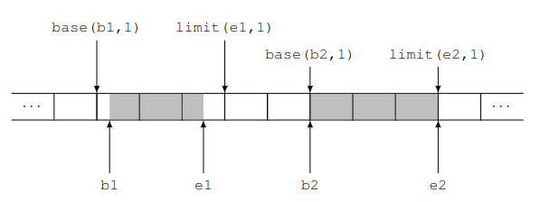

# 1. Indice

- [1. Indice](#1-indice)
- [2. Paginazione](#2-paginazione)
  - [2.1. Registri limite inferiore e superiore](#21-registri-limite-inferiore-e-superiore)
- [3. Paginazione](#3-paginazione)
  - [3.1. Super MMU](#31-super-mmu)
    - [3.1.1. Esempio](#311-esempio)
  - [3.2. Trie-MMU](#32-trie-mmu)
    - [3.2.1. Formato delle tabelle](#321-formato-delle-tabelle)
    - [3.2.2. Regioni e Sottoregioni](#322-regioni-e-sottoregioni)
  - [3.3. MMU](#33-mmu)
    - [3.3.1. Traduzioni Identità](#331-traduzioni-identità)
    - [3.3.2. TLB](#332-tlb)
  - [3.4. Pagine di grandi dimensioni](#34-pagine-di-grandi-dimensioni)
- [4. Funzioni di Supporto per la Paginazione](#4-funzioni-di-supporto-per-la-paginazione)
  - [4.1. Calcoli con gli Indirizzi](#41-calcoli-con-gli-indirizzi)
  - [4.2. Manipolare le singole entrate](#42-manipolare-le-singole-entrate)
  - [4.3. Lavorare su singole tabelle](#43-lavorare-su-singole-tabelle)
  - [4.4. Interagire con l'Hardware](#44-interagire-con-lhardware)
  - [4.5. Lavorare con interi `TRIE`](#45-lavorare-con-interi-trie)
  - [4.6. Funzioni `map` e `unmap`](#46-funzioni-map-e-unmap)
  - [4.7. Debugger](#47-debugger)


# 2. Paginazione

Fin'ora abbiamo visto la memoria come divisa, dall'indirizzo in un registro, in due sezioni:
- `M1`: accedibile sia al `sistema` che all'`utente`
- `M2`: riservata solo al `sistema`

Fin'ora abbiamo assunto che in `M2`, in ogni istante, si trova **_solo la memoria privata del processo attualmente in esecuzione_**, così da evitare che un processo acceda alla memoria dell'altro.

La memoria privata degli altri processi l'abbiamo localizzata in un `HD` esterno, che effettia _swap_ dell'intero `M2` quando si cambia processo.

Tuttavia questo processo è incredibilmente dispendioso e inefficente. Quello che vogliamo fare ora è eliminare, o almeno ridurre, le copie da e verso lo _swap_, tenendo a mente che ci piacerebbe comunque **preservare i vantaggi** che ha trasferire tutta la `M2`, ovvero:
- _Isolamento tra i processi_: ciascun processo può accedere solo alla propria memoria privata
- _Semplicità nel collegamento dei programmi_: il _collegatore_ può assumere che ogni programma abbia a disposizione l'intera `M2`
- _Semplicità nel (s)caricamento dei processi_: la memoria privata di ogni processo viene ricaricata **esattemente nella stessa posizione** ogni volta che il processo torna in esecuzione
- _Possibilità di condivisione della memoria_: se più processi hanno bisogno di condividere memoria tra loro, il sistema può concederlo evitando di sostituire le parti di memoria condivise ogni volta che cambia processo.

Un modo per riassumere la situazione è dire che ogni processo "pensa" di avere la **CPU** e la `M2` tutta per sé, quando in realtà ha una **CPU** _virtuale_ e una `M2` _virtuale_.
Le vere componenti **incarnano ad ogni istante** le loro controparti virtuali del _processo attualmente in esecuzione_.
<div class="grid2">
<div class="">

Quello che facciamo quindi è dividere la memoria in diverse sezioni, ognuna che sarà assegnata ad un processo.
All'interno della `M2` virtuale troviamo due sezioni:
- **Codice**: sezione `.text` dell'`assembler`
- **Memoria**: divisa in:
  - sezione `.data` dell'`assembler`
  - `stack` e `heap` complementari

I riferimenti alla memoria tramite "puntatori complementari", sta a significare che i due puntatori si trovano ai capi opposti della **stessa regione di memoria**.
Lo `stack` "sale" in memoria mentre l'`heap` scende, prendendo spazio finché non **collidono**, generando un'eccezione di riempimento della memoria.

</div>
<div class="">


</div>
</div>


Per implementare questa divisione è necessario il supporto dell'_hardware_.

Esistono diversi metodi per implementarlo, noi ne vedremo qualcuno.

## 2.1. Registri limite inferiore e superiore

Questo metodo suppone di sapere **di quanta memoria ha bisogno ogni processo**.

Ogni processo dovrà avere sufficente spazio per contenere:
- La sezione `.text` con il codice del programma da eseguire
- La sezione `.data` di variabili globali
- La sezione dedicata a `stack` e `heap`

Mentre _delle prime due_ sezioni il collegatore **conosce sempre la dimensione**, per quanto riguarda _la terza_, essa può essere soggetta **a espansione dinamica durante l'esecuzione**.

È allora necessario stabilirne una **dimensione massima**.
Questa scelta può essere effettuata dal programmatore, che informa il sistema di quanto grande debbano essere le porzione dedicate allo `stack` e allo `heap`.
In alternativa è anche possibile che il compilatore/collegatore/sistema assumano un valore di _default_.

Una volta che l'informazione è nota, il sistema può sfruttarla per copiare da e verso lo _swap_ solamente la memoria usata dai processi entranti e uscenti.

Per vietare all'`utente` l'accesso alle porzioni di `M2` di processi diversi, si inseriscono nella **CPU** _due registri_, `LINF` e `LSUP`, che hanno come compito quello **di contenere gli indirizzi dell'inizio e della fine della porzione di memoria virtuale del processo in esecuzione**.
Entrambi i registri sono scrivibili _**solo da livello `sistema`**_.

Quando la **CPU** lavora in modalità `utente`, deve controllare che gli accessi siano in indirizzi **_compresi_** nell'intervallo $\Bigl[$`LINF`, `LSUP`$\Bigr)$.
In caso di accessi _out-of-bound_ si genererà invece un'eccezione di protezione `13`.

Poiché la maggior parte dei processi non avrà bisogno di tutta la memoria `M2`, possiamo pensare di caricare più di uno stato alla volta, tenendo in memoria anche lo stato dei processi presenti ma non in esecuzione, così da evitare di ricaricarli quando verranno _schedulati_.

In pratica rendiamo la memoria `M2` come una _cache dello swap_, con gli stessi problemi da risolvere, ovvero quale processo rimuovere quando la memoria si satura.
Non ci addentriamo in questi problemi adesso, che vedremo più avanti nel corso di **_Sistemi Operativi_**, e ci limitiamo a studiare i meccanismi che permettono di realizzare questa _cache_.

<figure class="80">

<figcaption>

(a) Vengono caricati 4 processi: `P1`, `P2`, `P3`, `P4`
(b) È in esecuzione `P2`, non si può accedere alla memoria degli altri processi
(c) cambianto il contenuto di `LINF` e `LSUP` cambia la zona di memoria accessibile
</figcaption>
</figure>

Per permettere questa configurazione `LINF` non contiene più il primo indirizzo di `M2`, ma bensì quello della **prima locazione appartenente al processo in esecuzione**.
Entrambi i registri devono quindi avere una posizione nel vettore `contesto` dei descrittori di processo, ovvero `I_LINF` e `I_LSUP`:
- <u>Ogni volta</u> che un processo viene caricato dallo _swap_ il `sistema`, riferendosi alla parte di `M2` da lui occupata, **deve inizializzarne i campi**:
  - `contesto[I_LINF]` con **l’indirizzo iniziale**
  - `contesto[I_LSUP]` con **l'indirizzo finale**

- <u>Ogni volta</u> che si cambia processo, il `sistema` **aggiorna anche il contenuto** di `LINF` e `LSUP` con i valori presi dal descrittore del processo entrante.

Questo permette alla **CPU** di controllare che ogni processo non effettui accessi _out-of-bound_ rispetto alla memoria assegnata.

Questa soluzione presenta però dei difetti e dei problemi.

Il primo risiede nel capire **dove salvare la sezione `.text` di ogni processo**. Infatti, a differenza della memoria unica, dove la sezione `.text` aveva un indirizzo costante dove essere salvata (`LINF`), nel caso di memorie multiple il _collegatore_, si troverà indirizzi di partenza variabili a seconda dello stato del sistema.

Ci sono due modi per risolvere questo problema:
1. Compilare tutti i programmi in modo che siano indipendenti dalla posizione.
    Questo è possibile e funziona _entro certi limiti_, poiché gli _offset_ possibili sono di dimensione massima `32bit` (`2GB`)
2. Creare un **caricatore rilocante**, che riloca il programma al posto del _collegatore_ e, nel momento della carica, lo modifica in modo da adattarlo all'indirizzo di caricamento.


Un secondo problema risiede nel fatto che i processi potrebbero utilizzare **indirizzi assoluti** per salvare oggetti in memoria.
Nella memoria unica ciò non era un problema, poiché avveniva una sovrascrittura totale ad ogni cambio processo.
Partizionando la memoria però questo diventa rilevante.
Ipotizziamo di avere un processo `P1` che salva un indirizzo assoluto nella sua partizione. Questo processo viene poi **rimosso** e rilocato in un'altra, diversa dalla prima. A questo punto l'indirizzo assoluto che era utilizzato non sarà più disponibile, in quanto si riferisce ad una partizione adesso _out-of-bound_.

Esiste quindi il **_vincolo forte_**:
> _Se un processo è locato in una determinata partizione della memoria, nel caso di scarica e carica, dovrà **sempre** essere rilocato nello stessa posizione._


Il terzo problema risiede sulla mancanza di una memoria condivisa, possibile con questo _hardware_, solamente tra processi in partizioni adiacenti.
Per risolvere tutti i problemi **cambiamo l'interpetazione degli indirizzi da parte della CPU**:
> Da adesso in poi, la **CPU** interpreta ogni indirizzo `x` come `LINF + x`.
> In questo modo ogni _indirizzo "assoluto"_ di un processo, adesso indica semplicemente l'_offset_ da `LINF` di quel processo.

Questa implementazione fa in modo che ogni processo si comporti come se avesse **_una sua memoria dedicata_**, anche se in realtà non è altro che una **memoria virtuale** con **indirizzi virtuali** `x`, che sono tradotti dalla funzione `LINF + x` che li traduce in *indirizzi fisici*.

Permane comunque il problema della _frammentazione esterna_.
<div class="grid2">
<div class="">

Se infatti i processi avessero dimensioni diverse potremmo ottenere casi come quello a destra, dove abbiamo:
- Rimosso `P2` e inserito `P5`.
- Rimosso `P3` e `P4` per inserire `P5`.
- Terminato, e quindi rimosso `P5` e inserito `P3`.

Adesso non esiste più spazio per `P4`.

</div>
<div class="">


</div>
</div>

Per ovviare a questo problema i sistemi moderni **_utilizzano una funzione di traduzione molto più complessa_**, quella che chiamiamo **_<u>Paginazione</u>_**

# 3. Paginazione

Dato un processo, dividiamo il suo spazio di memoria in quelle che chiamiamo **_pagine_**, ognuna di dimensione fissa `4KiB`.
Dividiamo inoltre anche la **RAM** in **_frame_**, anch'essi di <u>dimensione fissa</u> `4KiB`.

Da adesso **_ogni pagina può essere inserita in ogni frame_**.

In questo modo risolvo il problema della _frammentazione esterna_, poiché i programmi non necessitano più di essere contigui.
Di conseguenza non avremo più i registri `LINF` e `LSUP`, che perdono completamente di senso.

Questa scelta impone però dei limiti, uno dei quali è che **non posso dare ad un singolo processo uno spazio di memoria minore di `4KiB`**.

Dobbiamo adesso capire come tenere traccia dei `frame` che corrispondano alle `pagine`.

Adottiamo come prima soluzione l'introduzione un'_array_, che chiamiameremo **_Tabella di corrispondenza_** <small>(da ora **tabella**)</small>, alla quale salviamo in ogni posizione, il numero del `frame` di riferimento.
La posizione `x` si riferirà alla `x`-esima `pagina` del processo.

<div class="grid2">
<div class="">

A questo punto scomponiamo ogni indirizzo in due parti `{a[p], o}` dove:
- `a[o]`: indica il numero di `pagina`, che viene convertito tramite la **tabella** nell'indirizzo del `frame` (`f`).
- `o`: è l'offset rispetto all'inizio della `pagina`.

In questo modo, quando accediamo all'indirizzo virtuale `x` di un processo, andiamo nell'indirizzo reale `f + o`.
</div>
<div class="">

</div>
</div>


Questa soluzione mantiene l'**isolamento**, poiché ogni _processo_ avrà **una sua tabella**, e potrà accedere ai soli ed unici `frame` contenuti in essa.
Quando questo non accade verrà sollevata l'eccezione di _page fault_ (o _segmentation fault_ nei sistemi _Unix_).
Inoltre, questa soluzione non richiede di salvare la **tabella** nel contesto, poiché la ricreeremo ogni volta che il processo verrà caricato.

Ci permette inoltre di **implementare una memoria condivisa**.
Per permettere a due o più _processi_ di condividere dei `frame`, basta inserirli nelle loro **tabelle**.
Possiamo quindi decidere:
- Quali processi condividono della memoria
- Quali frame adibire ad essere condivisi tra processi.

## 3.1. Super MMU

Per implementare le tabelle, possiamo immaginare un nuovo dispositivo, chiamanto **Super MMU** (_Memory Management Unit_).
Questa super componente, che nella realtà non esiste nella forma con la quale la descriveremo, si trova tra **CPU** e _cache_. Il posizionamento è tale da permetterci di progettare la _cache_ come se la `MMU` non esistesse.

La **super MMU** si occupa quindi della traduzione: _indirizzi virtuali_ $\to$ _indirizzi fisici_.

Vediamo quindi come modificare il `kernel` per implementare questo nuovo tipo di memoria nel caricamento dei processi.

Affinché tutto funzioni correttamente, diamo per scontato il fatto che **_la `Super MMU` è sempre attiva, anche mentre è in esecuzione il `kernel`_**.

Possiamo quindi inserire nella **super MMU** un nuovo _array_ dedicato proprio a quest'ultimo.
L'_array_ conserverà per ogni `frame` **il processo che lo sta occupando**.

Tuttavia questa soluzione <u>non è</u> quella utilizzata dai processori _intelx86_.

Capiamo quindi cosa succede durante le eccezioni quando vengono sollevate:

Il `kernel` deve accedere innanzitutto accedere alla riga corrispondente della `IDT`, ma per accedervi deve passare per la `MMU`, poiché non conosce l'indirizzo reale di questa.
È quindi necessario che la **MMU** abbia già fatto il cambio di tabella.
Per ovviare a possibili concorrenze che portano solamente ad errori, quello che facciamo è _"giocare di anticipo"_:
> Salveremo in ogni tabella di corrispondenza i frame relativi a `M1`.

Nei processori `AMD` si sfrutta la naturale divisione in due della memroria e si affida la parte superiore al sistema e quello inferiore all'utente. di fatto lo spazio di _indirizzamento virtuale_ nelle due parti (`sistema` e `utente`).

Questa soluzione lascia però in chiaro al programma gli indirizzi della memoria di sistema, cosa che noi _**non vogliamo**_.

Andiamo quindi a codificare in maniera più "complessa" le righe della **tabella di corrispondenza**:

- `P`: _flag di presenza_, indica se la traduzione nell'indirizzo esiste o meno, generando un'_eccezione_ di _page fault_ (in `Unix` _segmentation fault_).
  È sempre `0` nella prima pagina (per il caso `nullptr`), e nei `kernel` reali è azzerato per diverse prime pagine (per gestire opportunamente il caso di strutture più grandi di `4KiB`).

- `R/W`: indica se sono ammesse scritture nella pagina o meno

- `U/S`: dice se sono ammessi accessi alla pagina da livello utente o sistema. È questo `bit` che ci permette di vietare all'utente l'accesso alla memoria `M1`.

- `PCD`: _Page Cache Disable_, se settato, ordina alla _cache_ di **non intercettare** l'operazione e lasciarla passare inalterata sul bus, similmente a come si comporta per l'`I/O`

- `PWT`: _Page Write Through_, se settato ordina alla cache di usare la politica di _write-through_ per questo accesso (solo se in scrittura).
  È annullato da `PCD` se quest'ultimo è settato

- `A`, `D`: sono due _flag_ legati all'implementazione dell'area di _swap_, che vedremo solo da un punto di vista teorico senza implementarla nel nostro calcolatore.
  La `MMU` **setta `A`** di un'entrata durante l'accesso all'indirizzo interno della corrispondente pagina. Se l'accesso era in scrittura **viene settato anche `D`**.
  - `A` può essere usato quindi per capire quali pagine sono le **più utilizzate**. È di ausilio alla _paginazione su domanda_, nella quale vengono caricati in memoria solamente le pagine a cui il processo effettivamente accade, sfruttando il bit `P` e intercettando il _page fault_.
  - `D` può essere usato per capire quali pagine hanno subito modifiche e necessitano di essere salvate _ex-novo_, e quali invece non sono state modificate e non necessitano il nuovo salvataggio.


### 3.1.1. Esempio

Supponiamo di avere il seguente programma, nel quale abbiamo un _array_ di `char` di dimensione `8KiB` che chiamiamo `buf`, e del quale vogliamo saperne la somma.
```cpp
char buf[0x2000] = { 2, 6, -1, 200, ..., 15, 3, -32, 1};
int main() {
    int sum = 0;
    for (int i = 0; i < 0x2000; i++)
        sum += buf[i];
    return sum;
}
```

Dobbiamo tradurre questo programma in una sequenza di `byte` da dare al processore.

Per poterlo fare dobbiamo sapere:
- Che **CPU** utilizziamo (_intelx64_)
- Come è gestita la memoria

Per questo esempio supponiamo che lo spazio di memoria virtuale sia di soltanto `32KiB`.
Ciò implica che gli indirizzi possibili stanno tra `0000` e `7fff`.
Se abbiamo che ogni pagina è `4KiB`, implica che avremo a disposizione **_8 pagine_**, 2 delle quali (`0` e `1`) sono però **riservate al sistema**.

Dobbiamo quindi decidere come contenere il codice:
- `2`: `[2000, 2fff]` conterrà il codice
- `3-4`: `[3000, 4fff]` conterrà la variabile `buf`
- `7`: la usiamo come prima pagina della `pila`.

Una possibile traduzione è quindi la seguente.
In memoria tuttavia andrà la traduzione in linguaggio macchina, che è presente sulla destra
```x86asm
    |   .text
    |   .global main
    | main:
2000|     PUSHq %rbp                |55
2001|     MOVq %rsp, %rbp           |48 89 e5
2004|     SUBq $8, %rsp             |48 83 ec 08
2008|     MOVl $0, -8(%rbp)         |c7 45 f8 00 00 00 00
200f|     MOVl $0, -4(%rbp)         |c7 45 fc 00 00 00 00
    | for:                          |
2016|     CMPq $0x2000, -4(%rbp)    |48 81 7d fc 00 20 00 00
201e|     JGE fine                  |7d 14
2024|     MOVSlq -4(%rbp), %rcx     |48 63 4d fc
2028|     MOVSbl buf(%rcx), %eax    |0f be 81 00 30 00 00
202f|     ADDl %eax, -8(%rbp)       |01 45 f8
2032|     ADDl $1, -4(%rbp)         |83 45 fc 01
2036|     JMP for                   |eb e2
    | fine:                         |
203b|     MOVl -8(%rbp), %eax       |8b 45 f8
203e|     POPq %rbp                 |5d
203f|     ret                       |c3
    |                               |
    | .data                         |
3000| buf:    .BYTE 2, 6, -1, 200   |02 06 ff c8
    |         ...                   |...
4ffc|         .BYTE 15, 3, -32, 1   |0f 03 e0 01

```

Dopo aver caricato il programma in memoria, inizializziamo i registri:
- `%rip`: `0x2000`
- `%rsp`: `0x0000`
- `%rbp`: `0x0000`
- `%rcx`: `0x0000`

All'avvio del sistema la **CPU** tenterà di prelevare l'istruzione contenuta in `%rip`, ovvero `0x2000`, per poi analizzarla per scoprire che l'istruzione è l'equivalente di `PUSHq %rbp`.

La **CPU** inizia quindi ad eseguire l'istruzione, decrementando per prima cosa `%rsp` di `8`, assumendo il valore `7ff8`.
Una volta terminata l'esecuzione, `%rip` viene incrementato di `1`.

Il programma prosegue, arrivando alla riga `2028`, nella quale si accede alla memoria `.data` del programma.
Da notare che è presente l'indirizzo di `buf` come immediato esadecimale nel sorgente macchina.

Verrà quindi sommato al contenuto di `%rcx` (`0`) e il risultato, interpretato come `byte` verrà sottoposto a lettura, salvandolo nel registro `%eax` (propriamente esteso).

Questo è quello che il programmatore si aspetta succeda quando manda in esecuzione il programma.

Quello che succede nella memoria reale però è differente, poiché tra **CPU** e **RAM** si trova la **Super-MMU** che converte gli indirizzi virtuali in indirizzi reali.

Immaginiamo di avere un secondo processo `P2`, diverso da `P1` visto prima:
```x86asm
2000| 55
2001| 48 89 e5
2004| b8 2a 00 00 00 00
200a| 5d
200b| c3
```


Per **caricare un programma**, non si intende solamente l'atto di salvare le sue `pagine`, ma anche quello di **_predisporre la tabella di corrispondenza_**.

La **Super-MMU** avrà questa forma (le informazioni riquadrate indicano l'_inaccessibilità da livello utente_):

<div class="grid2">
<div class="top">
<div class="p">

Caricamento del processo `P2`
</div>
<div class="flexbox"><span>

|       | `P1`  |    `P2`     |          `RAM`           |
| :---: | :---: | :---------: | :----------------------: |
|   0   |       |             |                          |
|   1   |       | $\boxed{1}$ | $\boxed{\text{sistema}}$ |
|   2   |       |      2      |          .text2          |
|   3   |       |             |                          |
|   4   |       |             |                          |
|   5   |       |             |                          |
|   6   |       |             |                          |
|   7   |       |      7      |          stack2          |

</span>
</div>

La pagina `0` è lasciata con `P = 0` per intercettare le deferenziazioni di `nullptr`.

`P2` non utilizza le pagine `3`, `4`, `5` e `6`.

</span>
</div>
<div class="top">
<div class="p">

Caricamento del processo `P1`
</div>
<div class="flexbox"><span>

|       |    `P1`     |    `P2`     |          `RAM`           |
| :---: | :---------: | :---------: | :----------------------: |
|   0   |             |             |                          |
|   1   | $\boxed{1}$ | $\boxed{1}$ | $\boxed{\text{sistema}}$ |
|   2   |      3      |      2      |          .text2          |
|   3   |      4      |             |          .text1          |
|   4   |      5      |             |        .data1[0]         |
|   5   |             |             |        .data1[1]         |
|   6   |             |             |          stack1          |
|   7   |      6      |      7      |          stack2          |

</span>
</div>

Anche per `P1` la pagina `0` è lasciata con `P = 0` e la pagina `1` corrisponde allo stesso `frame` di sistema inaccessibile da livello `utente`.

`P1` non utilizza le pagine `5` e `6`

</span>
</div>
</div>

Quando mandiamo in esecuzione `P1` **_tutte le pagine che non sono nel suo codominio diventano <u>inaccessibili</u>_**.

`P1` comincia la sua esecuzione, con la **CPU** fisica che esegue una lettura all'indirizzo `2000` come quella virtuale.

La `MMU` intercetta l'operazione e scompone l'indirizzo in `2|000`, ovvero `pagina` e _offset_. Consulta quindi l'entrata (`2`) della **tabella** restituendo il corrispondente numero di `frame` (`3`).
L'accesso viene completato e la **CPU** fisica riceve `PUSHq %rbp` esattamente come la virtuale, ed inizia ad eseguirla.
Successivamente decrementa `%rsp` di `8`, cercando quindi di effettuare una scrittura all'indirizzo `7ff8`.
La `MMU` intercetta quindi l'operazione e scompone l'indirizzo in `7|ff8`, consultando l'entrata `7` e trovando il `frame` `6`.
La scrittura viene quindi completata all'indirizzo _reale_ `6ff8`.

La **CPU** _fisica_ e _virtuale_ continuano di paripasso eseguendo le medesime istruzioni.

Ipotizziamo quindi che ad un certo punto si generi un'interruzione con cambio di processo e vada in esecuzione `P2`.
A questo punto `P1` si "_congela_", mentre il `kernel` carica i registri di `P2` e attiva la sua **tabella**.

`P2` inizia la sua esecuzione, con la **CPU** (sia _fisica_ che _virtuale_) che eseguono una lettura all'indirizzo `2000`.
La **MMU** infatti intercetta `2|000` e corrisponde alla _pagina_ `2` il _frame_ `2`.
Viene raccolta quindi l'istruzione `PUSH %rbp`, che decrementerà `%rsp` di `8` e andrà a scrivere il contenuto all'indirizzo virtuale contenuto, che stavolta si riferisce a `7ff8`, salvandola nell'opportuna _pila_.

<div class="grid2">
<div class="">


Passa ulteriore tempo e immaginiamo che il `kernel`, per un motivo o per un altro, decida di **_rimuovere le pagine di `P1`_** dopo avere copiate nello _swap_, eseguendo un'operazione di _swap-out_, decidendo di caricare un nuovo processo `P3` con una sua **tabella di corrispondenza**:

</div>
<div class="">
<div class="flexbox"><span>

|       |    `P1`     |    `P2`     |    `P3`     |          `RAM`           |
| :---: | :---------: | :---------: | :---------: | :----------------------: |
|   0   |             |             |             |                          |
|   1   | $\boxed{1}$ | $\boxed{1}$ | $\boxed{1}$ | $\boxed{\text{sistema}}$ |
|   2   |             |      2      |      3      |          .text2          |
|   3   |             |             |             |          .text3          |
|   4   |             |             |             |          stack3          |
|   5   |             |             |             |                          |
|   6   |             |             |             |                          |
|   7   |             |      7      |      4      |          stack2          |

</span>
</div>
</div>
<div>

Passa altro tempo e `P2` termina. Il `kernel` procederà quindi a  liberare tutte le sue pagine.
Ancora dopo il `kernel` decide di ricaricare `P1` per rimetterlo in esecuzione (sulla destra).

Le pagine di `P1` non  occupano più gli stessi frame che occupavano in precedenza.
Tuttavia anche la tabella di corrispondenza di `P1` è adesso diversa, ed in linea con i nuovi `frame`.
Se infatti va in esecuzione `P1`, ricordiamo che stava per prelevare `MOVSbl buf(%rcx), %eax` all'indirizzo `2028`.

A questo punto la **CPU** fisica e la virtuale prelevano l'istruzione, quindi sommano il contenuto di `%rcx` e la costante `3000` ottenendo `3001` come indirizzo, per poi effettuarvi una lettura.

Ancora una volta la `MMU` scompone in `3|001` per ottenere il `frame` `5` all'offset `001`.
L'accesso viene ancora una volta completato, ed entrambe le **CPU** ricevono lo stesso valore continuando di pari passo completamente intoccate ed estranee al fatto che le `pagine` di `P1` siano state spostate.

</div>
<div class="">
<div class="flexbox"><span>

|       |    `P1`     | `P2`  |    `P3`     |          `RAM`           |
| :---: | :---------: | :---: | :---------: | :----------------------: |
|   0   |             |       |             |                          |
|   1   | $\boxed{1}$ |       | $\boxed{1}$ | $\boxed{\text{sistema}}$ |
|   2   |      2      |       |      3      |          .text1          |
|   3   |      5      |       |             |          .text3          |
|   4   |      6      |       |             |          stack3          |
|   5   |             |       |             |         .data[0]         |
|   6   |             |       |             |         .data[1]         |
|   7   |      7      |       |      4      |          stack1          |

</span>
</div>
</div>
</div>

## 3.2. Trie-MMU


<div class="grid2">
<div class="">

Abbiamo già detto che nella realtà non utilizziamo la **Super-MMU**. Uno dei motivi è legato alle sue dimensioni se fosse implementata.
Proviamo infatti a calcolare la dimensione delle _tabelle di corrispondenza_ usate dalla **Super-MMU**.

Partiamo dal dire che nei processori _intelx86_ a `64bit` **non tutti gli indirizzi sono utilizzabili**.
Normalmente sono utilizzabili "solamente" `48bit`, ma esistono anche casi di memoria grande `57bit`, ma ne ometteremo l'analisi poiché del tutto analoga alla prima.

Questa scelta è supportata dal fatto che maggiore il numero di bit maggiore è il numero di complicazioni alle quali andiamo incontro. Inoltre, `48bit` non sono in realtà per niente pochi, più che sufficenti per i nostri scopi.

Affinché l'indirizzo, che si trova comunque su `64bit` sia utilizzabile, lo _standard_ prevede che i bit dal `48` al `63` siano **tutti uguali al bit `47`**, e quindi o **tutti `0` o tutti `1`**.
Gli indirizzi che rispettano questa caratteristica sono detti **_indirizzi normalizzati_**.
Questa scelta produce però un "buco" nel quale si troano tutti quegli indirizzi non utilizzabili.

</div>
<div class="">

</div>
</div>

La memoria virtuale ha quindi una dimensione di _almeno_ $2^{48}$Byte.
Conoscendo che ogni pagina è almeno $2^{12}$Byte, la memoria virtuale contiene un massimo di:
$$
    {2^{48} \over 2^{12}} = 2^{36} = 64 \text{Gi pagine}
$$

La tabella di corrisponendza di ogni processo deve avere **una entrata per ognuna** di queste pagine. Ogni entrata deve poi contenere almeno i bit `P`, `R/W`, `U/S`, `PCD`, `PWT`, `A`, `D` e il numero di frame che fornisce i bit da `12` a `51` dell'indirizzo fisico, per un totale di `47bit` arrotondabili in `6Byte`.

Se poi vogliamo che la dimensione di ogni entrata sia una potenza di 2 saranno necessari almeno `8Byte`, che per le `64Gi` pagine comporta un totale di `512GiB`.

Difficilmente quindi possiamo pensare che la **Super-MMU** esista davvero.
Per affrontare il problema notiamo infatti che la stragrande maggioranza dei programmi ha bisogno solo di una piccola frazione dei $2^{48}$Byte disponibili nella _memoria virtuale_, ed è solo di quella porzione che vorremmo contenere le informazioni.

È quindi stata introdotta la `Trie-MMU`, una `MMU` del tutto identica alla **Super-MMU**, tranne che per il formato della tabella di corrispondenza e, sperabilmente, per le dimensioni.
Come la **Super**, la **Trie** possiede:
- Memoria interna dove salvare le tabelle
- Registro `cr3` che serve ad individuare la _tabella di corrispondenza_ attiva ad ogni istante.

La struttura dati da `Trie-MMU` è un _**bitwise trie**_, che è una variante di _trie_:
> I _trie_ sono strutture dati ad albero che permettono di **mappare chiavi di tipo stringa in valori**, in modo che i caratteri successivi dela chiave guidino la ricerca all'interno dell'albero.

<div class="grid2">
<div class="">

Consideriamo ad esempio il _trie_ mostrato sulla destra.

L'albero memorizza le associazioni:
- `trip` $\to$ `viaggio`
- `tree` $\to$ `albero`
- `hill` $\to$ `collina`
- `hot` $\to$ `caldo`
- `house` $\to$ `casa`

Si noti inoltre come gli archi dell'albero siano contrassegnati con i caratteri delle chiavi e il valore associato ad ogni chiave si trova nella _foglia_ che si raggionge partendo dalla radice e seguendo il percorso indicato dalla chiave.
<small>(in trie generici si può trovare anche nei nodi intermedi, tuttavia nel nostro caso le chiavi hanno tutte la stessa dimensione)</small>

Un modo per implementare un _trie_ è di avere in ogni nodo _un array di 128 entrate_, ciascuna delle quali contenga il puntatore al prossimo nodo da visitare in base al codice _ASCII_ del prossimo carattere della chiave.

</div>
<div class="">
<figure class="90">

<figcaption>

Ogni nodo si trova sul percorso di tutte le chiavi che **iniziano con lo stesso prefisso**
</figcaption>
</figure>
</div>
</div>

Per esempio il nodo marcato con $2$, si trova nel percorso delle chiavi che iniziano con `hi`.
Una ricerca della chiave `history`, arriverebbe al nodo $2$ per poi trovare un puntatore nullo associato al carattere `s`, e la ricerca si concluderebbe con un fallimento.
L'inserimento di una nuova associazione chiave/valore nel _trie_ comporta una visita dell'albero come in una ricerca, ma creando gli eventuali nodi intermedi mancanti, fino alla foglia.

Nel nostro caso la **chiave** è **_il numero di `pagina`_**, e il **valore** che vi vogliamo associare è il **_corrispondente numero di `frame`_**.

Per questo scopo possiamo utilizzare un _bitwise trie_, che funziona come i _trie_ ma utilizza gruppi di bit piuttosto dei caratteri.

<div class="grid2">
<div class="">

In particolare il numero di pagina è composto da `36bit`, raggrupabili in **4 gruppi** di `9bit`.
Ogni nodo del _bitwise trie_ conterrà dunque una tabella di $2^9 = 512$ entrate con puntatori al nodo successivo. <small>(eventualmente nulli)</small>

Inoltre, **le foglie stesse possono essere tabelle** indicizzate dall'ultimo gruppo di `9bit` della chiave.

In questo caso le entrate delle tabelle foglie conterranno il numero di `frame` associato al numero di pagina, ottenendo la struttura sulla destra.

Questo procedimento viene chiamato **_table-walk_**

Per convenzione ogni livello dell'albero viene numerato da `4` a `1` (livello delle foglie), in modo di poter parlare di **_tabelle di livello `x`_**.

In questa struttura è molto comodo utilizzare la **rappresentazione in base `8`**, dove raggruppiamo i `9bit` in **_3 cifre_**.


</div>
<div class="">

<figure class="90">

<figcaption>

Ciascun nodo dell'albero è una tabella di `512` entrate di `8Byte` ciascuna, per un totale di `4094Byte` = `4KiB` ciascuna.
</figcaption>
</figure>
</div>
</div>

Notiamo immediatamente che le dimensioni totali del livello `1` sono le medesime della **Super-MMU**.
Tuttavia, con la **Trie-MMU** possiamo **non istanziare tutte le entrate immediatamente**.
Per fare ciò poniamo semplicemente `P = 0` nelle righe tabelle di livello `2`, `3` o `4` che si riferiscono a indirizzi mai utilizzati.

Se ad esempio un processo non usa nessun indirizzo il cui numero di `pagina` inizi con $(777)_8$, il _trie_ di questo processo **non ha bisogno di tutto il sottoalbero** di quel nodo, ed eviterà quindi di allocarlo.

Ipotizziamo che il nostro _trie_ si trovi a dover tradurre l'indirizzo virtuale $v = (000\;777\;000\;777\;1234)_8$.

Il **numero di pagina è**: $(000\;777\;000\;777)_8$.
I primi `9bit` sono $(000)_8$, perciò verrà utilizzata l'entrata di indice `0` del livello `4`, recuperandone il contenuto.
Questo contenuto rappresenta l'indirizzo dove si trova la tabella da considerare di livello `3`.
Si passa quindi a questa per valutare i successivi `9bit` $(777)_8$ per sapere dove si trova la tabella di livello `2` da consultare.
La _trie_ utilizzarà l'ultima entrata e passerà alla seconda tabella di livello 2 dall'alto in figura.
Qui verranno utilizzati i bit $(000)_8$ verso la terza tabella di livello `1` dall'alto, trovando infine la traduzione che stava cercando nell'entrata $(777)_8$ di questa tabella.

Questa struttura ci permette di **non dovere allocare più volte in uno stesso _tree_ una zona di memoria condivisa**.
Per condividere la memoria sarà sufficente far puntare allo stesso nodo i _trie_ di due processi distinti.
Inoltre possiamo adesso **scegliere dove _virtualmente_ ogni processo vede la memoria condivisa**.
Inoltre, possiamo, tramite i bit `R/W` di questi nuovi percorsi chi può scrivere nella memoria condivisa e chi non può.

### 3.2.1. Formato delle tabelle

Il formato delle tabelle di livello `1` è il seguente:

<figure class="80">

<figcaption>

Questo formato rispecchia quello adottato nelle architetture _Intel/AMD_ a `64bit`.
Il formato contiene le informazioni che avevamo introdotto con la **Super-MMU**.
</figcaption>
</figure>

Da adesso chiameremo queste entrate **_descrittori di pagina virtuale_** o **_descrittori di livello 1_**.

Per quanto riguarda `PCT` e `PWD` hanno senso **_solamente_** in questo livello.

Per quanto riguarda `A` e `D`:
- `A`: può invece essere utilizzato per capire quali `pagine` sono **più usate** o sono state **utilizzate più recentemente**.
  Viene settato da `MMU` se quell'entrata è stata _utilizzata_.
- `D`: ha senso solo al **livello 1**. Ogni volta che il sistema carica le pagine di un processo in memoria, dovrebbe porlo `D = 0` in tutte le entrate della tabella di corrispondenza.
  Al momento di eseguire uno _swap-out_ del processo, il sistema può evitare di salvare tutte le pagine del processo nel dispositivo di _swap_, esaminando solo quelle pagine dove adesso `D = 1` a seguito di una scrittura.

I **_descrittori di livello 2, 3 e 4_** (_descrittori delle tabelle di livello 1, 2, e 3_) invece hanno quindi la seguente forma:
<figure class="80">

<figcaption>

Ciascuna contiene `512` entrate.
Da notare i padding tra i bit `0` e `11`, dovuti all'allineamento a multipli di `4KiB`.
</figcaption>
</figure>

Viene introdotto un nuovo `bit`, il `PS` (_Page Size_), che per ogni livello intermedio indica il punto di arresto della traduzione.
In questi modo comunica che il `frame` ha la dimensione della regione da lui identificata.

Questi descrittori, seppur simili, sono diversi da quelli di livello `1`:
- Questi descrivono **tabelle**
- Gli altri descrivono `pagine`

Il processo di traduzione si articola in questo modo:


Durante la traduzione la **Trie-MMU** esegue anche altri compiti, analoghi ai compiti aggiuntivi che svolgeva la **Super-MMU**:
- Controlla **tutti i bit** `R/W`: permette le operazioni di scrittura solo se **_tutti e_** `4bit` lungo il percorso la permettono
- Controlla **tutti i bit** `U/S`: permette le operazioni di accesso solo se **_tutti e_** `4bit` lungo il percorso la permettono
- Passa al controllore _cache_ le informazioni dei bit `PWD` e `PCD` del _descrittore di livello 1_
- Pone **tutti e** `4bit` `A = 1` incontrati (se non lo erano già)
- In caso di scrittura, pone `D = 1` nel _descrittore id livello 1_.

Se uno qualsiasi dei bit `P` incontrati durante la traduzione vale `0`, la **Trie-MMU** smette di tradurre e solleva un'eccezione di _page fault_.

Ciascuna delle tabelle di corrispondenza deve essere sostituita quindi con uno di questi _trie_.

### 3.2.2. Regioni e Sottoregioni

Un altro modo per pensare alle operazioni svolte dalla **Trie-MMU** è di _ragionare in termini di regioni naturali_
<small>(intervalli di indirizzi con dimensione pari ad una potenza di 2 e allineate naturalmente)</small>

Possiamo quindi identificare ciascuna tabella del _trie_ specificando la sequenza di bit della chiave che porta dalla radice alla tabella in questione.

Per esempio, la terza tabella di **livello 2** dall’alto nell'immagine sopra è identificata dalla sequenza di `18bit` $(777\;000)_8$.

La traduzione di **tutti gli indirizzi virtuali che iniziano con questo prefisso deve passare da questa tabella**.

Questa tabella, dunque, è "_responsabile_" della traduzione dell’intera regione naturale, grande `248−18` = `230` = `1GiB`, il cui numero di regione è appunto $(777\;000)_8$.

Aggiungendo ulteriori `9bit` possiamo identificare anche **ogni singola entrata della tabella**.

Per esempio, i `27bit` $(777\;000\;777)_8$ identificano
- La terza tabella di livello 1 dal basso (`t`),
- L’ultima entrata della seconda tabella di livello 2 dal basso (`e`).

Di nuovo, la traduzione di tutti gli indirizzi virtuali che iniziano con $(777\;000\;777)_8$ deve passare dall’entrata e e poi da una dalle entrate della tabella `t`.

Tutti questi indirizzi virtuali _appartengono alla stessa regione naturale_ grande `248−27` = `221` = `2MiB`, il cui numero di regione è $(777\;000\;777)_8$.

Possiamo perciò dire che l’entrata `e`, oppure l’intera tabella `t`, **sono responsabili della traduzione in questa regione**.

In generale, diremo che:
> Ogni entrata di una tabella di livello $i$, con $1 \le i \le 4$, sarà **responsabile della traduzione di una regione naturale di livello** $i -1$.

> Ogni tabella di livello $i$ sarà responsabile nella sua interezza **della traduzione di una regione naturale dello stesso livello** $i$.

In questa definizione incontriamo le _regioni di livello 0_ **non sono altro che le `pagine`**, grandi ognuna `12byte`.

In generale una regione di livello $j$, con $0\le j\le 4$, è grande $29j + 12$byte.

Perciò ogni entrata di una tabella di livello 1 è responsabile della traduzione di una ben precisa pagina, mentre una intera tabella di livello 1, nel suo complesso, è responsabile della traduzione di una ben precisa regione di livello 1, grande `29×1+12B = 2 MiB`, la stessa regione di cui è responsabile l’entrata (in una tabella di livello 2) che punta alla tabella nel _trie_, e così via.

## 3.3. MMU

Eliminiamo ora le semplificazioni fatte fin'ora e studiamo la `MMU` che si trova nei sistemi _intel/AMD_ a `64bit`.

La `Trie-MMU` aveva una memoria interna per memorizzare le tabelle dei vari livelli, mentre nella `MMU` **non funziona così**, ma **_le tabelle devono essere memorizzate nella memoria fisica_**.
Infatti anche le tabelle sono allineate a `4KiB`, quindi perfettamente inseribili nei `frame` di `M2`.
Il registro `%cr3` della `MMU` contiene semplicemente il numero di _frame_ della tabella radice del _trie_ corrente.
La `MMU` si limita quindi a realizzare in _hardware_ il _table-walk_, nella **RAM**. Questo rende la `MMU` realizzabile in pratica, ma genera nuovi problemi da affrontare:
- Dove trovare lo spazio per le tabelle nella memoria fisica
- Rendere efficente il meccanismo di _table-walk_, che richiede tanti accessi in memoria per singolo accesso iniziato dalla **CPU**.

### 3.3.1. Traduzioni Identità

Preoccupiamoci intanto di dove salvare i _trie_.

Quando una tabella, a questo punto in un `frame`, si riferisce alla tabella successiva in un'altro `frame`, conserva il suo **indirizzo fisico**, poiché gli _indirizzi virtuali_ esistono solo per la **CPU** prima dell'attraversamento della `MMU`.

Questo genera però dei problemi, in quanto il contenuto in `%cr3` è appunto un'indirizzo fisico, e la lettura provoca una traduzione non significativa.
```x86asm
MOV %cr3, %rax      ; Copio l'indirizzo fisico in %rax
MOV (%rax), %rbx    ; Copio il contenuto dell'indirizzo fisico %rax

;! ERRORE: la MMU tradurrà l'indirizzo fisico interpretandolo come virtuale
```

Per ovviare a questo problema di traduzione, il `kernel` fa in modo di utilizzare **traduzioni identità**.

Nello spazio di memoria _virtuale_ di un processo, diviso in due metà come abbiamo visto prima, riserviamo la parte alta al `sistema`, mentre la parte bassa all'`utente`.
Nella parte `sistema` inizializziamo quindi le **traduzioni identità**, che mappano un indirizzo virtuale `x` nell'indirizzo fisio `x`, affinché gli indirizzi virtuali e fisici combacino numericamente.
Questo permette alle esecuzioni in modalità `sistema` di poter accedere a tutta la **RAM**, "bypassando" gli indirizzi virtuali, accedendo praticemente agli indirizzi fisici.

L'indirizzo contenuto in `cr3` si riferirà quindi a questa porzione, in modo che il codice visto prima, quando eseguito dalla **CPU**, funzioni correttamente.

La modifica al _bootstrap_ di un processo per creare questa opzione è in realtà abbastanza banale, in quanto all'accensione la `MMU` è disattivata, e la **CPU** utilizza direttamente gli indirizzi **fisici**.

In questo modo possiamo quindi anche inserire gli indirizzi di `APIC` e `I/O` nella parte `sistema`, cossicché la **CPU** possa accedervi liberamente come se la `MMU` fosse disattivata.

### 3.3.2. TLB

Per ogni accesso in memoria `MMU` vengono effettuati un minimo di 4 tabelle per accedere in memoria.
Se consideriamo che la `MMU` deve aggiornare i `bit` `A` e `D`, possiamo arrivare a **8 accessi** o persino **12** nei casi peggiori.
Ciò riguarda anche gli accessi in _cache_.

Tutto questo processo non fa altro che **rallentare la nostra CPU**.

Inseriamo quindi una _cache_ alla `MMU` chiamata `TLB` (_Translation Lookaside Buffer_).

Lo scopo della `TLB` è di **ricordare le _traduzioni_ utilizzate più recentemente**, dove per _traduzioni_ intendiamo ciò che è contenuto nei descrittori di `livello 1`, insieme alle informazioni accessorie.

Quando `MMU` accede alla memoria tramite un'indirizzo virtuale, può quindi salvare nel `TLB` la sua traduzione.
Agli accessi successivi si controllerà prima se in `TLB` è già presente il descrittore che si sta cercando, altrimenti ci si comporta come descritto fin'ora, tramite _table-walk_.

La `TLB`, per struttura, è poco accessibile da _software_, tuttavia ne è permesso lo **svuotamento**.
Questo processo è obbligatorio nei cambi di contesto, in quanto le traduzioni di `P1` non hanno senso per `P2`.
Nei processori _intel_ questo svuotamento avviene **in automatico quando viene scritto `%cr3`**, anche se viene cambiato in se stesso. (`MOV %cr3, %cr3`)

Un esempio di `TLB` a due vie può essere il seguente:

<figure class="80" id="fig-1">

<figcaption>

Figura 1: `V` rappresenta l'indirizzo _virtuale_, `F` rappresenta l'indirizzo _fisico_.
</figcaption>
</figure>

Per ottimizzare lo spazio, all'interno dei dati nel `TBL` non sono salvate alcune informazioni:
- `P`: se l'indirizzo si trova in _cache_ vuol dire che era presente
- `A`: se l'indirizzo si trova in _cache_ vuol dire che vi abbiamo effettuato un accesso
- `U/S`: salvato un solo bit ottenuto dall'`AND` dei quattro bit incontrati nel _table-walk_
- `R/W`: salvato un solo bit ottenuto dall'`AND` dei quattro bit incontrati nel _table-walk_

È importante focalizzarci su due punti riguardanti il bit `A` e il bit `D`.

Il bit `A` viene settato **_durante il table-walk_**, qiventa quindi un problema quindi azzerarlo via software. Infatti, se l'indirizzo è presente nel `TLB`, non viene rieseguito fatto l'accesso al _trie_.
In questo caso la soluzione è quella di **azzerare le righe corrispondenti in `TLB`** prima di affettuare gli accessi che modificano `A`.

Il bit `D` deve essere settato _**solo quando effetuiamo un'accesso in scrittura**_.
Nel caso in cui effettuiamo un accesso in lettura tramite _table-walk_ (che non setta `D`) a un indirizzo, lo salveremo nel `TLB`.
A questo punto se effettuiamo un accesso in scrittura allo stesso indirizzo, dovremmo settare `D` nel _trie_, ma non vi accediamo mai in quanto si trova nella `TLB`.

Settare quello nella `TLB` è completamente inefficace per il _software_ poiché non solo è per lui inaccessibile, ma il contenuto stesso del `TLB` è volatile, in quanto è una **cache**, quindi ogni riga può essere soggetta a sovrascritture.
È necessario quindi effettuare un _table-walk_ per sovrascrivere il bit `D`.
Il modo per farlo è non consultare la `TLB` negli accessi in scrittura di frame che avevano `D = 0`. apportando questa modifica alla [figura 1](#fig-1):


## 3.4. Pagine di grandi dimensioni

Quando effettuiamo una traduzione, non possiamo saperne a priori le dimensioni.
Infatti questa informazione sarà accessibile solo alla quando arriveremo al `livello 1`, guardando il bit `PS`.

Perciò dobbiamo trovare una soluzione per quanto riguarda il salvataggio di indirizzi più grandi in `TLB`.

Nei primi processori, gli accessi a pagine più grandi dei `4KiB` occupavano più righe della `TLB`.
Ad esempio pagine da `2MB` ne occupavano ben **512 righe**.

Nel caso di pagine da `1GiB` la traduzione è la seguente:


La soluzione moderna a questo problema è quella di avere un `TLB` **per ogni dimensione**.

La traduzione verrà quindi cercata **_in parallelo_** in _ciascuno_ dei `TLB`, come nel caso di `TLB` a più vie, e verrà selezionata solamente quella desiderata.

I `TLB` aggiuntivi permettono di alleggerire il carico sul `TLB` principale, velocizandone le operazioni.


# 4. Funzioni di Supporto per la Paginazione

Nella libreria `libce.h` sono definite una serie di funzioni e tipi che ci permettono di gestire la paginazione.

Lo standard `C++`non suporta la conversione tra puntatore e tipo nativo, anche se è proprio ciò che desideriamo fare quando gestiamo il `kernel`.

Nella libreria definiamo i _tipi numerici_ `paddr` (_physical-address_) e `vaddr` (_virtual-addres_).
Entrambi sono puramente `typedef` di `natq`, ma facciamo la distinzione per puro scopo di lettura e utilizzo.

Quando vogliamo convertirlo in un puntatore a `type` utilizziamo il _cast_:
```cpp
type* punV = ptr_cast<type>(v);
type  punP = int_cast<type>(p);
```

Lo standard ci permette di fare questa cosa affinché il `type` sia sufficente grande da contenere la variabile.

Vediamo quindi le funzioni.

## 4.1. Calcoli con gli Indirizzi

La prima è la funzione `norm()`, che serve a _normalizzare_ un indirizzo virtuale (rende i `16bit` più significativi tutti uguali al bit `47`).

```cpp
// vm.h
static inline constexpr vaddr norm(vaddr a) {
	return  (a & VADDR_MSBIT) ?	    // se il bit più sign. è 1
		    (a | ~VADDR_MASK) :	    // setta tutti bit alti
		    (a & VADDR_MASK);	    // altrimenti resettali
}
```

La funzione `base(v, liv)` ci fornisce la base della regione di livello `liv` in cui cade un indirizzo `v`.
La funzione `limit(e, liv)` ci fornisce invece la base della prima regione di livello `liv` che si trova a destra di un intervallo `[b, e)`.

<div class="grid2">
<div class="">

```cpp
// vm.h
static inline constexpr vaddr base(vaddr v, int liv) {
    natq mask = dim_region(liv) - 1;
	return v & ~mask;
}

// ...

static inline constexpr vaddr limit(vaddr v, int liv) {
	natq dr = dim_region(liv);
	natq mask = dr - 1;
	return (v + dr - 1) & ~mask;
}
```
</div>
<div class="">
<figure class="100">

<figcaption>

Esempio per intervalli di indirizzi `[b1, e1)` e  `[b2, e2)`.
</figcaption>
</figure>
</div>
</div>

La funzione `dim_region(liv)` restituisce invece la dimensione in `Byte` di una regione di livello `liv`.
Per _regione di livello_ $i$ si intende l'intervallo di indirizzi coperti da una singola entrata di una tabella di livello $i+1$.

```cpp
static inline constexpr natq dim_region(int liv) {
	natq v = 1ULL << (liv * 9 + 12);
	return v;
}
```

## 4.2. Manipolare le singole entrate

Per rappresentare un'entrata di una qualsiasi tabella di qualunque livello, è introdotto il tipo `tab_entry` (anch'essa una `typedef` di `natl`).


Il file `vm.h` contiene anche la definizione di un po' di costanti, una per ogni bit del byte di accesso delle entrate.
Queste possono essere usate come maschere per estrarre, settare o resettare i vari bit.
Ad esempio:
```cpp
tab_entry e;
if(e & BIT_P)   // Controllo del bit P
e |= BIT_W;     // Settare il bit W
e &= ~BIT_A;    // Resettare il bit A
```

Per estrarre l'indirizzo fisico contenuto nell'entrata di `e` è introdotta la funzione `extr_IND_FISICO(tab_entry e)`.
Allo stesso modo esiste la funzione `set_IND_FISICO(tab_entry& e, paddr p)` che setta il campo dell'entrata `e` con il numero di frame dell'indirizzo fisico `p`, senza modificare `A`.

```cpp
static inline constexpr paddr extr_IND_FISICO(tab_entry e) {
	return e & ADDR_MASK;
}

static inline void  set_IND_FISICO(tab_entry& e, paddr f) {
	e &= ~ADDR_MASK;
	e |= f & ADDR_MASK;
}
```

## 4.3. Lavorare su singole tabelle

Per allocare una tabella nella memoria si utilizza la funzione `alloca_tab()`, mentre `rilascia_tab()` la dealloca:
```cpp
/// Array dei descrittori di frame
des_frame vdf[N_FRAME];

// ...

paddr alloca_tab() {
	paddr f = alloca_frame();
	if (f) {
		memset(voidptr_cast(f), 0, DIM_PAGINA);
		vdf[f / DIM_PAGINA].nvalide = 0;
	}
	return f;
}

void rilascia_tab(paddr f) {
	if (int n = get_ref(f)) {
		fpanic("tentativo di deallocare la tabella %lx con %d entrate valide", f, n);
	}
	rilascia_frame(f);
}
```

La funzione `i_tab(v, liv)` estrae dall'indirizzo virtuale `v` l'indice che la `MMU` usa per consultare le tabelle di livello `liv`.
```cpp
static inline constexpr int i_tab(vaddr v, int liv) {
	int shift = 12 + (liv - 1) * 9;
	natq mask = 0x1ffULL << shift;
	return (v & mask) >> shift;
}
```

La funzione `get_entry(t, i)`, restituisce un riferimento all'entrata `i`-esima della tabella all'indirizzo fisico `t`.
```cpp
static inline tab_entry& get_entry(paddr tab, natl i) {
	tab_entry *pd = ptr_cast<tab_entry>(tab);
	return  pd[i];
}
```

Se si vuole sovrascrivere completamente un'entrata di una tabella con un nuovo valore si utilizza la funzione `set_entry(tab, j, se)`, che ha il vantaggio di gestire automaticamente l'eventuale contatore di intrate valide della tabella `tab`.
```cpp
void set_entry(paddr tab, natl j, tab_entry se) {
	tab_entry& de = get_entry(tab, j);
	// il contatore deve essere aggiustato se il bit P cambia valore
	if ((se & BIT_P) && !(de & BIT_P)) {
		inc_ref(tab);
	} else if (!(se & BIT_P) && (de & BIT_P)) {
		dec_ref(tab);
	}
	de = se;
}
```

## 4.4. Interagire con l'Hardware

Sono presenti delle funzioni scritte in `assembler` che permettono di _leggere_ i registri `cr3` e `cr2`, e _scrivere_ in `cr3`.

Le funzioni sono `readCR3()`, `readCR2()` e `loadCR3(dir)`.

In particolare si utilizza `loadCR3(dir)`, dove `dir` è il `paddr` della tabella radice, va usata per **attivare un nuovo albero di traduzione**.

Il registro `cr2` contiene l'ultimo `vaddr` che ha **causato un'eccezione di `page fult`**, e <u>non è scrivibile da software</u>.


Esiste anche la funzione `invalida_entrata_TLB(v)` che serve a **invalidare la traduzione** associata al `vaddr v` nel `TLB` nel caso ne stesse conservando una copia.
Per invalidare l'intero `TLB` si può utilizzare `invalida_TLB()`, che nei processori _intel_ è equivalente a `loadCR3(read(CR3))`.

## 4.5. Lavorare con interi `TRIE`

Sono introdotte anche delle funzioni utili quando si lavora con interi `trie`, che utilizzano internamente quelle enunciate sopra.

È introdotto innanzitutto **l'iteratore** `tab_iter`, che permette di _visitare tutte le entrate dell'albero di traduzione coinvolte, **a tutti i livelli**, nella traduzione di tutti gli indirizzi di un dato intervallo_.

La visita è del tipo _depth-first_, e può essere eseguita sia _anticipata_ che _posticipata_.
Tutte le entrate sono **visitate una sola volta** e le entrate foglia sono visitate rispettando **_l'ordine crescente degli indirizzi virtuali_**.

Va costruito specificando l'indirizzo fisico della tabella radice dell'albero, la base dell'intervallo e la sua lunghezza.

Quando viene costruito si trova sull'entrata della tabella radice relativa all'indirizzo base, e ad ogni istante, tranne quando la visita è terminata, l'iteratore si troverà su una qualche entrata dell'albero.

Per spostare l'iteratore sulla prossima entrata si utilizza il metodo `next()`, e per ottenere un **riferimento all'entrata fisica**, **l'indirizzo fisico della tabella** o al **livello della tabella** si utilizzano rispettivamente i metodi `get_e()`, `get_tab()` e `get_l()`.

Se la visita è termitata l'operatore di conversione a `bool` restituisce `false`.

È quindi possibile stampare tutto il percorso di traduzione nel seguente modo:
<div class="grid2">
<div class="top">

```cpp
// Albero di radice tab4
// Intervallo di vaddr [v, v+1)

for(tab_iter it(tab4, v); it; it.next()) {
    printf("tab %x, liv %d, entry %x\n",
        it.get_tab(),
        it.get_l(),
        it.get_e());
}
```

`it` si troverà in ordine su `tab4`, `tab3`, `tab2` e infine su `tab1`.
Successivamente la visita sarà terminatà e la conversione a `bool` resituirà `false`.

</div>
<div class="top">

```cpp
// Albero di radice cr3
// Pagine v e v+DIM_PAGINA
// (suppenendo v non sia né l'ultima né adiacente al buco)
for(tab_iter iT(tab4, v, 2*DIM_PAGINA); it; it.next()) {
    printf("tab %6lx, liv %d, entry %6lx\n",
        it.get_tab(),
        it.get_l(),
        it.get_e());
}
```
In questo caso le prime 4 iterazioni sono le stesse che a sinistra.
Tuttavia a questo punto itererà per tutta la `tab1`.
Quando finirà tornerà a `tab2` entrando nel secondo indirizzo per rientrare al primo livello.
</div>
</div>


Quelle implementate sopra sono visite in _ordine anticipato_, utili per la **creazione** di _trie_.

Per implementare invece una _visita posticipata_:
```cpp
tab_iter it(tab4, v);
for(it.post(); it; it.next_post()) {
    pritnf("tab %6lx, liv %d, entry %6lx\n",
        it.get_tab(),
        it.get_l(),
        it.get_e());
}
```

In questo caso la visita avverrà in ordine `tab1`, `tab2`, `tab3` e infine `tab4`.
È utile per la **distruzione** di _trie_.

Se invece vogliamo esaminare il percorso di traduzione **di un singolo indirizzo**, conviene usare il seguente codice:
```cpp
tab_iter it(tab4, v);
while(it.down()) {
    // ...
}
```

La differenza tra `it.next()` e `it.down()` è che la `tab_iter::down()` ad ogni passo **scende di un livello**. Arrivata quindi alla tabella di livello 1, considera la visita terminata. La `tab_iter::next()` invece si può muovere anche tra entrate di una stessa tabella. Arrivata quindi alla tabella di livello 1, se chiamata passa semplicemente all'entrata successiva. Termina solamente quando si raggiunge la dimensione massima specificata ( o quelal di _default_).

Proseguendo con altre funzioni troviamo la funzione `trasforma(root, v)` che converte l'indirizzo virtuale `v` nel corrispondendte indirizzo fisico in base al _trie_ con radice `root`.


## 4.6. Funzioni `map` e `unmap`

Sono in molti casi il modo più semplice di manipolare i _trie_ per creare o eliminare traduzioni.

La funzione `map()` riceve:
- L'indirizzo fisico `tab` della tabella radice
- Gli estremi di un intervallo `[begin, end)` di _indirizzi virtuali_
- Parametro _template_ `getpaddr` che si deve comportare come una funzione che traduce da `vaddr` a `paddr`.

La funzione `map` creerà quindi nell'albero di radice `tab` le traduzioni `v`$\to$`getpaddr(v)` per tutti gli indirizzi di pagina `v` nell'intervallo `[begin, end)`.
La funzione riceve anche un parametro `flags` con il quale si può specificare il valore desiderato per i _flag_.

Nel caso venga passato un intervallo già occupato, la `map()` genererà un errore.

Vediamo un esempio per creare delle traduzioni identità nell'intervallo `[0x1000, 0x800000)`, in modo che siano accessibili in scrittura da livello sistema:
```cpp
paddr identity_map(vaddr v) {
    return v;
}

void foo() {
    // ...
    map(tab, 0x1000, 0x800000, BIT_RW, &identity_map);
    // ...
}
```

La funzione creerà il mapping:
- `1000`$\to$`identity_map(1000)`$\to$`1000`
- `2000`$\to$`identity_map(2000)`$\to$`2000`
- ...
- `7ff000`$\to$`identity_map(7ff000)`$\to$`7ff000`

Se invece vogliamo mappare gli stessi indirizzi su nei nuovi frame di `M2`, basta sostituire `identity_map`:
```cpp
paddr my_alloc_frame(vaddr v) {
    return alloca_frame();
}

void foo() {
    // ...
    map(tab, 0x1000, 0x800000, BIT_RW, &my_alloc_frame);
    // ...
}
```

In questo caso sono molto utili le **_espressioni lambda_** al posto dei puntatori a funzione.
Le espressioni _lambda_ hanno la seguente sintassi:
```cpp
// Per i passaggi per riferimento è sufficente scrivere [&] invece di []
[/* & */](argomenti) -> returnType {
    /*
    * corpo funzione
    */
    return something;
}
// `-> returnType` si può omettere
```

Un'altra possibilità è quella di usare oggetti istanza di classi/strutture che ridefiniscono `operator()`.
Questo è utile quando per creare correttamente le traduzioni non è sufficente conoscere l'indirizzo virtuale, ma abbiamo necessità di avere altre informazioni.
Un esempio nel nostro nucleo è data dalla funzione `carica_modulo()`, che deve creare un _mapping_ per ogni segmento di un file `ELF`.
Vediamo però un esempio più semplice: creare un mapping tra lo stesso intervallo di prima e degli indirizzi fisici arbitrari contenuti in un array `paddr a[]`:
```cpp
class my_addrs{
    paddr *pa;
    int i;
public:
    my_addrs(paddr *pa_) : pa(pa_), i(0) {}

    paddr operator()(vaddr v) {
        return pa[i++];
    }
}

void foo{
    paddr a[] = {...};

    my_addrs m(a);

    map(tab, 0x1000, 0x800000, BIT_RW, m);
}
```

La funzione `unmap()` esegue l'operazione inversa di `map()`: **distrugge tutte le traduzioni** in un dato intervallo di _indirizzi virtuali_.

La funzione si occupa di _deallocare_ anche le tabelle vuote dopo aver eliminate le tradizioni tramite `rilascia_tab()`.

La funzione riceve un parametro _template_ `putaddr` che l'utente può usare per decidere **cosa fare di ogni indirizzo fisico che prima era mappato da qualche indirizzo virtuale**.
Per esempio, per ditruggere il _mapping_ creato tramite `identity_map()` non è necessario fare niente, e `putaddr` può essere una `NOP`:
```cpp
void do_nothing(vaddr v, paddr p, int lvl) {

}

void foo() {
    // ...
    unmap(tab, 0x1000, 0x800000, &donothing);
    // ...
}
```

Invece, per disfare i mapping creati tramite `my_alloc_frame()` è necessario chiamare `rilascia_frame()`:
```cpp
void my_rel_frame(vaddr v, paddr p, int lvl) {
    rilascia_frame(p);
}

void foo() {
    //...
    unmap(tab, 0x1000, 0x800000, &my_rel_frame);
    //...
}
```

`map` e `unmap` utilizzano alcune funzioni per _allocare_ e _deallocare_ le tabelle.

La `libce` fornisce una versione semplificata di queste funzioni, allocandole sullo `heap`, senza mai _deallocarle_.

Il modulo `sistema` invece fornisce una versione **più sofisticata** che mantiene per ogni tabella un **_contatore delle entrate valide_** che permette di _deallocare_ le tabelle quando questo contatore vale `0`.
<small>(conta i bit di presenza `P` settati)</small>

## 4.7. Debugger

Nel _debugger_, digitando il comando `help vm`, avremo una serie di comandi che forniscono informazioni.

`vm maps` fornisce ad esempio informazioni sugli indirizzi virtuali in uso.